When trying to design a great **Developer Onboarding Experience** it's worth taking a look at what others have done before. This article is the first in a series where I am going to document the current onboarding experience of some well established developer focussed products.

The goal is **not** to critique any specific brand but **rather** to look at the complexities, the solutions, and the pitfalls of creating a great Developer Experience.

## Criteria

I will be looking at 3 aspects of the developer experience:

1. **Exploration**: Does the experience help me to understand or try out their product before signing up for an account?
2. **Onboarding &amp; Integration:** How well does the product guide me from their main site to create an account and to make that first API call or integration?
3. **Reference:** Once I have my first integration in place, how hard is it to find the full reference documentation?

## SendGrid

#### _Delivering your transactional and marketing email through one reliable platform._

[](https://sendgrid.com)

> SendGrid is a Boulder, Colorado-based transactional email delivery and management service. The company was founded by Isaac Saldana, Jose Lopez, and Tim Jenkins in 2009, and incubated through the TechStars accelerator program. As of 2013, SendGrid has raised over $27 million and has offices in Boulder, Denver, Orange, California, and London, and operations in New York City and San Francisco. - [Wikipedia](https://en.wikipedia.org/wiki/SendGrid)

For this first post I picked SendGrid. They are well established, have been very developer focussed for years, and they have a reasonably good reputation with developers.

## Landing

<Message> Since writing this article, SendGrid has made a lot of changes to their onboarding, partially based on this review. This article therefore serves as a historical document, and does not reflect the current onboarding experience of SendGrid. </Message>

[`http://sendgrid.com/`](http://sendgrid.com/)

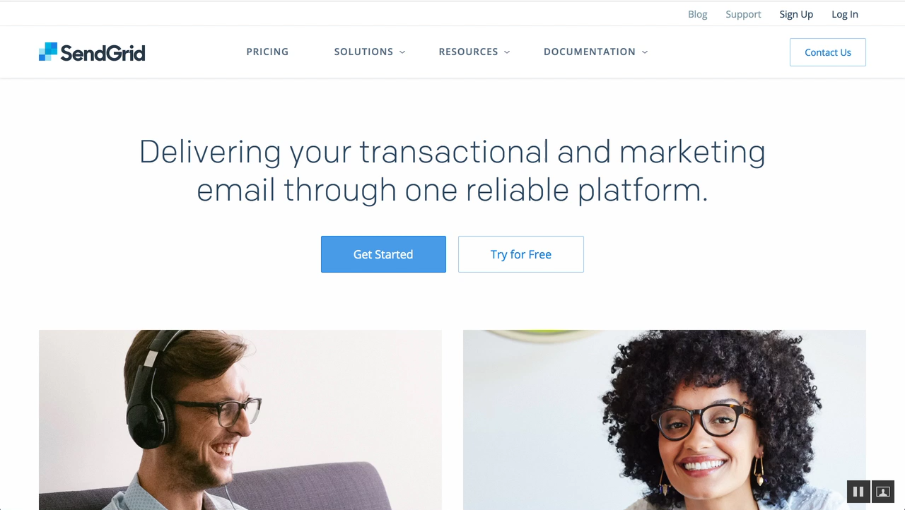

A pretty simple starting point. No clear direct link to any developer landing page but there's a big **Get Started** button so let's click that.

[`https://sendgrid.com/pricing/`](https://sendgrid.com/pricing/)

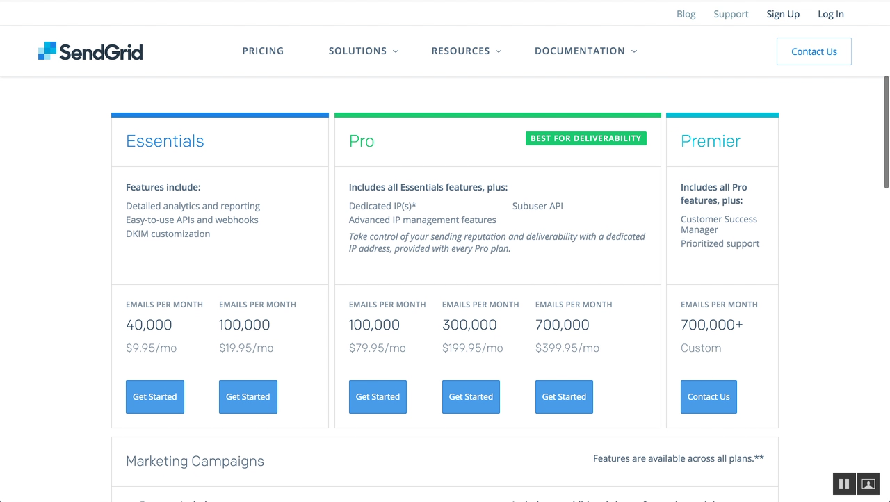

Not quite what I expected from Getting Started as a developer. Lots of paid plans.

When I scroll down though I see this.

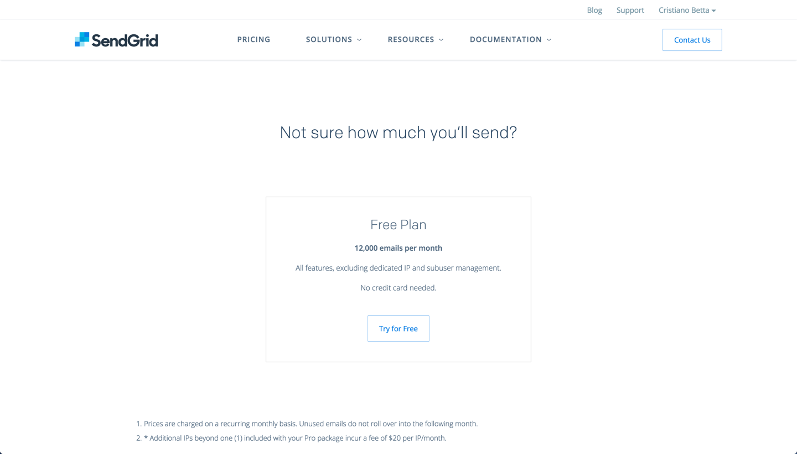

Great! A free plan! Let's try this.

## Signup

[`https://app.sendgrid.com/signup`](https://app.sendgrid.com/signup)

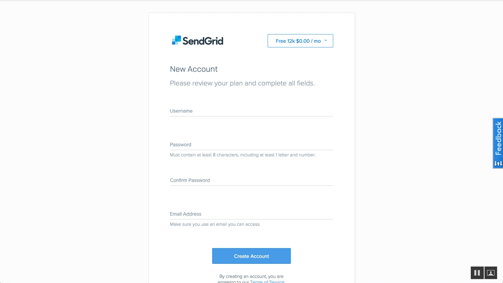

The sign up form is pretty straightforward. I fill in my details and continue.

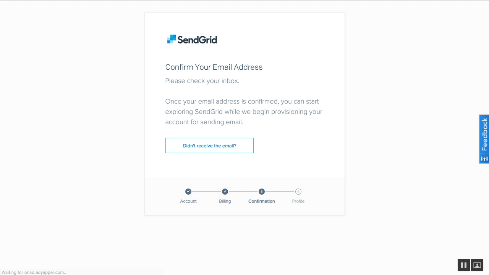

I take a quick detour via my email inbox.


A very pretty email - as is to be expected of an email company. When I click the big blue button I end up on the next form. I somehow knew that previous form was too easy!

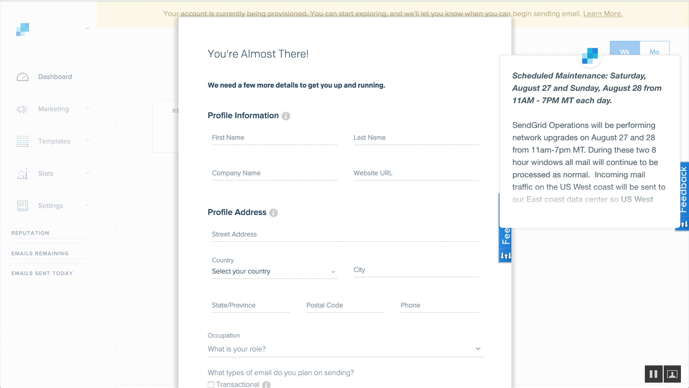

I noticed some interesting things here:

* This page is warning me of a scheduled maintenance even though I haven't yet finished signup.
* I have to supply my whole name and address even before I've had a chance to get an idea as to how their product works.

There are some interesting questions at the bottom of the form as well.

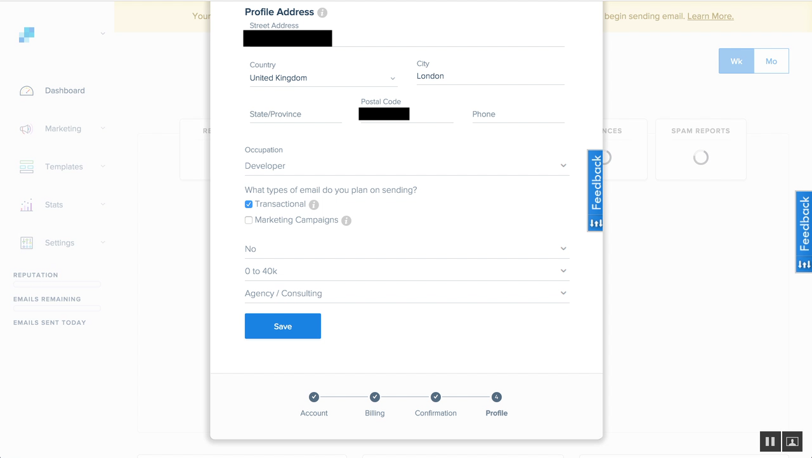

It's interesting to see how SendGrid assumes I already know what I need them for. Maybe they're not expecting a developer to do the signup process - although it is an option in the occupation section.

I save the form and end up on the following screen.

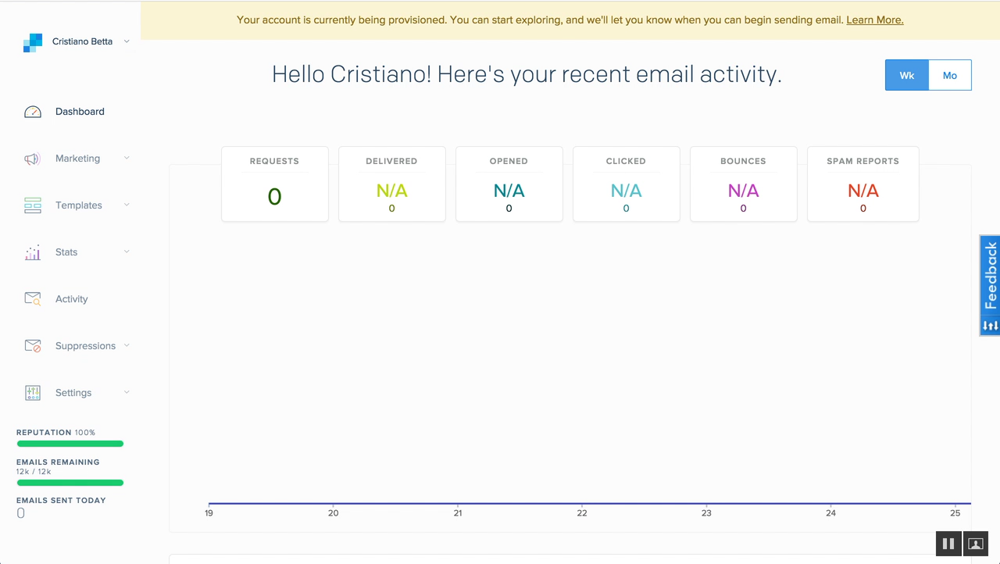

I find this page very dissapointing. I've followed the **Get Started**-button on their home page all the way here, and now they leave me hanging with no further instructions as to how to continue.

The warning at the top informs me that my account is still to be activated, but as I follow the link it just gives me a video explaining that this has to do with the obvious anti-spam measures they have to take.

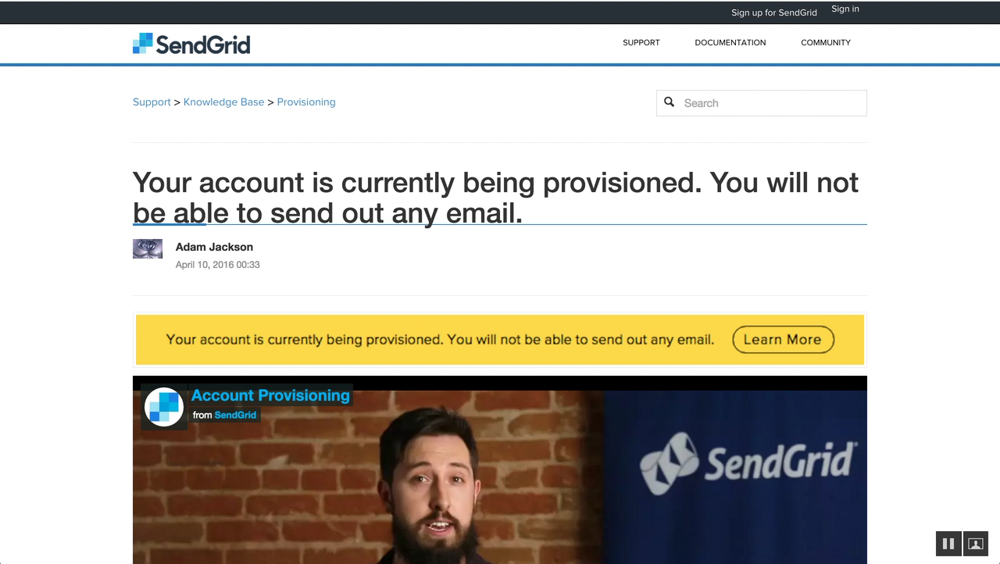

## Integration

I close that page and go back to my logged in dashboard. As I scroll down I find the following steps hinting me that there are next steps to take.

[`https://app.sendgrid.com/`](https://app.sendgrid.com/)

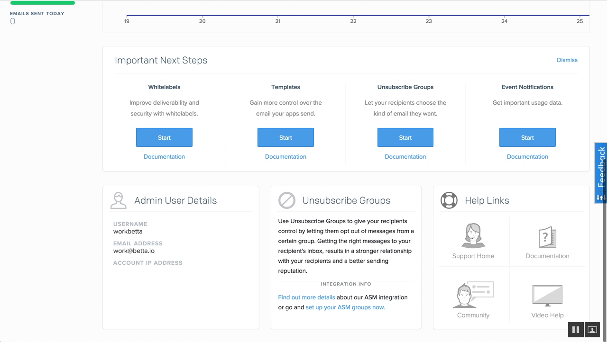

Interestingly enough none of these seem to link me to my API key, developer documentation, or any next steps to sending my first email.

Let's head back to the main site and see if I can find some documentation.

[`http://sendgrid.com/`](http://sendgrid.com/)

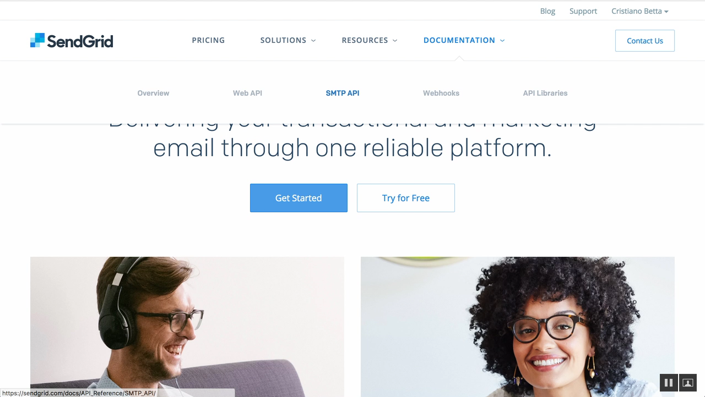

The homepage does have a documentation tab that expands into various sections. I click on the overview link.

[`https://sendgrid.com/docs/index.html`](https://sendgrid.com/docs/index.html)

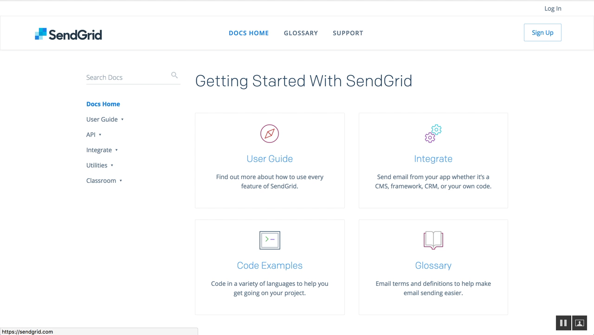

This looks promising. SendGrid split their documentation into various sections:

* A generic **User Guide** explaining what SendGrid is for the less technical. This is a great point for most people to understand the powerful features SendGrid offers beyond the obvious.
* An **Integrate** section explaining the various different ways you can integrate Sengrid. This is a great idea as SendGrid offers multiple application endpoints (SMTP, REST API, etc) and highlighting the differences can be very useful in early decision making.
* A **Glossary** to help you cut through the jargon of the email world and quickly get to terms with the terminology used across the rest of the documentation. I admit that although I'd advice you to keep your developer documentation jargon-free it's often hard to do so and a glossary can help beginners to understand your industry.
* A **Code Examples** section with simple code samples to quickly get to grips with a first integration.

That last one is clearly the one I need so let's select that one.

[`https://sendgrid.com/docs/Integrate/Code_Examples/index.html`](https://sendgrid.com/docs/Integrate/Code_Examples/index.html)

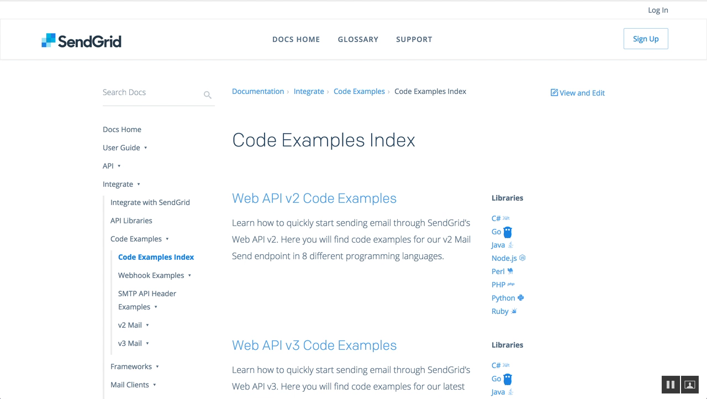

I was expecting a list of programming languages but instead I was given a list of different API endpoints. What's odd is that V2 is positioned above V3. I'd assume V3 would be newer and therefore better? This makes me wonder if V3 is stable or just a Beta. I decide to go with V3 anyway.

[`https://sendgrid.com/docs/Integrate/Code_Examples/v3_Mail/index.html`](https://sendgrid.com/docs/Integrate/Code_Examples/v3_Mail/index.html)

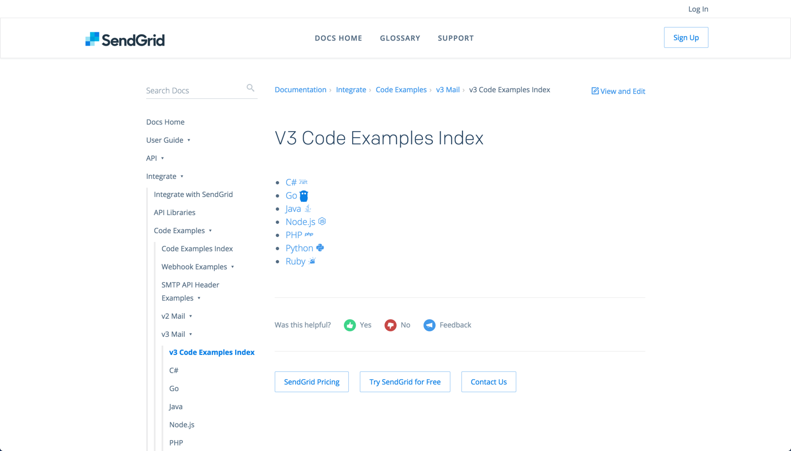

A list of programming languages. let's pick Ruby as that's what I'm most familiar with.

[`https://sendgrid.com/docs/Integrate/Code_Examples/v3_Mail/ruby.html`](https://sendgrid.com/docs/Integrate/Code_Examples/v3_Mail/ruby.html)

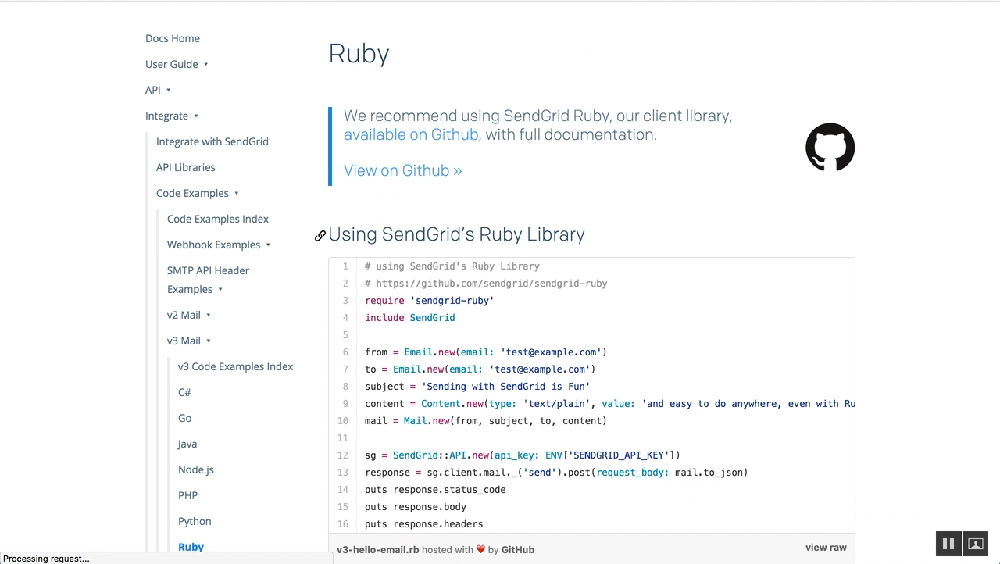

The code sample is simple enough for a Ruby developer to follow. On line 12 it asks me for an API key, and I haven't seen one so far.

## API Key

I check my email inbox for an API key but they haven't emailed it to me, which is a good thing. Let's head over to the SendGrid dashboard again. I find a link to **API keys** in the **Settings**. This seems extremely hidden for something so essential.

[`https://app.sendgrid.com/settings/api_keys`](https://app.sendgrid.com/settings/api_keys)

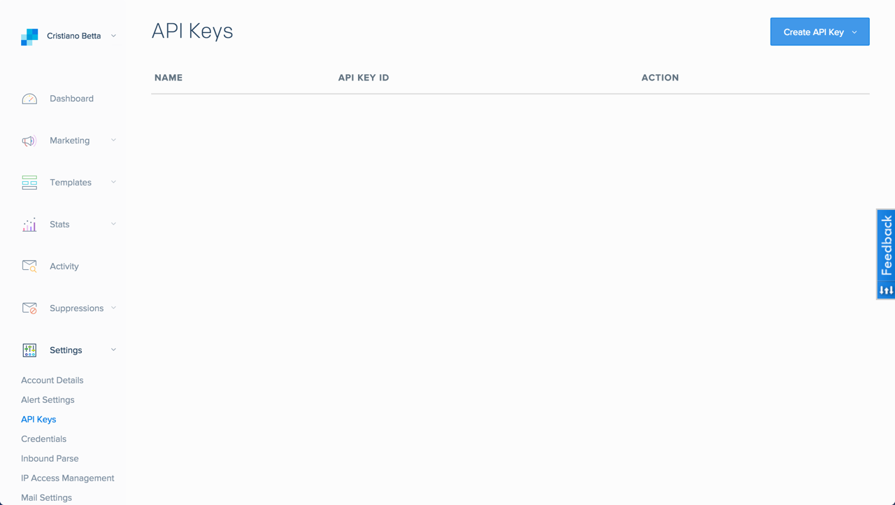

SendGrid hasn't created an API key for me by default. This seems odd as I'd assume everyone would need one. I click the big blue button to create one.


Apparently there are 2 kinds of API keys but at this point I'm not sure yet which one I need. It's odd there's no help text to help me decide which one I need. I assume I need a regular API key so I continue with that choice.

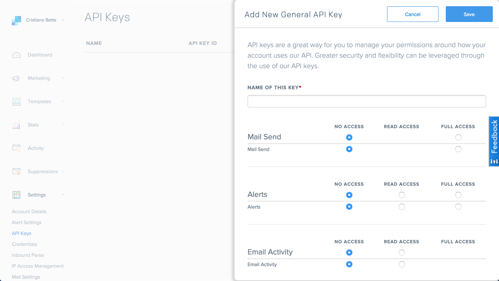

This seems to be the page I wanted. I tick the option to send emails and create my first API key.

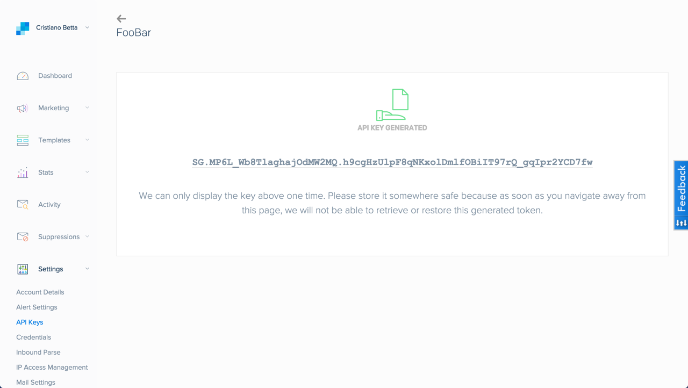

I have an API key! I click on the key and it copies it to my clipboard for me. Very nice!

## API Reponse

I go back to my code, add the key, and run the code. The output is as follows:

```bash
$ ruby test.rb
202

{"server"=>["nginx"], "date"=>["Fri, 26 Aug 2016 14:37:31 GMT"], "content-type"=>["text/plain; charset=utf-8"], "content-length"=>["0"], "connection"=>["close"], "x-message-id"=>["pfRkpys-Sk-sXKekBc5yzg"], "x-frame-options"=>["DENY"]}
```

The 202 is the response code, the next line is the body, and the last line is the headers. As an experienced developer I know that a response code in the **2**** range is generally good, but then the response also returns the word **DENY** in the headers. So did this email send? I check my email inbox but no email has arrived yet.

## API Reference

On the documentation overview earlier there was no direct link to the API reference but in the left hand menu we do find such link.

[`https://sendgrid.com/docs/API_Reference/index.html`](https://sendgrid.com/docs/API_Reference/index.html)


I used the V3 code sample to send an email so I click through to the **Mail Send V3** reference documentation.

[`https://sendgrid.com/docs/API_Reference/Web_API_v3/Mail/index.html`](https://sendgrid.com/docs/API_Reference/Web_API_v3/Mail/index.html)

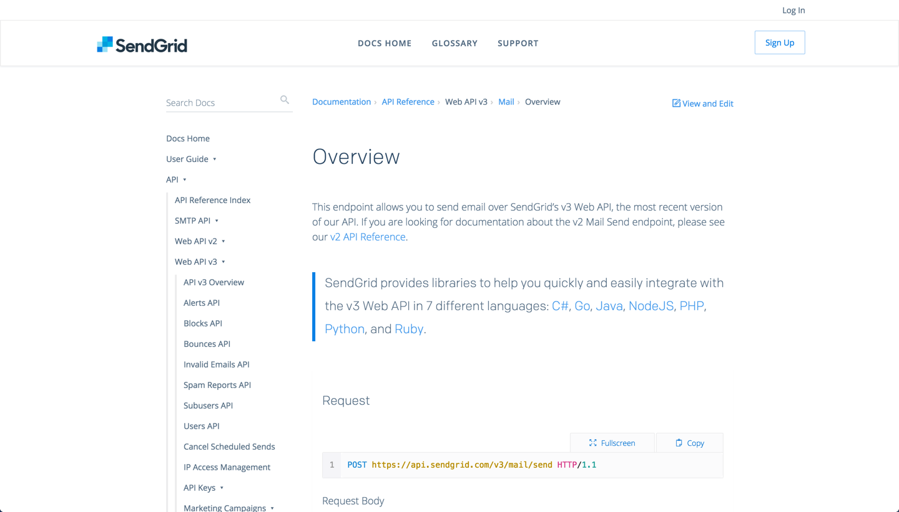

This page has a lot of info and it tells us that indeed the status of 202 is a successful response. I also found a list of full response codes in the sidebar.

[`https://sendgrid.com/docs/API_Reference/Web_API_v3/Mail/errors.html`](https://sendgrid.com/docs/API_Reference/Web_API_v3/Mail/errors.html)

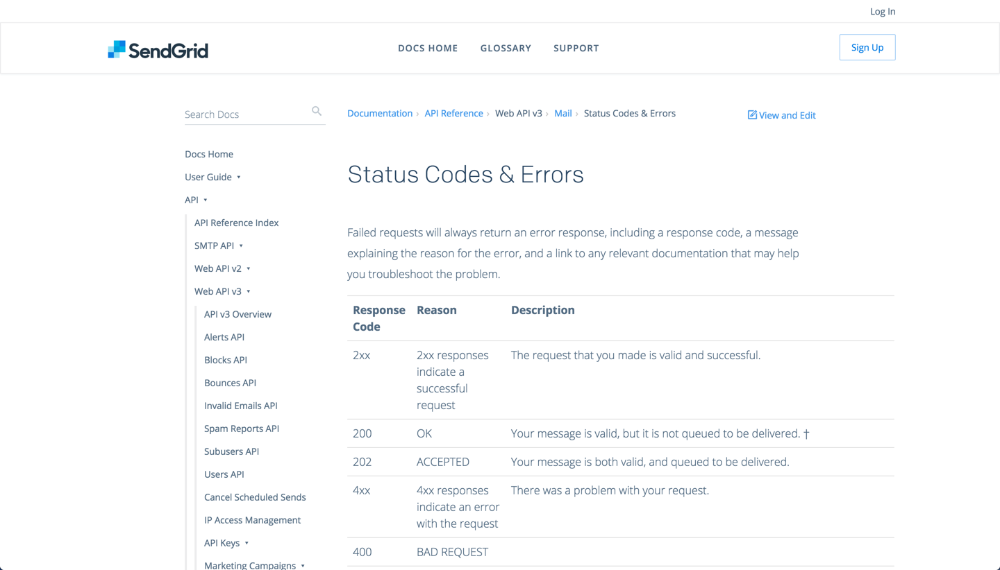

## Conclusions

> ★★★
>
> Harder than it should be

<!-- 1 Impossible
2 Barely possible
3 Harder than it should be
4 Almost flawless
5 Flawless -->

<Message> Since writing this article, SendGrid has made a lot of changes to their onboarding, partially based on this review. This article therefore serves as a historical document, and does not reflect the current onboarding experience of SendGrid. </Message>

As simple as email might sound, SendGrid has the hard task of having to explain some complicated issues to developers. A big issue they have to deal with is that they have more than one way to send an email. This choice makes their onboarding less seemless as it makes it hard for them to predict what a user is most likely to want.

All of this is reflected in their onboarding experience which at points leaves the user guessing what to do next. I often had to find the next step myself before I could continue.

### The good

* A clean, modern UI
* A free plan allowing me to try out their product before paying
* They use API keys instead of usernames/passwords for making API calls

### The bad

* The **Get Started** button on the homepage leads to a pricing page and signup instead of running a user through the steps to "get started"
* After signing up a developer is left with no next steps to continue with the integration
* The developer is left to guess where to get an API key and how to create it properly
* There is no way to try their service without signing up - athough this is mostly due to anti-spam measures
* It takes 4 clicks to get to a first code sample from the homepage

Most of these points are probably a sign of an onboarding experience designed to optimise signups rather than activations. While this can be good for dealing with larger enterprises who don't mind the follow ups via email/phone it rarely works well with individual developers and startups.

## Next

That's it for this first post on Developer Experience. Let me know in the comments below what you think of this post and if I should continue. I'd also love to know what company you think I should review next.

I'd also like to thank initiatives like [UserOnboard](https://www.useronboard.com/onboarding-teardowns/) for giving me the inspiration for this post.

I am a [freelance Developer Experience designer](https://work.betta.io). If you want to know more about my work have a look at [my portfolio](https://work.betta.io) and if you'd like for me to help make your company's Developer Experience better then most definitely reach out to me via [Twitter](https://twitter.com/cbetta) or [email](mailto:work@betta.io)!
