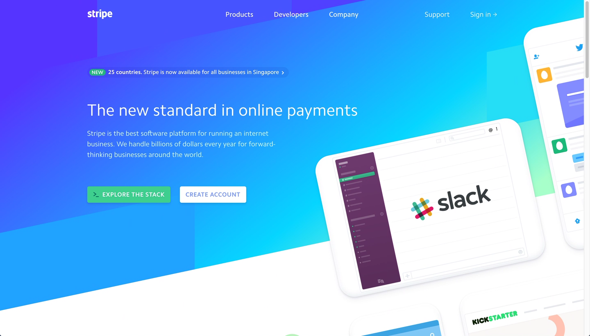
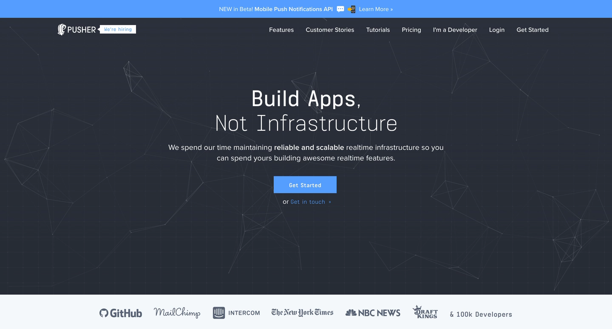
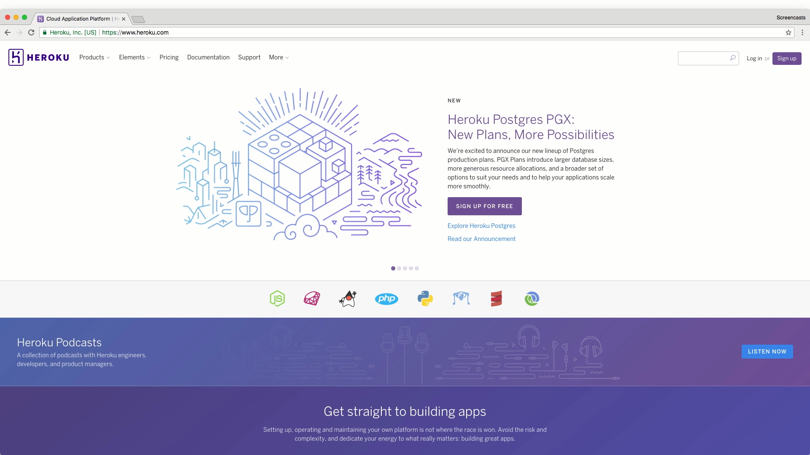

The initial home page is often catered to fit the needs of developers
and other interested parties. It therefore has to strike a balance to introduce
both technical and non technical people to the product at offer.

### Stripe
      

### Pusher
      

### SendGrid
      

### Twilio
      

### GitHub
      

### Heroku
      

