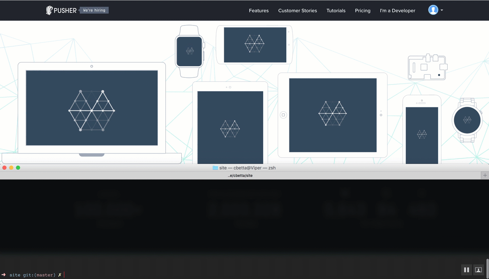
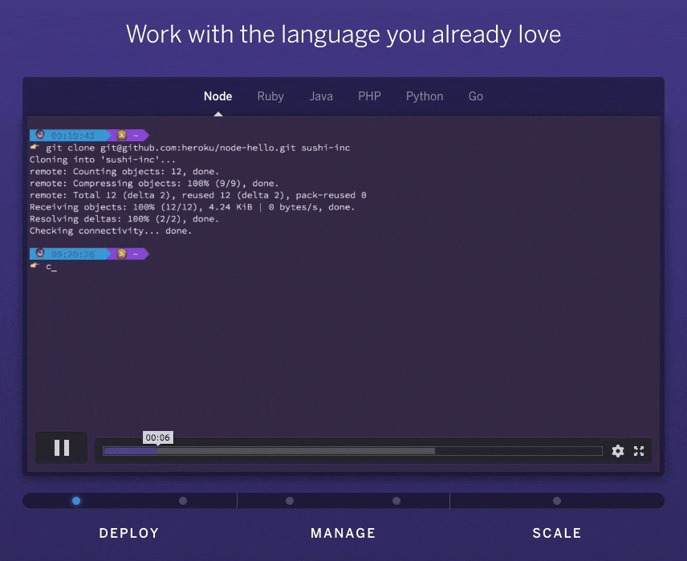
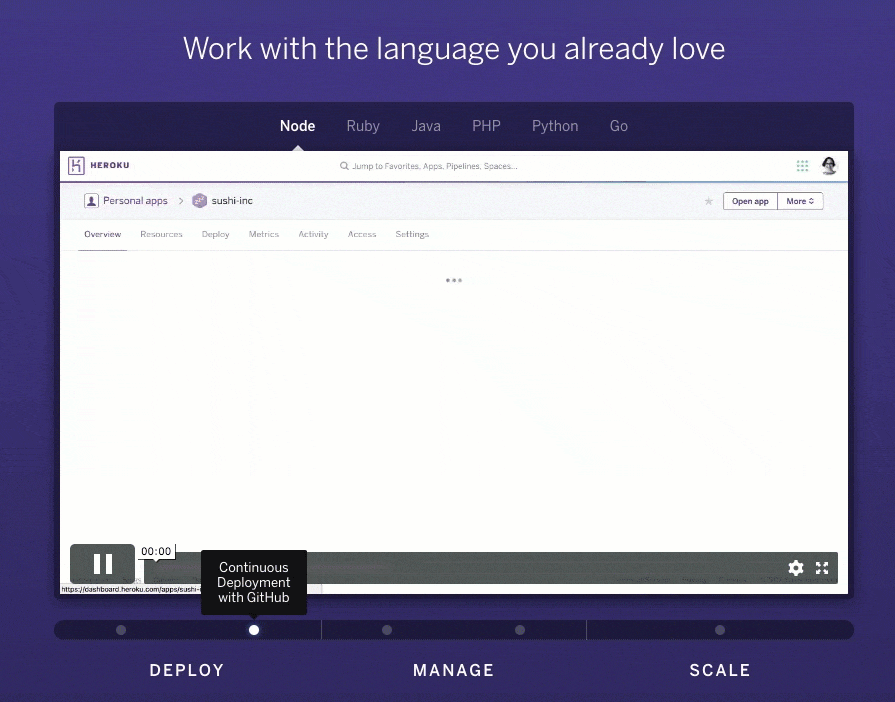

An interactive demonstration of product's features can be the
easiest way to explain to new users the purpose and power of your developer product.

### Pusher

### Twilio

### Stripe

### Heroku

