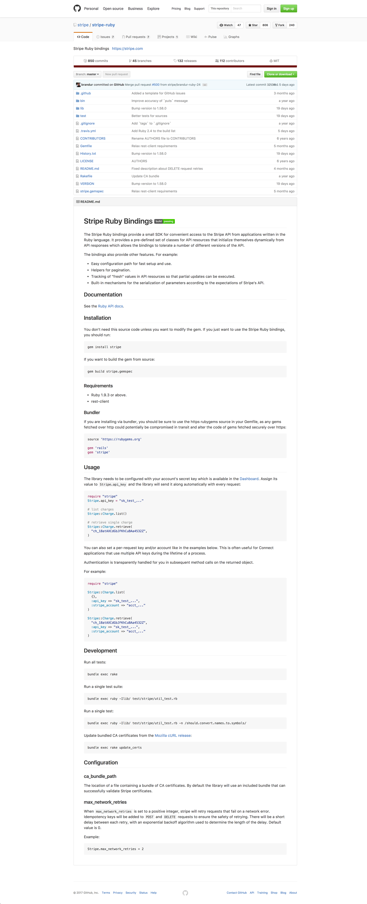
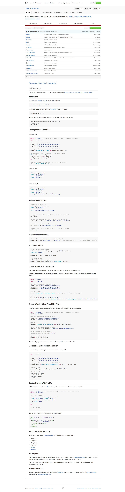
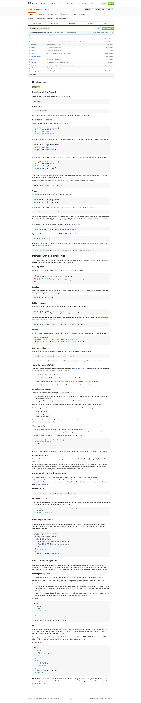
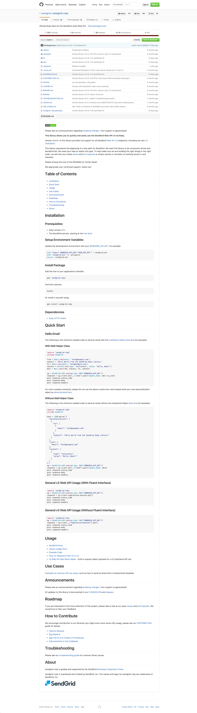
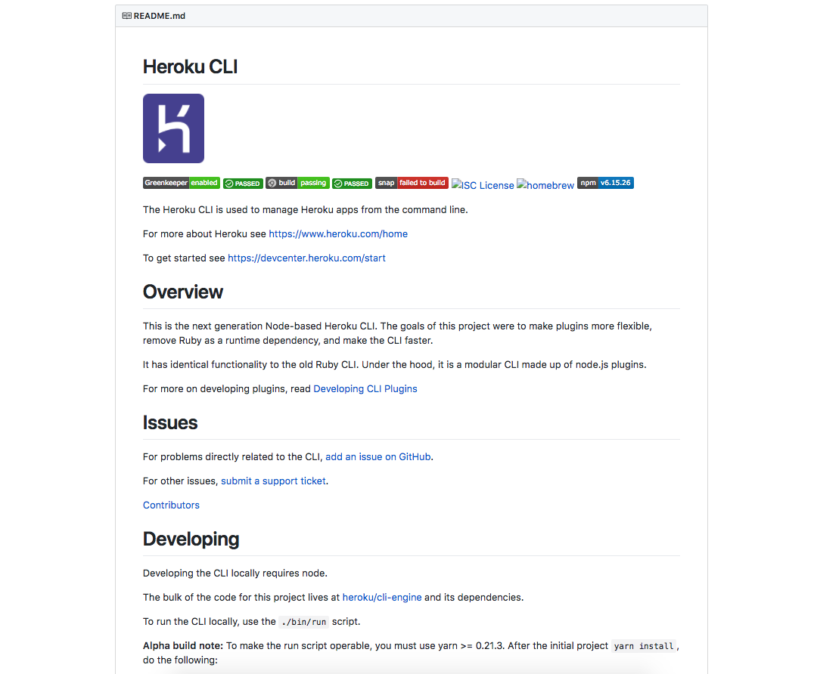

The README for the publicly available SDKs and libraries for a
developer product offer an important initial starting point or many developers.
Getting the various steps of the developer experience nailed down in this document
is important to a successful onboarding.

### Stripe

### Twilio

### Pusher

### SendGrid

### GitHub

### Heroku

