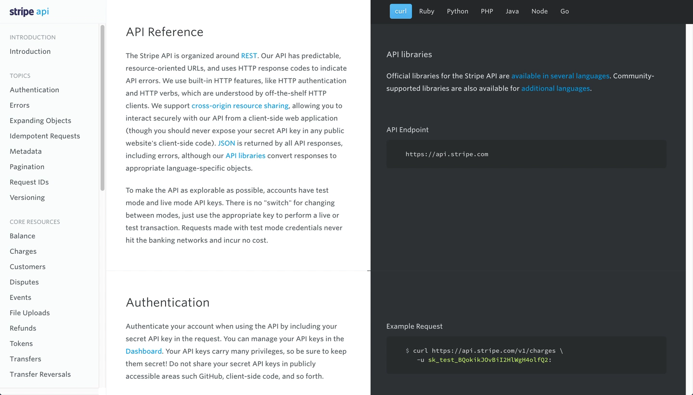
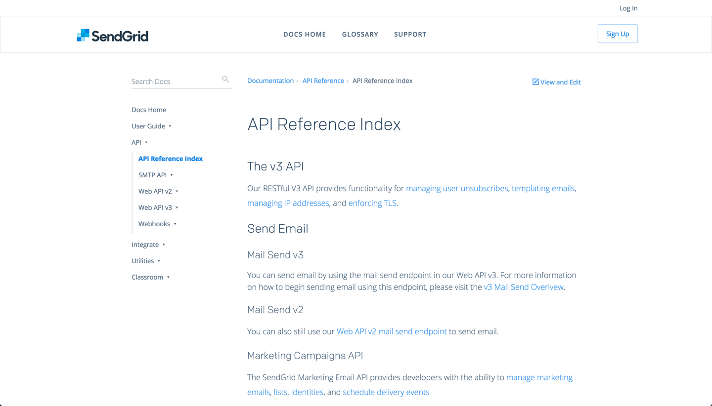
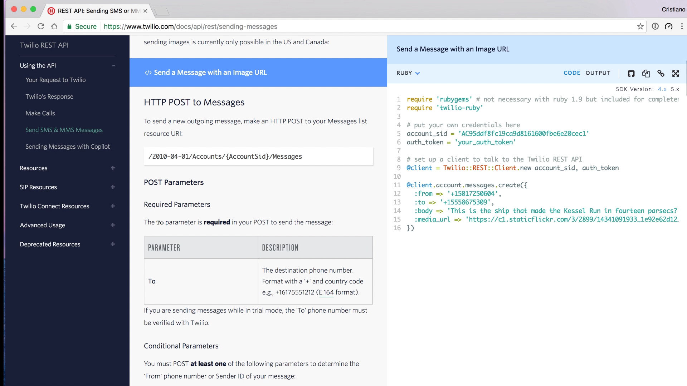
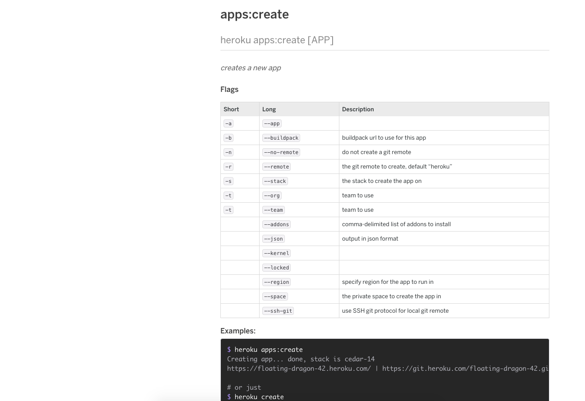
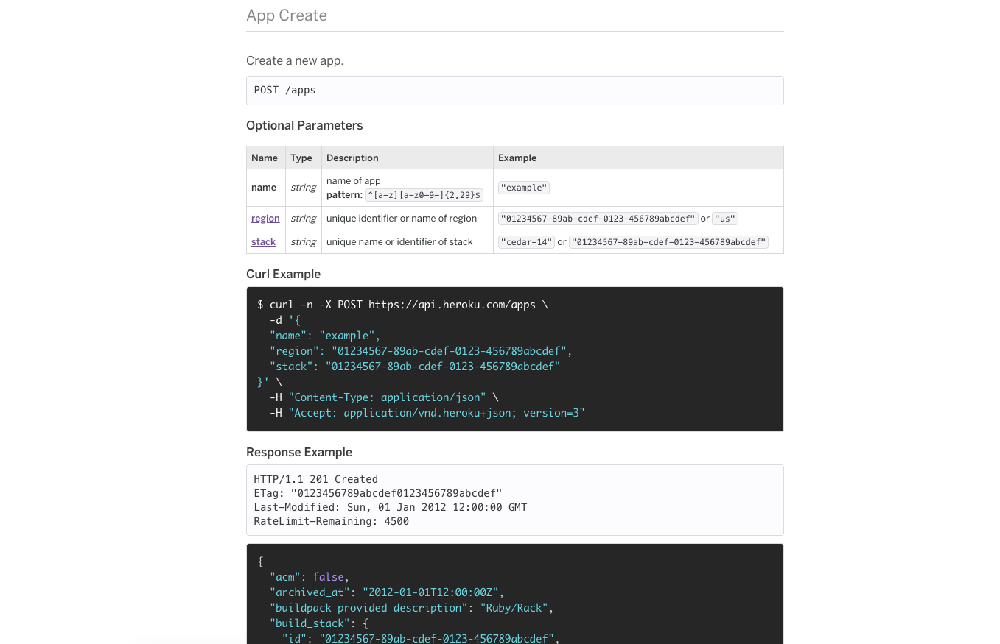

The reference documentation is an important tool to the experienced
and dedicated developer intending to make the most of a developer product.

### Stripe

### Sendgrid

### Twilio

### Heroku

