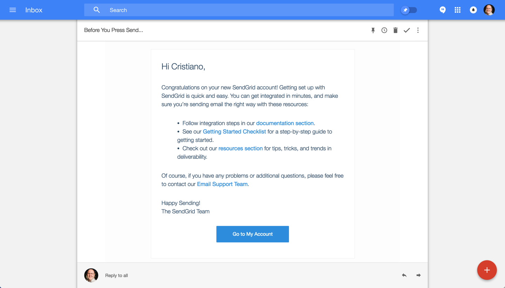
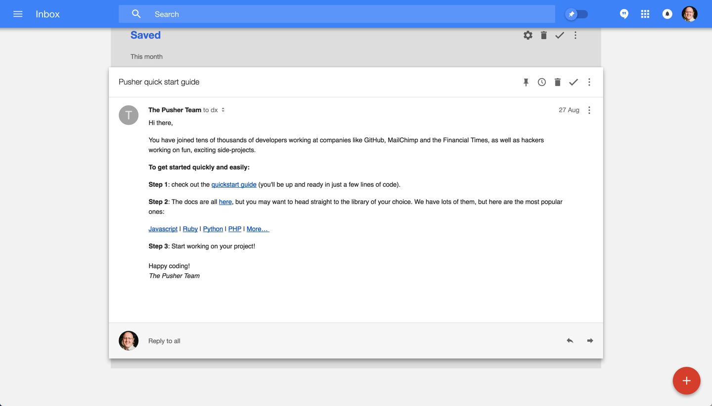
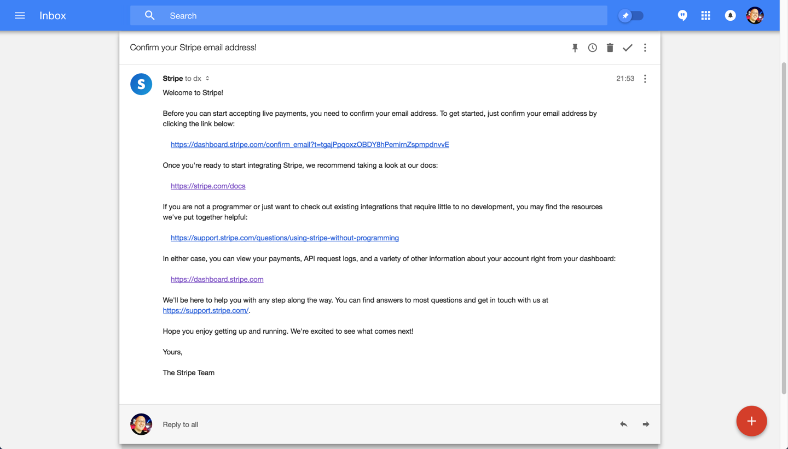
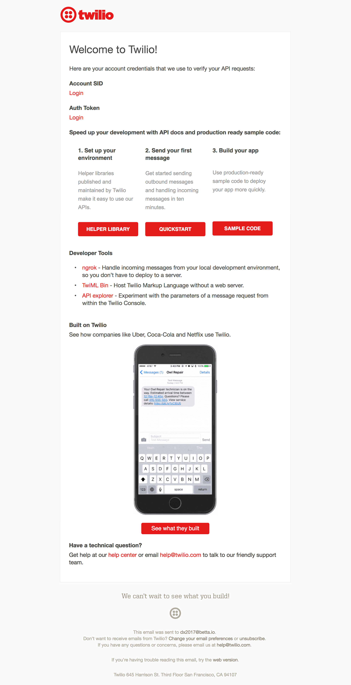
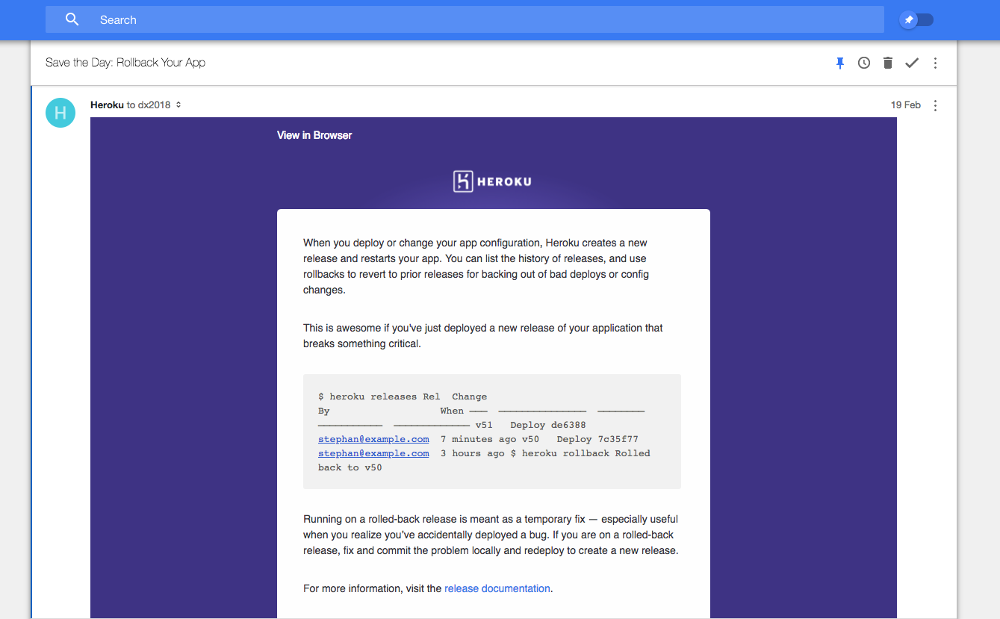
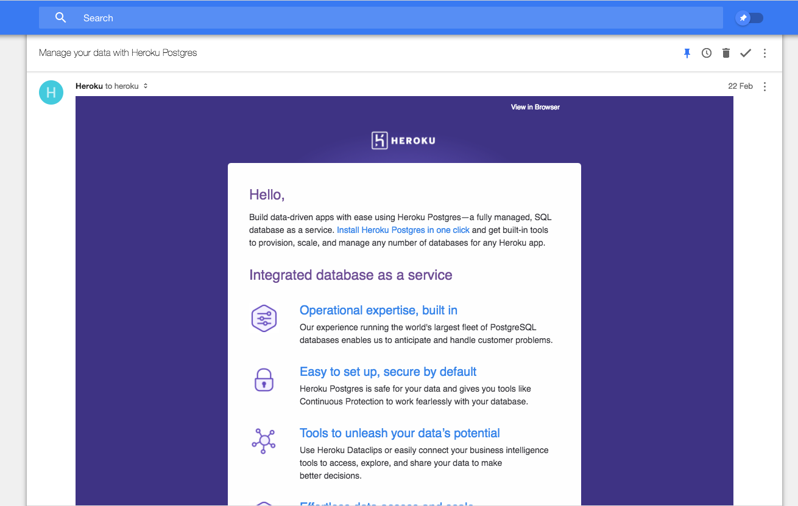
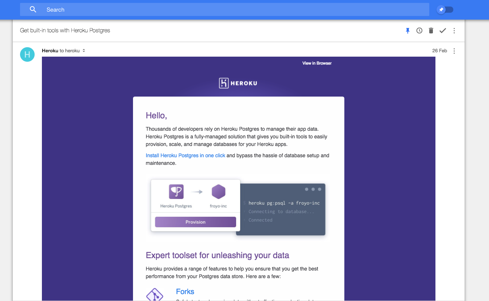

Welcome emails are an essential tool for managing user retention.
When people sign up and don't complete a first integration a simple welcome email
can often bring people back to your product on a later moment.

### SendGrid

### Pusher

### Stripe

### Twilio

### Heroku

