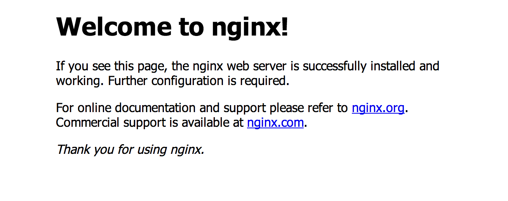

---

title: "Your mini-Heroku with Dokku and Dokkufy"
date: 2014-08-05
comments: true
tags: ruby, gems, dokku
icon: Terminal
migrated: true
---

I've always enjoyed [Heroku](http://heroku.com) but there are plenty of reasons both monetary and practical not to use it. I always liked the deployment method through Git though.

So this weekend at [LeedsHack](http://leedshack.org) I started to look into [Dokku](https://github.com/progrium/dokku), an open source mini-Heroku powered by [Docker](https://www.docker.com/), [Buildstep](https://github.com/progrium/buildstep) and some other bits that share infrastructure elements with Heroku.

I found the installation rather tedious and as this was a hackathon I decided to create something simpler.


## Introducing Dokkufy

[Dokkufy](https://github.com/cbetta/dokkufy) is a Ruby gem that makes it super simple to set up your own mini-Heroku on your own server.

Simply install with a swift `gem install dokkufy` and you're ready to "dokkufy" both your server and your app.

### Part 1: Dokkufying your server

Dokku only works with Ubuntu 12.04 and 14.04 server, so go get one of those images and boot up a server.

Then on your local machine run:

```
dokkufy server
> Server hostname or IP: ppd.io
> Username on server: cbetta
> Desired root domain (e.g. example.com): ppd.io
> ...
```

As you can see this will ask you for a few details: server name or IP, username, and the eventual server domain to run all apps under. After a few minutes, depending on your broadband speeds, you will have a Dokku server ready do go.

Open up your server's domain or IP in a browser and voila!



### Part 2a: Dokkufying your app

Now that we have a Dokku server ready to go it's time to prepare your app.

I used the [Heroku Node JS sample app](https://github.com/heroku/node-js-sample) for my example.

```
cd node-js-sample
dokkufy app
> Server hostname or IP: ppd.io
> Dokku username on server [dokku]:
> Using dokku@ppd.io:node-js-sample
> Setting git remote
> Writing .dokkurc
> You can now push your app using `git push dokku master`
```

As you can see this simply asks for the details of your server and then adds a Git remote and writes a `.dokkurc` file to your app.

Now do a `git push dokku master` and you will see your app deployed.

```
git push dokku master
> Counting objects: 4, done.
> Delta compression using up to 8 threads.
> Compressing objects: 100% (2/2), done.
> Writing objects: 100% (3/3), 307 bytes | 0 bytes/s, done.
> Total 3 (delta 1), reused 0 (delta 0)
> -----> Cleaning up ...
> remote: Cloning into '/tmp/tmp.mTjJcRME5f'...
> -----> Building node-js-sample ...
> remote: done.
> remote: HEAD is now at 961aa4a... Adds dokkurc file
>        Node.js app detected
> -----> Requested node range:  0.10.x
> -----> Resolved node version: 0.10.30
> -----> Downloading and installing node
> -----> Restoring node_modules directory from cache
> -----> Pruning cached dependencies not specified in package.json
> -----> Writing a custom .npmrc to circumvent npm bugs
> -----> Installing dependencies
> -----> Caching node_modules directory for future builds
> -----> Cleaning up node-gyp and npm artifacts
> -----> No Procfile found; Adding npm start to new Procfile
> -----> Building runtime environment
> -----> Discovering process types
>        Procfile declares types -> web
> -----> Releasing node-js-sample ...
> -----> Deploying node-js-sample ...
> =====> Application deployed:
>        http://node-js-sample.ppd.io
>
> To dokku@ppd.io:node-js-sample
>    97a7c5c..961aa4a  master -> master
```

Dokku will automatically create your project for you on first push and deploy your app to a subdomain of your chosen domain. In this case we deployed our app to [http://node-js-sample.ppd.io](http://node-js-sample.ppd.io).

### Part 2b: Controlling Dokku

When you install Dokku on your server it gives you some handy commands. Sadly to run those from your local machine you need to perform some ssh-fu.

So to make this easier Dokkufy also comes with a local `dokku` command. You can use this command in any dokkufied app that has a `.dokkurc` file. It will automatically use that file to infer the remote server details and your app name.

```bash
dokku help
>    backup:export [file]                      Export dokku configuration files
>    backup:import [file]                      Import dokku configuration files
>    config                                    display the config vars for an app
>    config:get KEY                            display a config value for an app
>    config:set KEY1=VALUE1 [KEY2=VALUE2 ...]  set one or more config vars
>    config:unset KEY1 [KEY2 ...]              unset one or more config vars
>    delete                                    Delete an application
>    help            						   Print the list of commands
>    logs [-t]                                 Show the last logs for an application (-t follows)
>    plugins-install 						   Install active plugins
>    plugins         						   Print active plugins
>    run <cmd>                                 Run a command in the environment of an application
>    url                                       Show the URL for an application
>    version                                   Print dokku's version
```

## Some final notes

That's it for Dokkufy. I recommend running `dokkufy help` to see how you can explore and install plugins to install things like Postgres, Redis, and other features on your machine.

I also want to thank the awesome [Jeff Lindsay](https://github.com/progrium) for his work on Dokku and I want to highlight what seems to be the next iteration of Dokku: [Flynn](https://flynn.io/).
