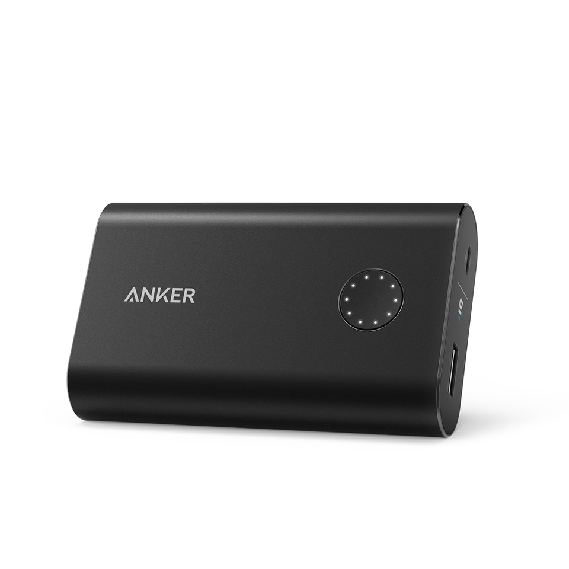
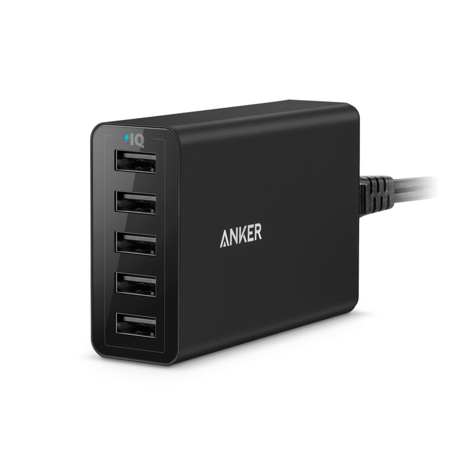
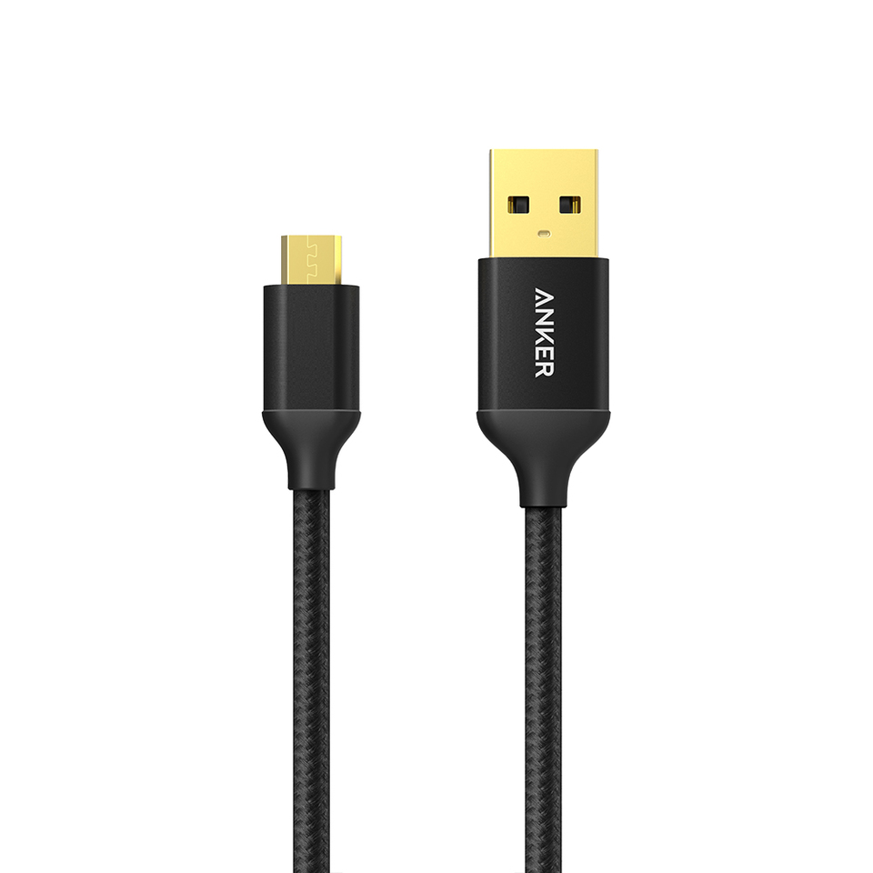

During the last 3 years I've travelled an awful lot and I realised it might be interesting to write up some of my favorite travel gear, specifically the chargers I use.

I discovered [Anker](https://www.anker.com/) when I was trying to find a power bank with more than 2000 mAh in capacity. Since then I've added a lot of their gadgets to my standard gear.

## [Portable chargers](http://amzn.to/1Wi6TKS)

The nice thing about the [Anker portable chargers](http://amzn.to/1Wi6TKS) is that they come in just about every size. I used to have a 10,000 mAh charger before upgrading to a 25,600 mAh monster, while Melinda has a relatively small 5,200 mAh portable charger she uses.

Anker sells just about every variation available, which means you can pick your ideal balance of capacity and size. Additionally they now also have portable chargers that support Quick Charge (for those of you with Android phones).

## [Wall chargers](http://amzn.to/1S7M0Sy)

The [Anker PowerPorts](http://amzn.to/1S7M0Sy) are  wall chargers featuring multiple (up to 10) USB ports for fast charging of your devices. Yes you can charge all of your devices with one if these. And you'd only need one wall socket, Making this ideal for hotels!

I have 2 of these at the moment, a 10x USB port version at home, and a 5x port version for travelling. One of the additional niceties of these devices is that it uses a simple figure 8 shaped power cable. When I travel abroad I just replace it with a cable with the appropriate local plug, rather than bringing an adapter.

## [Cables](http://amzn.to/1Wi7iwF)

Anker also makes some amazingly rugged [(nylon braided) cables](http://amzn.to/1Wi7iwF). I love these because the standard Apple cables keep dying on me. Maybe it's how I treat them, or maybe it's "Apple Quality". [These Nylon braided](http://amzn.to/1Wi7iwF) cables simply outlast any other cable I've owned.

An other reason is that I have so many micro-USB cables lying around and the quality between them varies a lot (some barely charge a device), while they all look the same. With the Anker cables I can easier identify the high quality ones.
