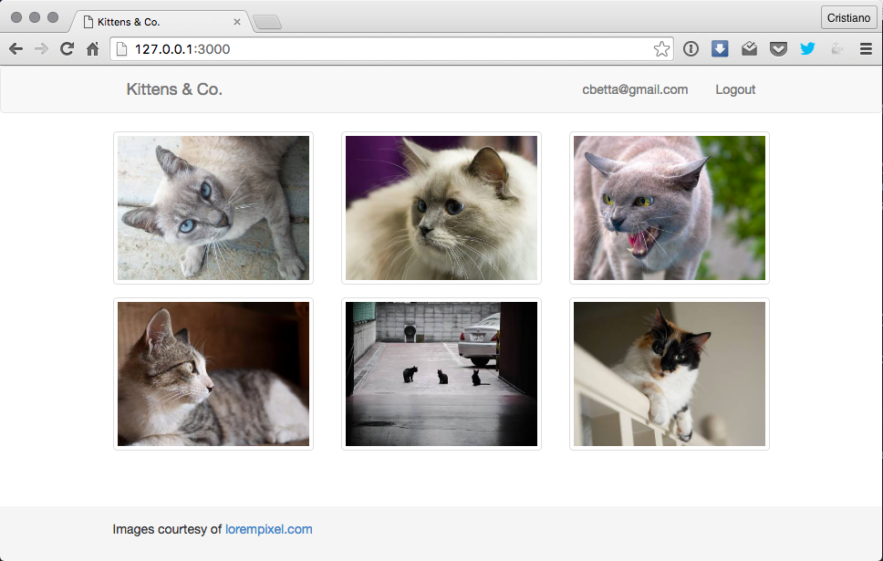
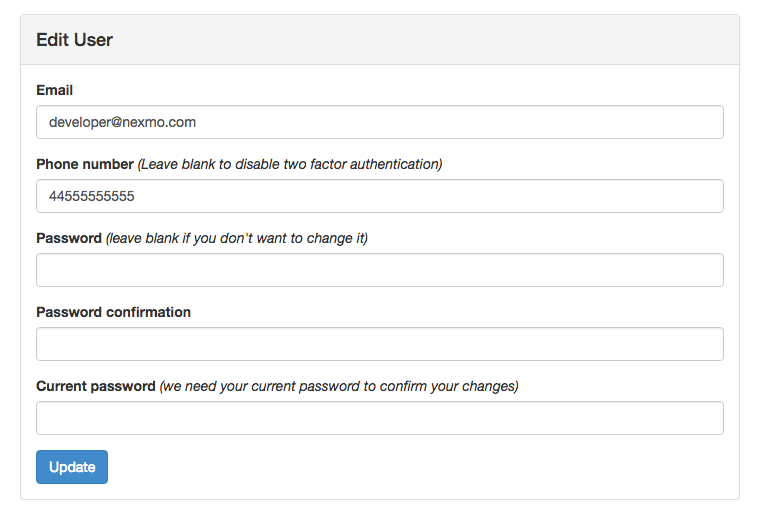
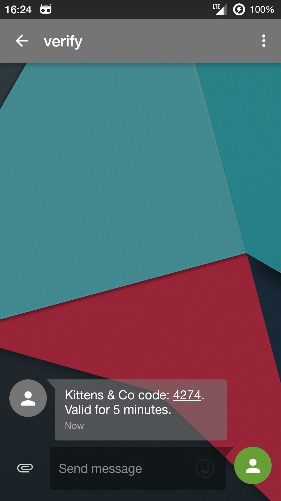
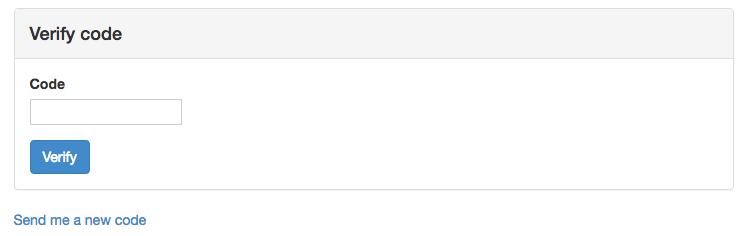
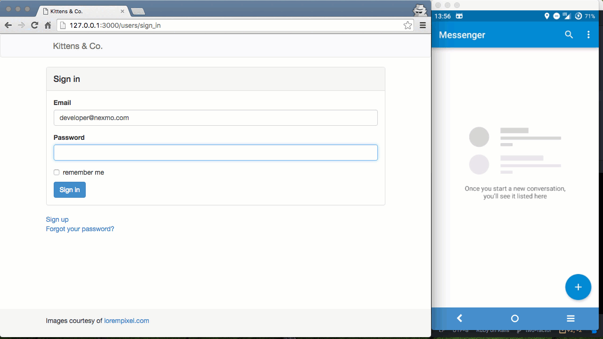

<Message> This post was originally first posted on
  the [Nexmo Developer Blog](https://www.nexmo.com/blog/2016/06/07/two-factor-authentication-2fa-ruby-rails-devise-nexmo-verify/) on June 7th 2016.  </Message>

I love applications that support two factor authentication! Whether it is
through SMS, voice, or other means - it simply tells me that the app developer
has been kind enough to think about my data and its security.

In 2015 more than [150 million](https://docs.google.com/spreadsheets/d/1Je-YUdnhjQJO_13r8iTeRxpU2pBKuV6RVRHoYCgiMfg/edit#gid=3)
user records were stolen and the leaked data proved that people still tend to use the
[same passwords across different sites](http://passwordresearch.com/stats/statistic371.html).
For those people the only thing standing between them and another compromised
account is a good second factor of authentication.

## A little business app

For this tutorial I am going to show you how to add two factor authentication
to your Rails site using the [Nexmo Verify API](https://www.nexmo.com/products/verify/).
For this purpose I have built a little app called ["Kittens & Co"](https://github.com/nexmo-community/nexmo-rails-2fa-demo) -
a social network where business cats can exchange their plans to take over the
world.

You can download the starting point of the app from Github and run it locally.

~~~sh
# ensure you have Ruby and Bundler installed
git clone https://github.com/nexmo-community/nexmo-rails-2fa-demo.git
cd nexmo-rails-2fa-demo
bundle install
rails server
~~~

Then visit [127.0.0.1:3000](http://127.0.0.1:3000) in your browser and register.

By default the app implements registration and login using [Devise](https://github.com/plataformatec/devise)
but most of this tutorial applies similarly to apps that use other
authentication methods. Additionally I added the `bootstrap-sass` and
`device-bootstrap-templates` gems for some prettyfication of our app.

All the code for this starting point can be found on the [basic-login](https://github.com/nexmo-community/nexmo-rails-2fa-demo/tree/basic-login)
branch on Github. All the code I will be adding below can be found on the
[two-factor](https://github.com/nexmo-community/nexmo-rails-2fa-demo/tree/two-factor) branch. For your convenience you can see [all the changes between our start and end point](https://github.com/nexmo-community/nexmo-rails-2fa-demo/compare/basic-login...two-factor) on Github as well.

## Nexmo Verify

[Nexmo Verify](https://www.nexmo.com/products/verify/) is phone verification
made simple. Most two factor authentication plugins will require you to manage
your own tokens, token expiry, retries, and SMS sending. Verify manages all of
this for you and all you need to know are just 2 API calls!

To add Nexmo Verify to our system I am going to add the following changes:

1. Add a `phone_number` to a  `User` account
2. Require verification on login if the user has a number on their account
3. Verify the code sent to their number and log the user in

## Adding a phone number

Let's start by adding a phone number to a user. I generate a new database
migration and change it to add a new column to our user model.

~~~sh
rails generate migration add_phone_number_to_users
~~~

~~~rb
# db/migrate/...add_phone_number_to_users.rb
class AddPhoneNumberToUsers < ActiveRecord::Migration
  def change
    add_column :users, :phone_number, :string
  end
end
~~~

~~~sh
rake db:migrate
~~~

Devise comes with the ability to edit a user right out of the box. By default
these views are hidden to the developer though, so I need to get a copy of them
to make changes to. Devise makes this pretty easy through a Rails generator.

~~~sh
# this is not the default generator but the one needed for the device-bootstrap-templates gem
rails generate devise:views:bootstrap_templates
# use the command below if you did not use the device-bootstrap-templates gem
rails generate devise:views:templates
~~~

This will copy a lot of view templates into `app/views/devise/`. I deleted most
of them and only kept the one I really needed: `registrations/edit.html.erb`.

The only change I need to make to this template is to add a phone number field
right after our email field.

~~~html
<!-- app/views/devise/registrations/edit.html.erb -->

  <%= f.label :phone_number %> <i>(Leave blank to disable two factor authentication)</i> 
  <%= f.number_field :phone_number, class: "form-control", placeholder: "e.g. 447555555555 or 1234234234234"  %>

~~~

The last step is to make Devise aware of this extra parameter. Without these
lines the phone number won't be accepted as a strong parameter and will be lost
after it's submitted.

~~~rb
# app/controllers/application_controller.rb
...
before_filter :configure_permitted_parameters, if: :devise_controller?

def configure_permitted_parameters
  devise_parameter_sanitizer.for(:account_update) << :phone_number
end
...
~~~

## Send a verification request

Now that a user can add their phone number to their account I can have them
verify their phone number on login. In order to send a verification message via
Nexmo Verify I am going to have to add the `nexmo` gem to my project.

~~~rb
# Gemfile
gem 'nexmo'
gem 'dotenv-rails', groups: [:development, :test]
~~~

As you can see I also added the `dotenv-rails` gem. This is so that the app can
load my API credentials from a `.env` file. The Nexmo gem automatically picks
up those environment variables and uses them to initialize the client. You can
find your credentials on [the settings page](https://dashboard.nexmo.com/settings) of your Nexmo account.

~~~sh
# .env
NEXMO_API_KEY='your_key'
NEXMO_API_SECRET='your_secret'
~~~

There are many different ways you could implement the verification check in your
app. To keep things simple I am just adding a `before_action` to my
`ApplicationController` that checks if the user has two factor authentication
enabled, and if they do makes sure that they are verified before they are
allowed to continue.

~~~rb
# app/controllers/application_controller.rb
before_action :verify_user!, unless: :devise_controller?

def verify_user!
  start_verification if requires_verification?
end
~~~

I decided to keep the check to see if the user requires verification very
simple by just checking if they have a phone number on file and if a `:verified`
value on their session hasn't been set yet.

~~~rb
# app/controllers/application_controller.rb
def requires_verification?
  session[:verified].nil? && !current_user.phone_number.blank?
end
~~~

To start the verification process I call `send_verification_request` (API call #1)
on the `Nexmo::Client` object. I don't need to pass in any API credentials
because it has already been initialized through our environment values - though
if you want to be explicit you can (see the [gem documentation](https://github.com/Nexmo/nexmo-ruby)).

~~~rb
# app/controllers/application_controller.rb
def start_verification
  result = Nexmo::Client.new.send_verification_request(
    number: current_user.phone_number,
    brand: "Kittens & Co"
  )
  if result['status'] == '0'
    redirect_to edit_verification_path(id: result['request_id'])
  else
    sign_out current_user
    redirect_to :new_user_session, flash: {
      error: 'Could not verify your number. Please contact support.'
    }
  end
end
~~~
As you can see I pass the verification request the name of my web app. This is
used in the text message the user receives and adds some very nice brand
personalisation.

If the message has been sent successfully I redirect the user to a page to fill
in the code they will receive. Obviously at this state this would fail as I
haven't implemented this just yet.

## Check a verification code

The final step is to confirm the code the user receives on their phone and set
them as verified accordingly. For this I am going to have to add a new page.

I'll start with adding the routes and a basic controller.

~~~rb
# config/routes.rb
resources :verifications, only: [:edit, :update]
~~~

~~~rb
# app/controllers/verifications_controller.rb
class VerificationsController < ApplicationController
  skip_before_action :verify_user!

  def edit
  end

  def update
    ...
  end
end
~~~

As you can see I made sure to skip the `before_action` I added earlier so that
the browser doesn't end up in an infinite loop of redirects.

When the user lands on the new page they are presented with a simple form to fill
in their verification code.

~~~html
<!-- app/views/verifications/edit.html.erb -->
...
<%= form_tag verification_path(id: params[:id]), method: :put do %>
  

    <%= label_tag :code %> 
    <%= number_field_tag :code, class: "form-control"  %>
  

  <%= submit_tag 'Verify', class: "btn btn-primary" %>
<% end %>
...
~~~

The user then submits their code to the new `update` action. In this action I am taking the `request_id` and `code` from the params and pass them to the
`check_verification_request` method (API call #2!) to verify them.

~~~rb
# app/controllers/verifications_controller.rb
def update
  confirmation = Nexmo::Client.new.check_verification_request(
    request_id: params[:id],
    code: params[:code]
  )

  if confirmation['status'] == '0'
    session[:verified] = true
    redirect_to :root, flash: { success: 'Welcome back.' }
  else
    redirect_to edit_verification_path(id: params[:id]), flash: { error: confirmation['error_text'] }
  end
end
~~~

When the confirmation comes back successful I set the user's status as verified
and redirect them back to the main page. If the code was not successful I
instead present the user with a message describing what went wrong. A full list
of the response status codes can be found in [the Verify documentation](https://docs.nexmo.com/verify/api-reference/api-reference#check).

And that's it! I promised you, just 2 API calls.

## Next steps

The Nexmo Verify API has a lot more options than I showed here, ranging from
searching and controlling the requests, to changing the code length and expiry
time. Although the code I showed here is pretty simple I ended up with a very
powerful out of the box experience. The system falls back to phone calls if
needed, expires tokens without me doing anything, prevents reuse of tokens,
and logs verification times.

The Nexmo Ruby library is very agnostic as to how it's used which means you
could implement things very different than me. For example, you could require
the phone number on user registration, rejecting new accounts until the
number has been validated.

I'd love to know what you'd add next? Leave me your ideas in the comments below.
