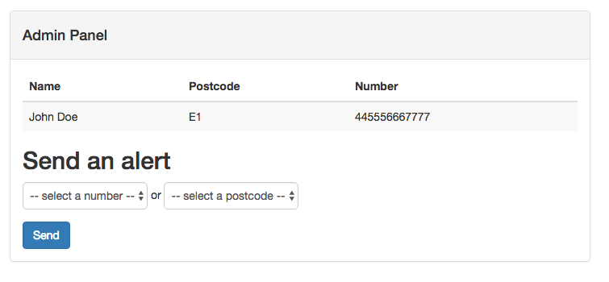

> This post was originally first posted on
  the [Nexmo Developer Blog](https://www.nexmo.com/blog/2016/06/21/building-voice-alerts-broadcast-system-using-ruby-nexmo-text-speech-api/) on June 7th 2016.

Sometimes a text message won't do. When you really want to be alerted of
something important you probably want to receive an actual phone call, wether
it's because a server is down, or because a natural disaster has occurred
in your area.

Similarly as a service provider or (local) authority dealing with an
emergency I want to reach out to as many people as possible, as quickly as possible, regardless if they own a mobile phone.

## The flood alerts app

For this tutorial I am going to show you how to build a **Voice Alerts Broadcast
System** using the [Nexmo Text-To-Speech API (TTS)](https://docs.nexmo.com/voice/text-to-speech). For this purpose I have
built my own **Nexmo Flood Alerts** service that allows people to subscribe to voice alerts for their postcode.

You can download the starting point of the app from Github and run it locally.

~~~sh
# ensure you have Ruby and Bundler installed
git clone https://github.com/nexmo-community/nexmo-sinatra-voice-alerts-demo.git
cd nexmo-sinatra-voice-alerts-demo
bundle install
bundle exec rake db:migrate
ruby app.rb
~~~

Then visit [localhost:4567](http://localhost:3000) in your browser and subscribe
to a flood alert with your postcode and your number. After this you can visit the
(very rudimentary) [admin panel](http://localhost:3000/admin) where you should
be able to see your subscription.

The app is a basic [Sinatra](http://www.sinatrarb.com/) app, written in Ruby with
a few extra gems to make things easier. I've added **SQLite3** and
**ActiveRecord** for persisting our **Subscribers**. I also added **Bootstrap**
to make our UI look a bit more attractive. For this tutorial I've left the
fetching of the flood data as an implementation detail and instead I will be
sending the notifications by hand through the admin panel.

All the code for this starting point can be found on the
[subscriptions](https://github.com/nexmo-community/nexmo-sinatra-voice-alerts-demo/tree/subscriptions)
branch on Github. All the code I will be adding below can be found on the
[alerts](https://github.com/nexmo-community/nexmo-sinatra-voice-alerts-demo/tree/alerts)
branch. For your convenience you can see
[all the changes between our start and end point](https://github.com/nexmo-community/nexmo-sinatra-voice-alerts-demo/compare/subscriptions...alerts)
on Github as well.

## Nexmo Text-To-Speech

[Nexmo Voice](https://www.nexmo.com/products/voice/) is the easiest way to build
high quality voice applications in the cloud. It has plenty of features and the
one we will be looking at today is the
[Text-To-Speech API (TTS)](https://docs.nexmo.com/voice/text-to-speech). We will
use this API to send people voice calls that will speak out the flood alerts to
them. To do this we are going to add the following changes to our app:

1. Add Nexmo to our app
2. Create a form to allow the admin to select who receives the alerts
3. Send a request to the Nexmo API for a Text-To-Speech message

## Adding Nexmo to our app

In order to send a Text-To-Speech message via Nexmo I am going to have to
add the `nexmo` gem to my project.

~~~rb
# Gemfile
gem 'nexmo'
gem 'dotenv'
~~~

As you can see I also added the `dotenv` gem. This is so that the app can
load my API credentials from a `.env` file. The Nexmo gem automatically picks
up those environment variables and uses them to initialize the client. You can
find your credentials on [the settings page](https://dashboard.nexmo.com/settings)
of your Nexmo account.

~~~sh
# .env
NEXMO_API_KEY='your_key'
NEXMO_API_SECRET='your_secret'
~~~

We also need to tell our app to use these two gems on start.

~~~ruby
# app.rb
require 'nexmo'
require 'dotenv'
Dotenv.load
~~~

Now that we've loaded these 2 gems we can simply call `Nexmo::Client.new`
without any parameters and use this in our app anywhere we want.

## Select a number or postcode

Before we start sending alerts to everyone we should probably give the admin
a way to select who to send a message to. Let's start by adding a form to the
admin panel.

~~~html
<!-- views/admin.erb -->
  ...
</table>

<h2 class='header'>Send an alert</h2>

<form class="form form-vertical" action="/alert" method="post">
  

    <select class="form-control" name="number">
      <option disabled selected value> -- select a number -- </option>
      <% Subscriber.pluck(:number).sort.each do |number| %>
        <option><%= number %></option>
      <% end %>
    </select>
  

  <input type='submit' value='Send' class='btn btn-primary'>
</form>
~~~

Ignoring the Bootstrap boilerplate, all we did here is to create a form with 1
field that gives us the option to target a phone number. Let's add a second
field though that let's us choose from all the postcodes as well.

~~~html
<!-- views/admin.erb -->
...
<select class="form-control" name="postcode">
  <option disabled selected value> -- select a postcode -- </option>
  <% Subscriber.pluck(:postcode).sort.each do |postcode| %>
    <option><%= postcode %></option>
  <% end %>
</select>
...
~~~

## Send a Text-To-Speech message

When the admin submits this form it will `POST` a request to `/alert` where
we can parse the number or postcode selected and make a call to the Nexmo API.

~~~ruby
# app.rb
...
post '/alert' do
  if params[:number]
    send_alert(:number, params[:number])
  elsif params[:postcode]
    send_alert(:postcode, params[:postcode])
  end
  redirect '/alert'
end
~~~

To actually send the message we will pass along 4 parameters to the
`initiate_tts_call` method of the `Nexmo::Client`.

* `to` - The number to send a voice message to.
* `from` - The Nexmo Voice number to send a voice message from
* `message` - The message to speak out to the recipient
* `lg` - The voice language to use. In this case we will use a British voice.

To get a Nexmo Voice Number either head over to the
[Nexmo Dashboard](https://dashboard.nexmo.com/) and purchase a number, or
alternatively use the [Nexmo CLI](https://github.com/nexmo/nexmo-cli) and buy a
number right on the command line.

With this number purchased we can now send our actual message.

~~~ruby
# app.rb
def send_alert key, value
  Subscriber.where(key => value).each do |subscriber|
    Nexmo::Client.new.initiate_tts_call(
        to: subscriber.number,
      from: ENV['NEXMO_PHONE_NUMBER'],
      text: %{
        <break time="1s"/> Hello #{subscriber.name}.
        This is a flood alert for
        <prosody rate="-50%">#{subscriber.postcode}</prosody>.
        Thank you for using Nexmo.
      },
        lg: 'en-gb'
    )
  end
end
~~~

Here we find all the `Subscribers` that match the given postcode or number, and
then for each we make a call to the Nexmo API. In my app I put my number in the
`.env` file (`NEXMO_PHONE_NUMBER`) and you can do the same thing or you could
just put it directly into your code above.

The voice message's `text` parameter has a few interesting things embedded in
the actual text. First off I used the `<break/>`-tag to pause for a second at
the start of the call to wait for the recipient to put the phone to their ear.
Similarly I used the `<prosody>`-tag to slow down the pronunciation of the
postcode. More about these tags can be found
[in our documentation](https://docs.nexmo.com/voice/tts-hints).

Finally all we need to do is make sure that when the admin is redirected they
see a page that confirms they sent the alert.

~~~ruby
# app.rb
get '/alert' do
  erb :alert
end
~~~

~~~html
<!-- views/alert.erb  -->
<% content_for :title do %>
  Alert sent
<% end %>

  Your Nexmo Flood Alert has been sent.

~~~

That's it, give it a try! Make sure to restart Sinatra if needed. Select your
own number from the dropdown and submit the form. You should receive a voice
call within seconds!

## Next steps

The [Nexmo Text-To-Speech API](https://docs.nexmo.com/voice/text-to-speech) has
a lot [more options](https://docs.nexmo.com/voice/text-to-speech/request) than
I showed here, and I actually skipped a few very powerful ones:

* Nexmo can automatically retry a call for you up to 10 times
* Nexmo can automatically detect answering machines and either leave a message
or hangup
* You can specify a webhook endpoint for Nexmo to call after an alert has been
successfully received
* You can specify the preferred gender of the voice used to turn your text into
speech

Personally I really like it that I can send a Text-To-Speech message like this
without directly needing webhooks, allowing me to add webhooks only if needed or
on a later date.

I'd love to know what you'd add next? Leave me your ideas in the comments below.
