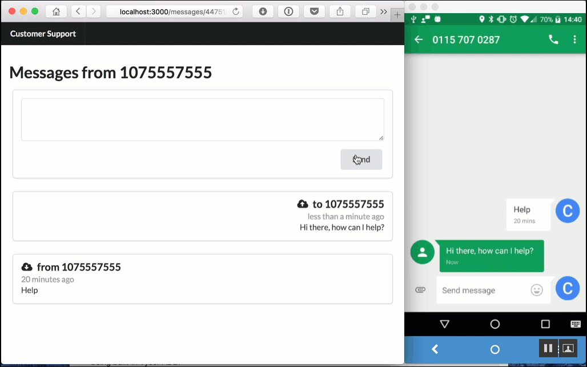
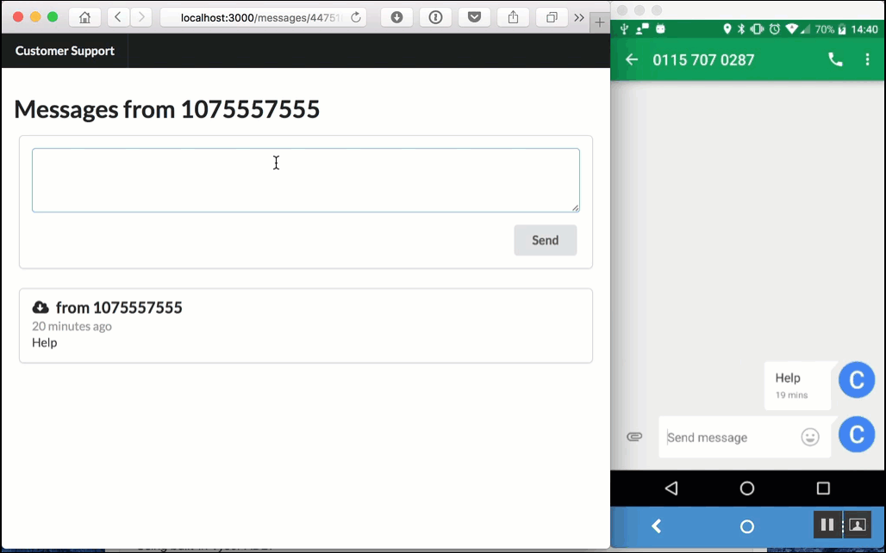

<Message> This post was originally first posted on 
the [Nexmo Developer Blog](https://www.nexmo.com/blog/2016/07/14/building-customer-service-chat-rails-5-action-cable-sms-dr/) on July 14th 2016. </Message>

[Rails 5](http://weblog.rubyonrails.org/2016/6/30/Rails-5-0-final/) shipped with some amazing new features like [Turbolinks 5](https://github.com/turbolinks/turbolinks/) and API mode, but the feature that caught our eye is the new build in WebSockets integration with the [ActionCable API](https://github.com/rails/rails/tree/master/actioncable). This new abstraction around WebSockets is baked straight into Rails and it's perfect for real-time events and two way communication. Today we're going to have a look at building a customer service experience on top of it and the [Nexmo SMS API](https://www.nexmo.com/products/sms/).

## A customer service chat client

For this tutorial we'll create a **two way customer support chat system** for a company that wants to directly communicate with their customer not only via their site but also via SMS. The web app will be the interface for the "customer support agent" and powered by ActionCable, while the customers can use their phone to send text messages straight to the support agent - all powered by Nexmo.

To make things easy we build a [starting point](https://github.com/nexmo-community/nexmo-customer-service-chat-demo) for our application and put it on Github. It's a basic Rails 5 app with a `MessagesController` for creating new messages in a thread. We provided some fake data via the seed file and a pretty UI with the help of [Semantic UI](http://semantic-ui.com).

You can download the starting point of this tutorial from Github if you want to code along.

~~~bash
git clone git@github.com:nexmo-community/nexmo-customer-service-chat-demo.git
cd nexmo-customer-service-chat-demo
bundle install
rails db:create db:migrate db:seed
bundle exec rails server
~~~

Then visit [localhost:3000](http://localhost:3000) in your browser and you should be able to comment on the existing threads but nothing will be sent via SMS just yet.

All the code for this starting point can be found on the [before](https://github.com/nexmo-community/nexmo-customer-service-chat-demo/tree/before) branch on Github. All the code we will be adding below can be found on the [after](https://github.com/nexmo-community/nexmo-customer-service-chat-demo/tree/after) branch. For your convenience you can see [all the changes between our start and end point](https://github.com/nexmo-community/nexmo-customer-service-chat-demo/compare/before...after) on Github as well.

## Nexmo SMS and Rails 5 ActionCable

The [Nexmo SMS API](https://www.nexmo.com/products/sms/) provides you with low latency and high deliverability. It is the most reliable way to reach users around the globe. While it has plenty of features we'll only be looking at two core elements: sending and receiving basic text messages and displaying them live in the web app using ActionCable.

To do this we are going to make the following changes to our app:

- Listen to incoming text messages
- Show new message in our UI with ActionCable
- Add Nexmo to our app
- Broadcast new messages from the service agent (via Nexmo)

## Incoming SMS messages

Our first step will be to add inbound SMS messages to our application. To do this we will need to get our hands on a Nexmo phone number capable of sending and receiving SMS messages.

You can buy a number from the [Nexmo Dashboard](https://dashboard.nexmo.com/settings), or you can use the [nexmo-cli](https://www.npmjs.com/package/nexmo) library and buy one straight from the command line. You can find your API credentials on [the settings page of your Nexmo account](https://dashboard.nexmo.com/settings)

For example to buy a UK phone number starting with 07:

~~~sh
> npm install -g nexmo-cli
> nexmo setup <your_api_key> <your_api_secret>
> nexmo number:buy GB 447* --confirm
Number purchased
> nexmo number:list
4475555555555
~~~

When a SMS is received by this new number Nexmo will call the webhook URL we specify. We'll create a dummy webhook for now that just returns a simple JSON response.

~~~ruby
# app/controllers/text_messages_controller.rb
class TextMessagesController < ApplicationController
  def index
    render json: { state: 200 }
  end
end
~~~

Let's also add this to our `routes.rb`.

~~~ruby
# config/routes.rb
Rails.application.routes.draw do
  resources :text_messages
  ...
end
~~~

If you now load [localhost:3000/text_messages](https://localhost:3000/text_messages) you should see a JSON response.

To make your app publicly reachable by the Nexmo webhooks you have a few options. If you are lucky enough to have a public IP on your machine you should be ready to go, for the rest of us we could either deploy the app, use an SSH tunnel, or my favorite solution: use the amazing [ngrok](http://ngrok.com/) tool.

Once your app is publicly available we can link our number to a webhook URL. Now every time an SMS is received a call will be made to this URL. For this we are again using the `nexmo-cli`.

~~~sh
> nexmo link:sms 44755555555 http://<your_url>.ngrok.io/text_messages
Number updated
~~~

If you get any errors at this state please make sure you are using the Nexmo phone number on your account, and that the webhook URL is publicly accessible.

The next step is to expand our action to take the incoming message, parse the response and save it to our database.

~~~ruby
# app/controllers/text_messages_controller.rb
def index
  message = Message.create!(
    number: params[:msisdn],
    text: params[:text],
    inbound: true
  )
  render json: { state: 200 }
end
~~~

Give it a try! Start your server (and ngrok if necessary) and send a message to your Nexmo number. Within a few seconds the message should be parsed by your app. Refresh the website to see you new message.

## Showing messages with ActionCable

Obviously we don't want to have to refresh our page every time a new message arrives and this is exactly where ActionCable comes in.

ActionCable uses channels to communicate between publishers and subscribers. In our case we're going to send the `number` and the `html` of our new message on the `messages` channel.

We'll start by adding a new line to our `TextMessagesController`:

~~~ruby
# app/controllers/text_messages_controller.rb
include ApplicationHelper

def index
  ...
  send_cable(message)
  render json: { state: 200 }
end
~~~

As you can see we extracted our publishing into a helper method as we will want to reuse this later on.

Our helper is pretty straightforward - it renders the HTML and then passes the HTML and the number to the `ActionCable.server` method.

~~~ruby
# app/helpers/application_helper.rb
def send_cable message
  html = render_message(message)
  ActionCable.server.broadcast 'messages',
    number: message.number,
    html: html
end

def render_message message
  ApplicationController.render({
    partial: 'messages/message',
    locals: { message: message }
  })
end
~~~

At the other side our frontend will want to connect to our server over a new WebSocket and listen to the `messages` channel for new messages coming in.

We start this off by mounting `ActionCable` in our routes.

~~~ruby
# config/routes.rb
Rails.application.routes.draw do
  mount ActionCable.server => '/cable'
  ...
end
~~~

This will expose a WebSocket endpoint on `http://localhost:3000/cable` that we can connect to using our Javascript as followed.

~~~javascript
// app/assets/javascripts/channels/messages.js
App.cable.subscriptions.create('MessagesChannel', {
  received: function(data) {
    // process data
  }
});
~~~

So how does Rails know that the `MessagesChannel` maps to the `messages` stream? It doesn't. We need to specify this ourselves.

~~~ruby
# app/channels/messages_channel.rb
class MessagesChannel < ApplicationCable::Channel
  def subscribed
    stream_from "messages"
  end
end
~~~

In more complicated examples you could use this to bind to specific channels based on the authenticated user, extra parameters, and much more. In our example we're keeping it simple and just subscribe to the `messages` stream.

Finally we just need to update our JS to insert the HTML we received over the cable into our UI.

~~~javascript
// app/assets/javascripts/channels/messages.js
App.cable.subscriptions.create('MessagesChannel', {
  received: function(data) {
    var list      = $('.numbers');
    var thread    = $('.thread');
    var number    = thread.data('number');
    var latest    = $('.message[data-number="'+data.number+'"]');

    // prepend to message thread
    if (thread.length &&
        data.number == number) thread.prepend(data.html);

    // prepend to list of ongoing threads
    if (list.length) {
      latest.remove();
      list.prepend(data.html);
    }

    $('.message:first').transition('flash');
  }
});
~~~

This code does a few things. First off it finds the `.thread` and `.numbers` elements. If we're on a thread for a number and we received that number we prepend the message. If we're on the `index` view of all numbers we remove the last message for this nummber and replace it with the new HTML.

To make all of this work we do need to add some data to our `.thread` and each `.message` so that we know what numbers they belong to.

~~~erb
<!-- app/views/messages/show.html.erb -->

">     
~~~

~~~erb
<!-- app/views/messages/_message.html.erb  -->
<%= link_to "/messages/#{message.number}",
      class: 'ui card message',
      data: { number: message.number } do %>
~~~

That's it for ActionCable! Start your server (and ngrok if necessary) and send a message to your Nexmo number. Within a few seconds the message should be parsed by your app and this time you do not need to refresh the website to see you new message. Instead it will show up as soon as ActionCable publishes it to the `messages` stream.

## Replying to messages

So now that we have incoming SMS working let's update our existing code to send new messages from the service agent directly to the phone number of the customer.

In order to send an SMS message via Nexmo we're going to have to add the `nexmo` gem to the project.

~~~ruby
# Gemfile
gem 'nexmo'

group :development, :test do
  gem 'dotenv-rails'
end
~~~

As you can see we also added the `dotenv-rails` gem. This is just to make things easier as it will allow the app to load our API credentials from a `.env` file. The `nexmo` gem automatically picks up those environment variables and uses them to initialize the client. You can find your credentials on [the settings page of your Nexmo account](https://dashboard.nexmo.com/settings).

~~~ruby
# .env
NEXMO_API_KEY=<your_api_key>
NEXMO_API_SECRET=<your_api_secret>
NEXMO_NUMBER=<your_phone number>
~~~

We also added our `NEXMO_NUMBER` to the `.env` file here as well.

Next let's turn our form into a `remote` form and use `ActionCable` to show the customer new submissions instead of redirecting the page.

~~~erb
<!-- app/views/messages/_form.html.erb -->
<%= form_for(@new_message, remote: true, html: { class: 'ui form error' }) do |f| %>
~~~

In our controller we will replace the redirect with something familiar.

~~~ruby
# app/controllers/messages_controller.rb
if message.save
  send_cable(message)
  send_sms(message)
end
~~~

The `send_cable` is our ActionCable publisher from before, and the `send_sms` will be implemented next.

Before we continue though let's create a `create.js.erb` so that our action doesn't complain about a missing view. We'll use this view to also empty our `textarea` when the form is submitted.

~~~js
// app/views/messages/create.js.erb
$('textarea').val('');
~~~

Finally let's send the SMS to the right number with the message from the support agent.

~~~ruby
# app/helpers/application_helper.rb
def send_sms message
  Nexmo::Client.new.send_message(
    from: ENV['NEXMO_NUMBER'],
    to: message.number,
    text: message.text
  )
end
~~~

That's it, you should now have full 2-way SMS to Rails messaging in place with he help of Nexmo and Rails 5's ActionCable. Restart your server if needed and send yourself some messages to see it all in action.

## Next steps

Obviously we skipped a lot of cool things both in ActionCable and the [Nexmo SMS API](https://www.nexmo.com/products/sms/). We haven't authenticated the customer service agent, and we didn't provide a web UI for the customer - which would be interesting to build on top of the [Nexmo Verify API](https://www.nexmo.com/products/verify/).

I'll be playing with [Turbolinks 5](https://github.com/turbolinks/turbolinks/) next to see if I can build this into a native mobile experience. I'd love to know what you'd add next? Please drop me a tweet (I'm [@cbetta](https://twitter.com/cbetta)) with your thoughts and ideas.
