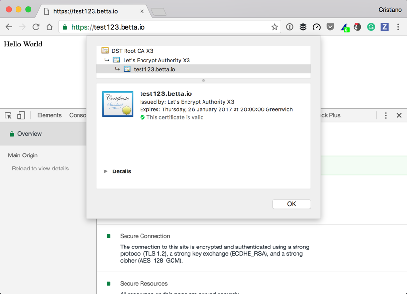
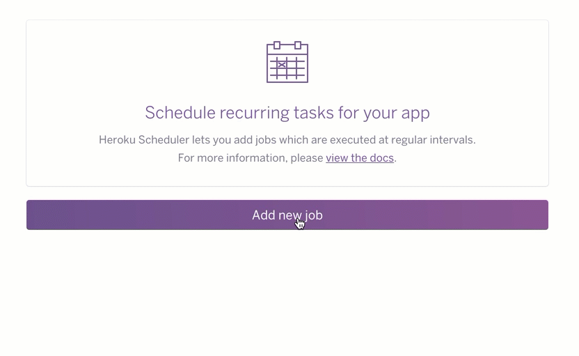

This is a short and straightforward tutorial showing how to use [Sinatra](http://www.sinatrarb.com/) on [Heroku](https://heroku.com) with an auto-renewing SSL certificate from [LetsEncrypt](https://letsencrypt.org/).

LetsEncrypt is awesome as it believes security should be built into the web without any extra cost.

The code for this demo is on [Github](https://github.com/cbetta/sinatra-lets-encrypt-heroku-demo). There is both a `before` and `after` branch with the code before and after I added SSL respectively.

## What we will cover

* [Create a basic Sinatra app](#create-a-basic-sinatra-app) that shows a basic `Hello World` message
* [Deploy to Heroku](#deploy-to-heroku) will allow us to see the app in action before we add SSL.
* [Add LetsEncrypt](#add-letsencrypt) capabilities to the application.
* [Configure the certificate](#configure-the-certificate) to match our domain, before we can create it.
* [Create a certificate](#create-a-certificate) and automatically store it with Heroku.
* [Enforce SSL](#enforce-ssl) so the site can no longer be served over `http`.
* [Schedule renewal](#schedule-renewal) of the certificate so you never have to get involved again.

## Create a basic Sinatra app

Let's start with a simple [Sinatra](http://www.sinatrarb.com/) app.

We start with the `sinatra` gem and bundle.

```ruby{1-2,4}
# Gemfile
source 'https://rubygems.org'

gem 'sinatra'
```

With this we can implement a simple `Hello, World` application.

```ruby
# app.rb
require 'sinatra'

get '/' do
  "Hello World"
end
```

## Deploy to Heroku

Heroku by default looks for a `config.ru` for `Rack` apps.

```ruby
# config.ru
require 'app'
run Sinatra::Application
```

Let's make sure we add this to `git`.

```ruby
git init
git add .
git commit -m "A Sinatra application"
```

Next let's create the Heroku app and deploy our Sinatra app to the server.

```ruby
> heroku create
Creating app... done, ⬢ intense-ridge-63161
https://intense-ridge-63161.herokuapp.com/ | https://git.heroku.com/intense-ridge-63161.git
> git push heroku master
```

If we run `heroku open` we should our simple `Hello World` app on a Heroku URL.

## Add LetsEncrypt

LetsEncrypt is pretty cool. A core idea is that you run it on your server, generate the SSL certificate right on the server, verify your domain, and automatically install the SSL to your server's SSL endpoint.

All of this will be fully automated, no more need to buy SSL certificates and fiddle around with the settings.

Are you sold yet? Let's get started!

Add the following gems and bundle.

```ruby
# Gemfile
gem 'rake'
gem 'platform-api', github: 'jalada/platform-api', branch: 'master'
gem 'letsencrypt-rails-heroku', github: 'cbetta/letsencrypt-rails-heroku'
```

Although the [`letsencrypt-rails-heroku`](https://github.com/pixielabs/letsencrypt-rails-heroku) gem's name says `rails` believe me it works great with Sinatra, although for now there are some patches in my version that I hope will be merged soon.

We also import a specific version of the `platform-api` gem, as we depend on some very new features on Heroku.

Next we want to add a `Rakefile` to our app. We import the LetsEncrypt `rake` tasks we will need later.

```ruby
# Rakefile
require 'letsencrypt-rails-heroku'
Letsencrypt.configure
spec = Gem::Specification.find_by_name 'letsencrypt-rails-heroku'
load "#{spec.gem_dir}/lib/tasks/letsencrypt.rake"
```

Finally we add some middleware in our application. Make sure to add this somewhere before your first routes.

```ruby
# app.rb
require 'letsencrypt-rails-heroku'

Letsencrypt.configure
use Letsencrypt::Middleware
```

We add these changes to our repository and push them to Heroku.

```bash
git add .
git commit -m "Add LetsEncrypt"
git push heroku master
```

## Configure the certificate

To roll our first LetsEncrypt certificate we will want to make sure our custom domain is pointed to our server somehow. In this case I will add `test123.betta.io`.

```bash
> heroku domains:add test123.betta.io
Adding test123.betta.io to ⬢ intense-ridge-63161... done
 ▸    Configure your apps DNS provider to point to the DNS Target
 ▸    intense-ridge-63161.herokuapp.com.
 ▸    For help, see https://devcenter.heroku.com/articles/custom-domains
```

Check your shell for the **DNS Target** created for you. Mine is `intense-ridge-63161.herokuapp.com`. Configure your domain to point to this target with a `CNAME` record.

**Note!** Use a very short TTL here as you will be changing this soon again.

Wait for your DNS to resolve, give it a try in the browser and ensure your domain is set up correctly.

Next run the following command to add some environment variables to Heroku.

```sh
heroku config:add ACME_DOMAIN=test123.betta.io
heroku config:add ACME_EMAIL=test@betta.io
heroku config:add HEROKU_APP=intense-ridge-63161
```

* `ACME_DOMAIN` the domain you want to request an SSL certificate for
* `ACME_EMAIL` any email you actually own
* `HEROKU_APP` the name of the Heroku application you created

We also need to set up a token to allow our app access to the Heroku API so that it can update the SSL certificate automatically.

```bash
> heroku plugins:install heroku-cli-oauth
> heroku authorizations:create -d "LetsEncrypt"
Creating OAuth Authorization... done
Client:      <none>
ID:          12312312-1233-2133-2333-213123312321
Description: LetsEncrypt
Scope:       global
Token:       43534554-4355-3455-3455-334534345355
> heroku config:add HEROKU_TOKEN=43534554-4355-3455-3455-334534345355
```

## Create a certificate

One last thing we need to do before we can roll our first certificate is to ensure we are not running a free dyno. Heroku does not support SSL on free dynos as they are not running 24/7.

The cheapest dyno is a hobby dyno ($7/month).

```bash
heroku dyno:type hobby
```

Now with all of this in place we can create our certificate.

```bash
> heroku run rake letsencrypt:renew
Running rake letsencrypt:renew on ⬢ intense-ridge-63161... up, run.5438 (Hobby)
Creating account key...Done!
Registering with LetsEncrypt...Done!
Performing verification for test123.betta.io:
Setting config vars on Heroku...Done!
Giving config vars time to change...Done!
Testing filename works (to bring up app)...Done!
Giving LetsEncrypt some time to verify...Done!

Adding new certificate...Done!
```

It worked!

We need to change our DNS Target though as this certificate has just added a new endpoint that we can use.

You can check your new DNS Target with this command.

```bash
> heroku domains
=== intense-ridge-63161 Heroku Domain
intense-ridge-63161.herokuapp.com

=== intense-ridge-63161 Custom Domains
Domain Name       DNS Target
────────────────  ──────────────────────────────
test123.betta.io  test123.betta.io.herokudns.com
```

Change your DNS record to point to new DNS target. This time you can set the TTL to a longer value.

Once you have done this verify your `https` works by visiting your site. You can verify your certificate is indeed provided by LetsEncrypt.



## Enforce SSL

With SSL in place we are not quite there yet as the site is still available over `http` as well. We will need to add some code to ensure `http` requests are redirected to `https`.

For this demo we will use the [`rack-ssl-enforcer`](https://github.com/tobmatth/rack-ssl-enforcer) gem.

```ruby
# Gemfile
gem 'rack-ssl-enforcer'
```

We add the `Rack::SslEnforcer` middleware to our app, ensuring to load it **after** the `LetsEncrypt` middleware.

```ruby
require 'rack/ssl-enforcer'

use Letsencrypt::Middleware
use Rack::SslEnforcer if production?
```

Finally we deploy our changes to Heroku.

```bash
git add .
git commit -m "Enforce SSL"
git push heroku master
```

Now hit your website on `http` and it should automatically redirect to `https`.

## Schedule renewal

The final step is to set up auto-renewal of your certificate. LetsEncrypt certificates expire every 90 days but it's recommended to do this sooner. Luckily we can completely automate this process using the [Heroku Scheduler add-on](https://elements.heroku.com/addons/scheduler).

We start by adding the scheduler to our app.

```bash
heroku addons:create scheduler:standard
heroku addons:open scheduler
```

On the scheduler we add a new job. We add a little check to ensure we only run this once a month, as LetsEncrypt will otherwise rate limit you.



The command we filled in is the following.

```bash
if [ "$(date +%d)" = 01 ]; then rake letsencrypt:renew; fi
```

## Conclusion

That's it. although this tutorial is relatively long the code is actually really simple. The full code for this demo is on [Github](https://github.com/cbetta/sinatra-lets-encrypt-heroku-demo). There is both a `before` and `after` branch with the code before and after I added SSL respectively.