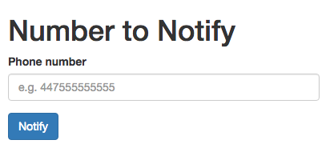
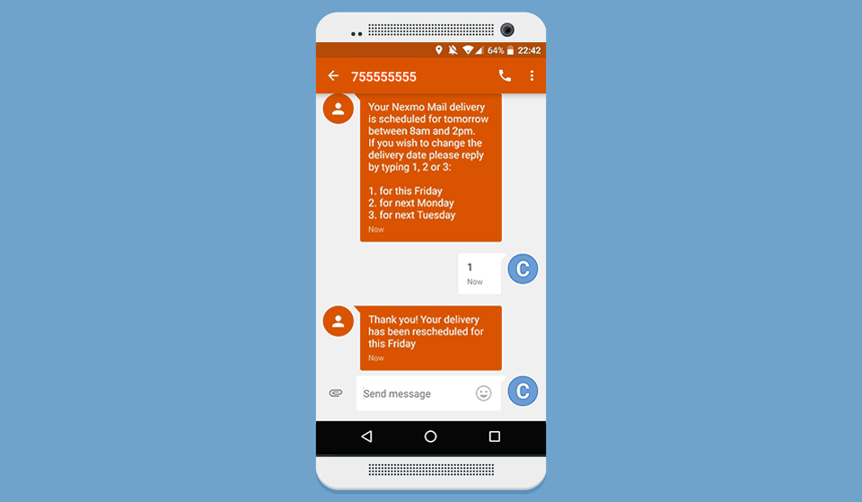

> This post was originally first posted on
  the [Nexmo Developer Blog](https://www.nexmo.com/blog/2016/09/29/building-interactive-delivery-notifications-system-using-expressjs-dr/) on September 29th 2016.

One of the amazing things about SMS is how ubiquitous it is. Wether you have a smartphone or an old '90s "dumb" phone you will be able to send and receive SMS messages. While many companies use them as a notification service only, they become **really** powerful when they facilitate a two way communication channel between companies and customers.

## Notifications for a package delivery company

For this tutorial we'll create an **interactive notifications system** for a package delivery company. For this purpose we've created a simple **"Nexmo Mail"** app that allows an employee of the delivery company to type in a phone number and notify a recipient of a package that will be delivered.

{:.ui.image.bordered}

This app serves as our starting point for this tutorial. It is a basic [Express](https://www.npmjs.com/package/express) app, written in Javascript with a few extra modules to make things easier. We've added the [`body-parser`](https://www.npmjs.com/package/body-parser) module to parse our form submissions, and we added [Bootstrap](http://getbootstrap.com) to make our UI look a bit more attractive. Finally, we added some [`babel`](https://www.npmjs.com/package/babel-cli) modules so that we can write modern [ES2015](https://babeljs.io/docs/learn-es2015/)-flavored Javascript.

You can download the starting point of this tutorial from Github:

~~~sh
git clone git@github.com:nexmo-community/nexmo-express-delivery-notifications-demo.git
cd nexmo-express-delivery-notifications-demo
npm install
npm start
~~~

Then visit [localhost:3000](http://localhost:3000) in your browser and submit a phone number in international format, e.g. `447755555555`.

All the code for this starting point can be found on the [number-form](https://github.com/nexmo-community/nexmo-express-delivery-notifications-demo/tree/number-form) branch on Github. All the code we will be adding below can be found on the [delivery-notifications](https://github.com/nexmo-community/nexmo-express-delivery-notifications-demo/tree/delivery-notifications) branch. For your convenience you can see [all the changes between our start and end point](https://github.com/nexmo-community/nexmo-express-delivery-notifications-demo/compare/delivery-notifications...number-form) on Github as well.

## The Nexmo SMS API

The [Nexmo SMS API](https://www.nexmo.com/products/sms/) provides you with low latency and high deliverability. It is the most reliable way to reach users around the globe. While it has plenty of features we'll only be looking at two core elements: sending and receiving basic text messages. We will use this API to send people a notification of their delivery, offering them to change their delivery slot, and listen to any changes they send to us. To do this we are going to add the following changes to our app:

- Add Nexmo to our app
- Send an SMS message to the number provided with their delivery slot and instructions on how to change their slot
- Listen to and confirm incoming text messages from the user to change their slot

We will be hardcoding the options in our app just to keep things simple. In your app you will obviously be determining the user's options based on some amazing machine learning algorithm you've personally invented.

## Adding Nexmo to our app

In order to send an SMS message via Nexmo we're going to have to add the [nexmo](https://www.npmjs.com/package/nexmo) module to the project.

~~~javascript
npm intall nexmo dotenv --save
~~~

As you can see we also added the [dotenv](https://www.npmjs.com/package/dotenv) module. This is just so that the app can load the API credentials from a `.env` file. You can find your credentials on t[he settings page of your Nexmo account](https://dashboard.nexmo.com/settings).

~~~yml
# .env
KEY='<your_api_key>'        
SECRET='<your_api_secret>'        
FROM='<phone_number>'
~~~

We also added the Nexmo phone number that we will be sending an SMS message from to the `.env` file. You can buy a number from the [Nexmo Dashboard](https://dashboard.nexmo.com/settings), or you can use the [`nexmo-cli`](https://www.npmjs.com/package/nexmo) library and buy one straight from the command line.

For example to buy a UK phone number starting with `077`:

~~~sh
npm install -g nexmo-cli
nexmo setup <your_api_key> <your_api_secret>
nexmo number:buy GB 4477* --confirm
~~~

Now that we have our API key, secret, and Nexmo phone number we initialize the Nexmo client.

~~~javascript
// app.js - after the other imports
import Nexmo from 'nexmo';        
import dotenv from 'dotenv';        

dotenv.config();

const nexmo = new Nexmo({        
  key: process.env.KEY,        
  secret: process.env.SECRET        
});
~~~

From now on we can use `nexmo` anywhere in our app to make the API calls we need.

## Sending an SMS message

Currently when the employee submits a phone number it calls the `POST /notify` endpoint which simply outputs a text confirmation in the browser. We will need to add some code to send an SMS message with the planned delivery slot, and a list of options for them to choose from.

Let's hardcode some options for the user to change their delivery slot to.

~~~javascript
// app.js - after the previous code
const options = [        
  'this Friday',        
  'next Monday',        
  'next Tuesday'        
];
~~~

We can use these options to generate a pretty text message to send to the user.

~~~javascript
// app.js - after the previous code
let notification = "Your Nexmo Mail delivery is scheduled for tomorrow between " +        
                   "8am and 2pm. If you wish to change the delivery date please " +        
                   "reply by typing 1, 2 or 3:\n\n";        

options.forEach((option, index) => {        
  notification += `${index+1}. for ${option}\n`;        
});
~~~

**Note:** We didn't hardcode the whole message here as we will need these options later on again.

Next up all we need to do is send the message to the phone number that was submitted.

~~~javascript
// app.js         
app.post('/notify', (request, response) => {         
  send(request.body.number, notification); // adding this line
  response.send('Notification sent');
});
~~~

We wrapped the actual Nexmo API call in a `send` function just to make things more readable and reusable. The `send` function wraps the `nexmo.sms.sendTextMessage` API and prefills the Nexmo phone number we bought before.

~~~javascript
// app.js - anywhere outside of an endpoint call      
let send = function(number, message) {        
  nexmo.sms.sendTextMessage(        
    process.env.FROM,        
    number,        
    message        
  );        
}
~~~

If you now try and resubmit your own mobile number you should get a text message within seconds.

## Incoming Messages

Our final trick is to receive an incoming message from the user replying to our earlier text message. To do this we are going to have to make our app available publicly to a Nexmo webhook.

Let's start by adding a dummy endpoint for the webhook to call.

~~~javascript
// app.js
app.get('/response', (request, response) => {        
  // TODO: Confirm selection
  response.send('Response processed');        
});
~~~

To make your app publicly reachable by the Nexmo webhooks you have a few options. If you are lucky enough to have a public IP on your machine you should be ready to go, for the rest of us we could either deploy the app, use an SSH tunnel, or my favorite solution: use the amazing [ngrok](http://ngrok.com) tool.

Once your app is publicly available we can link our number to make a call to this endpoint when a SMS has been received. For this we are again using the `nexmo-cli`.

~~~sh
> nexmo link:sms 44755555555 http://<your_url>.ngrok.io/response
Number updated
~~~

If you get any errors at this state please make sure you are using the Nexmo phone number on your account, and that the URL is publicly accessible.

Our last step is to expand our endpoint to take the incoming message, parse the response, check if it contains one of our options, and sends another text message to confirm their selection.

~~~javascript
// app.js
app.get('/response', (request, response) => {        
  // TODO: store this selection somewhere in your database

  // parse the message the user sent us
  const selection = parseInt(request.query.text) - 1;        
  const day = options[selection];    

  // by default we will warn them to send us a valid response
  let message = "Please select from one of the valid options only.";   

  // if the response was valid though we confirm the selection
  if (day) {        
    message = `Thank you! Your delivery has been rescheduled for ${day}`;        
  }        

  send(request.query.msisdn, message);        
  response.send('Response processed');        
});
~~~

Now try replying to the message you received earlier. It might take a few seconds depending on your internet connection but you should get a confirmation in seconds. Also try and reply with some random text and see what happens.

## Next steps

The [Nexmo SMS API](https://www.nexmo.com/products/sms/) has a lot [more options](https://docs.nexmo.com/messaging/sms-api/api-reference#request) than I showed here including MMS, Flash Messages, vCard, vCal and much more. Personally I really like how easy the [`nexmo-cli`](https://github.com/nexmo/nexmo-cli) make it to buy phone numbers and tie them to an endpoint.

I'd love to know what you'd add next? Please drop me a tweet (I'm [@cbetta](https://twitter.com/cbetta)) with your thoughts and ideas.
