This is the fourth in a series of articles focussing on reviewing [Developer Onboarding](https://betta.io/blog/categories/developer-onboarding/). In this post I'm looking at the onboarding offered by [Twilio](https://twilio.com/).

## Criteria

I will be looking at 3 aspects of the developer onboarding experience:

1. **Exploration**: Does the experience help me to understand or try out their product before signing up for an account?
2. **Onboarding &amp; Integration:** How well does the product guide me from their main site to create an account and to make that first API call or integration?
3. **Reference:** Once I have my first integration in place, how hard is it to find the full reference documentation for the API call I made?

## Twilio

#### _Build apps that communicate with everyone in the world_

<Youtube id="LUAt8vw1Wys"></Youtube>

> Twilio (pronounced TWILL-e-o) is a cloud communications platform as a service (PaaS) company based in San Francisco, California. Twilio allows software developers to programmatically make and receive phone calls and send and receive text messages using its web service APIs. - [Wikipedia](https://en.wikipedia.org/wiki/Twilio)

Twilio is one of the companies most famous for having an excellent Developer Experience. Their reputation as a "developer first" company is well established.

## Exploration

My first step is to try and learn what it would be like to use Twilio before I sign up. Let's visit their main site.

I love this simple design. They get straight to the point and explain what they do in plain English. No marketing terms, no jargon, just a simple proposition: APIs for communication.

Twilio has done an excellent job at hiding the complexities of their product line up under a menu that only those of us who know what we are looking to achieve will be able to find and need.

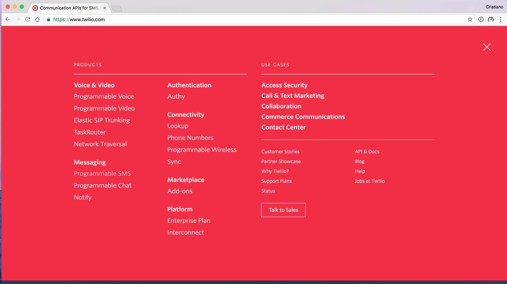

Rather than talking about SIP, TaskRouter, Network Traversal, or any other industry jargon on their frontpage they keep it to a minimum. Yes it's there, but for those of us new to the platform the messaging is clear and to the point.

Even this menu is pretty straightforward. Links are split in products and use-cases, allowing one to pick our own adventure. Products are split into their separate categories as well.

I follow the __Messaging__ link and eventually end up on a page describing the SMS API.

This is a perfect **Demo Unit**, it achieves the most essential goals.

1. It shows a working sample of the code
2. It shows what the code to implement the sample would look like
3. It does not require any development skills to experience the sample

## Onboarding

At this point I'm happy to  continue so I click the big orange button to get started. It takes me to the sign up form.

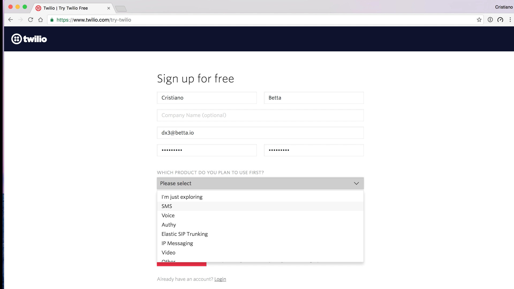

Twilio's sign up form asks some very important questions that I love:

* What product do you plan to use first?
* What are you building?
* Choose your language

These answers can help them better cater their onboarding experience to me. It's good to see that every question also has an option to answer it with "I don't know".

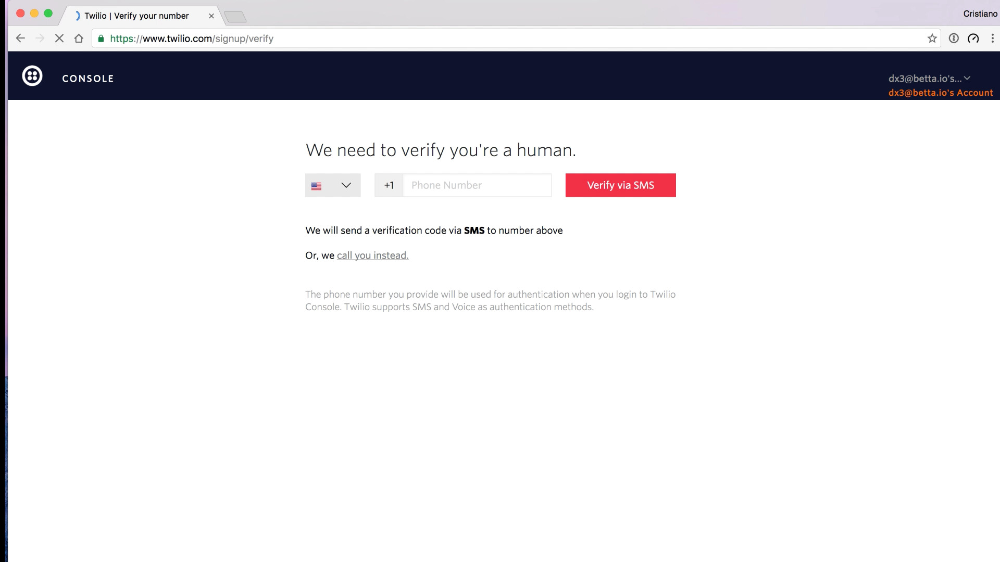

Rather than verifying my email, Twilio verifies my mobile phone number. They do this to battle spam and it allows a new user to directly start sending with a trial account to that number, and that number only.

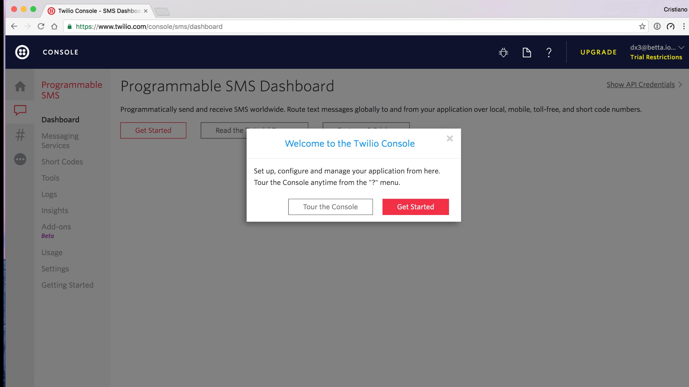

Once confirmed I am presented with a rather excellent first use experience. It tries to cover a few things:

1. It explains the dashboard to me
2. It gets me started with my first implementation

I take a tour of the console.

I get a few tooltip explanations of where to find what I need. Interesting, but I always feel like these kind of tooltips are a sign of an overcomplicated, confusing UI. If you need them you need to review your UI, not provide more instructions.

## First Use Experience

After the quick introduction to the console I __Get Started__ with my first implementation.

Because I answered __SMS__ as my "Product I'd use first" when I signed up, I directly get presented with an SMS tutorial.

The first step is to buy a phone number. There's little explanation as to why, but I kinda like that. I assume they know and they are showing by example.

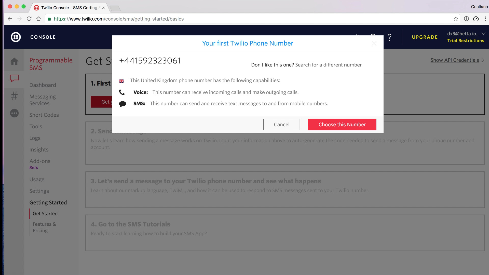

Cool, I have a new phone number! I even get to change the number if I want, but I don't really care so I continue. Interestingly here the explanation as to why I need a number does show up.

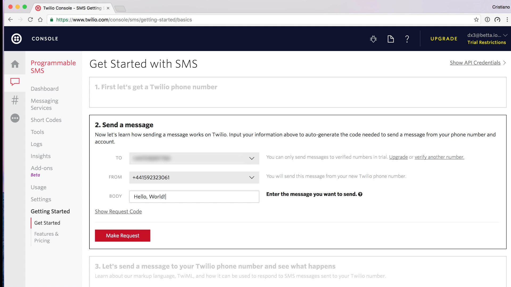

On to the next step: sending a message. I'd like to point out that all this time it's clear to me that this is a 4 step process, and I'm now at step 2.

What's interesting here is that this is not a step where I get to implement some code, instead I can use their console to send an SMS. I need to expand the code sample to see the code I'd need to produce this step myself.

And here is probably the most disapointing thing of the Twilio onboarding experience. This code sample is extremely basic and could be so much better:

1. Add some syntax highlighting
2. Automatically select Ruby for me, as I did specify that as my language when I signed up
3. Insert my API credentials in the code
4. Insert my Twilio phone number in the code

Instead I copy paste this code into my text editor and continue with the click-demo instead.

Next up a bit about receiving SMS and replying to them. This is the first flow chart I've seen so far. I tend to hate these when they are presented too early, due to information overload, but this one seems to be well timed.

I try out the demo they provided, I send an SMS to my Twilio phone number and promptly get a reply.

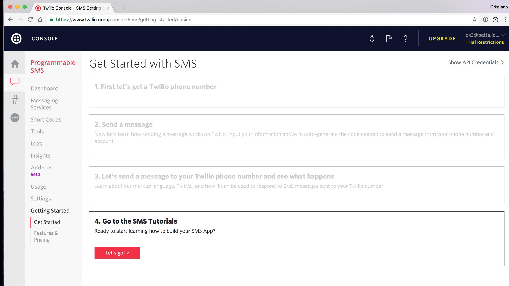

Step 4 turns out to not really be a step at all - I like this, always under sell and over deliver your product's simplicity. Instead it just sends us to the vast documentation Twilio provides.

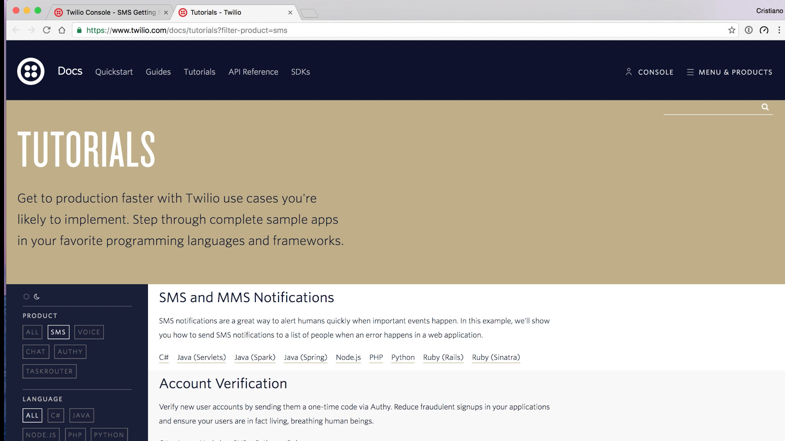

## Integration

I copy-pasted some code earlier and I want to quickly test and see if I can make it work on my machine. What I need though is my Twilio phone number and API credentials. It took me a moment to realise that the __#__ icon represents the __numbers__ section, but once I saw it I figured out where to find my number. I do wish this sidebar would just have text on it though. It would just be way more obvious.

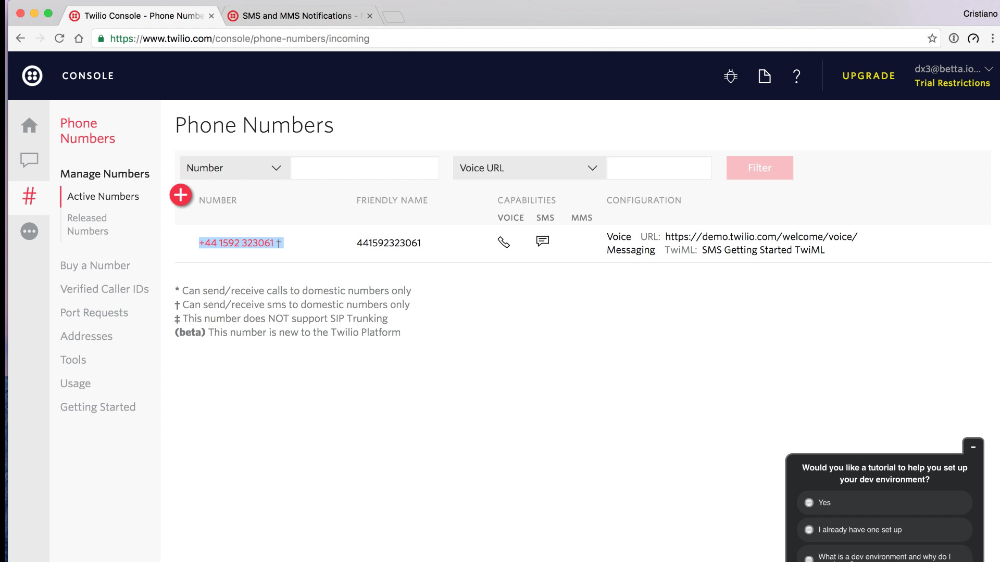

Surprisingly in the whole onboarding process I have not been presented with my API credentials, and the phone numbers screen does not have it either. I click around randomly and eventually spot a __Show API credentials__ link in the top right corner.

I click on that link and boom, my API credentials.

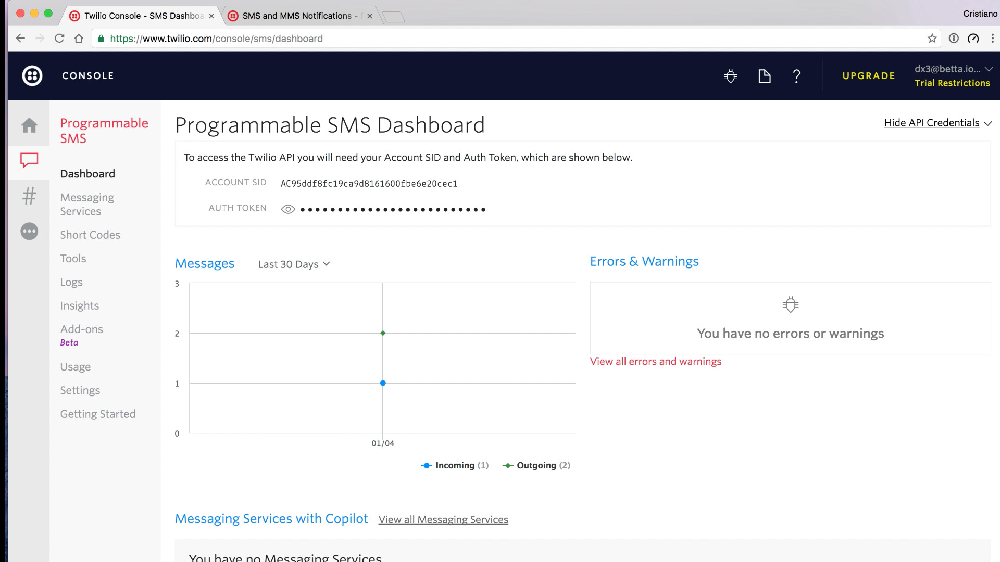

With this in place I run my code, install the Twilio gem, and run the code again, and promptly I receive the SMS message I expected.

## Reference

My next step is to see what exactly the arguments and return types are for the SMS API. I click on the docs icon on the dashboard and end up on the API reference.

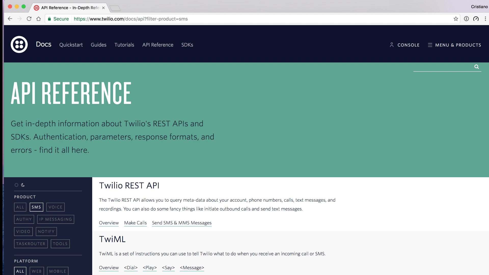

I spot the __Send SMS & MMS Messages__ link under the __Twilio REST API__ header and click on it to continue.

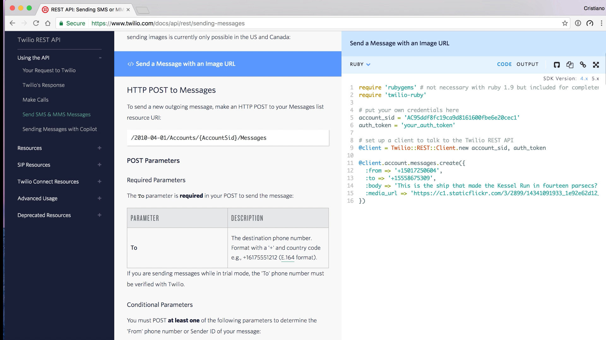

This page has a lot of detail on the arguments this API takes: the recipient, the message, and a various array of optional other arguments. It pairs this with some Ruby code, I'm not sure if this is because of my earlier choices or not.

What it's missing though is the response I can expect from this API. It's not obvious and there's no clear links to the documentation for this either.

Eventually I spot the __Output__ link next to the code.

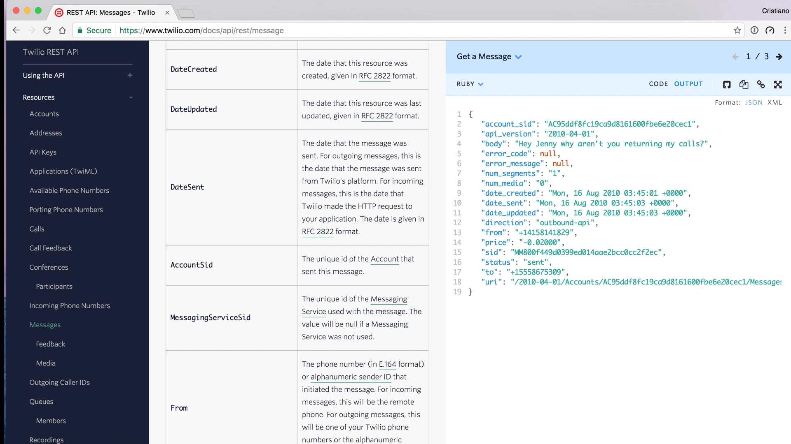

That's the actual message object that's returned. It's not labeled as such in the API, but I figure it must be after clicking around the REST API reference documentation for a bit and finding the __Message__ resource.

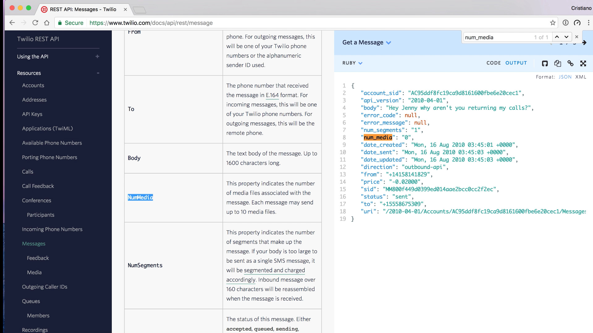

In this resource every attribute of the response is described, though one note would be to point out that the names do not match 100% due to the documentation being written for the XML response, not the JSON response. It's not too hard to go from __snake_case__ to __CamelCase__ though.

I wondered if I was in the wrong place for the kind of documentation I was looking for, so I quickly went over to the Twilio Ruby gem on Github, to see if those docs provided the right kind of links. Sadly those docs were equally as sparse, not pointing to any reference docs from the samples at all.

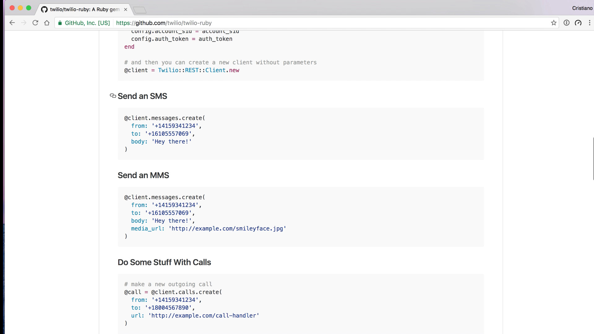

## Emails

Finally I want to highlight the email I eventually received from Twilio.

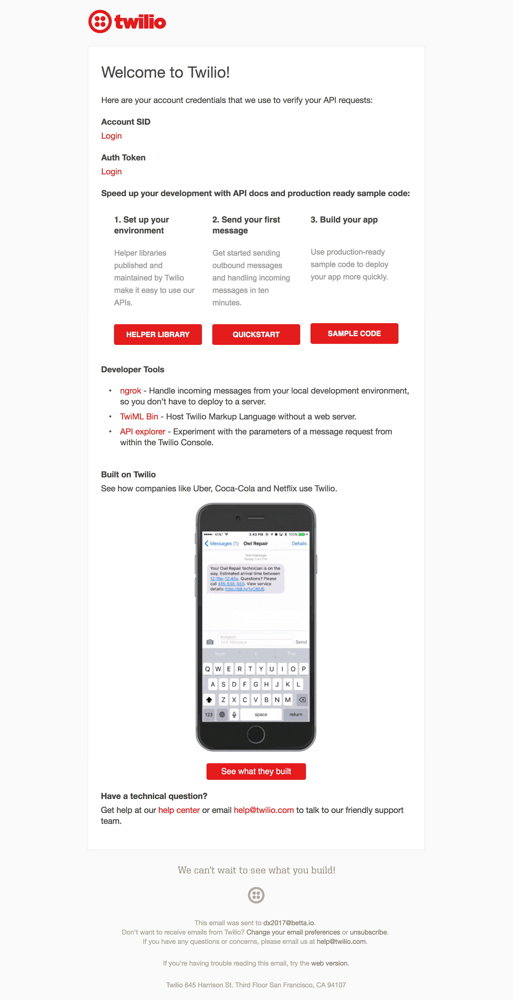

Interestingly here I finally get presented with links to my API credentials. It also features a few segments to give someone who did not finish the __Get Started__ guide another chance to get started.

I love how this email also provides links to some very useful non-Twilio essentials like Ngrok.

## Conclusions

> ★★★★
>
> Almost flawless

Twilio is an example of a developer product that offers a wide variety of solutions within a certain industry.  Twilio's first-use experience is not perfect but still much more advanced than I've seen in many other places.

### The good

* The __demo unit__ is a great example of how to combine a click-demo with some actual code, without requiring someone to do an actual implementation at that point.
* The onboarding and first use experience is excellent, focussing on just the use case I specified when I signed up. The step by step guide takes me through all the important steps, handling a few variations of my use case (sending, and receiving SMS).
* Overall most of the documentation, dashboard, and first use experience has been kept low on jargon, and has very clear messaging.

### The bad

* It's really hard to find a good code sample to demonstrate how the API would work from the frontpage. Every time I tried I either landed on the documentation, which was too in-depth, or on more marketing pages. The demo unit I eventually did discover required 3 non-obvious clicks to get to.
* The first-use-experience, though a great way to show what Twilio is, does not really force someone to do an implementation. It's mostly just a click-demo with some code on the side.
* Where the first-use-experience does provide some code, it's not syntax highlighted, does not insert any actual API keys, nor does it insert the Twilio phone number just purchased.
* The reference docs are extensive, but it would be great to see links from API calls to some documentation on the expected output.

## Next

That's it for this fourth post on [Developer Onboarding](/blog/categories/developer-onboarding/). Let me know in the comments below what you think of this post and if I should continue. I'd also love to know what company you think I should review next.

