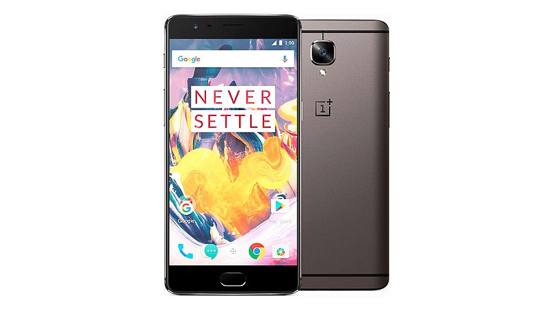
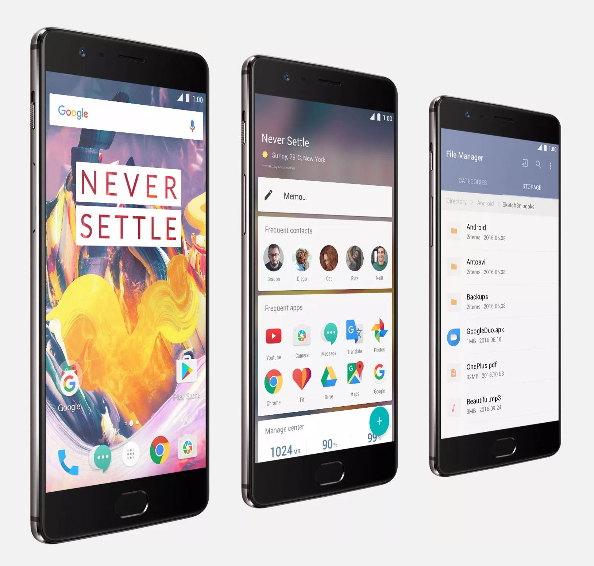

In November I bought a new phone, the [OnePlus 3T](https://oneplus.net/). Before this I had a __OnePlus X__, the very underwhelming but sturdy little brother in the OnePlus range. If you're not familiar with OnePlus let me introduce them for you: they are a Chinese mobile phone manufacturer founded in 2013 that mostly prides itself in selling powerful but relatively cheap phones to the international market. Their slogan is "Never Settle".

## Why upgrade?

My main reason to upgrade was that the __OnePlus X__, though cheap, did settle on a lot of things: not enough memory, battery, or CPU, and a total lack of exciting features like NFC payments and finger print unlock.

In November 2016 the OnePlus 3T was announced as a minor upgrade of the OnePlus 3, the former flagship model in the OnePlus range.

## The good

### 👍 Price

One of the main reasons to buy a OnePlus phone in general is the pricing. Where the OnePlus 1 and 2 were dirty cheap, the 3 and 3T are a bit pricier but still bargains. The 3T starts at £399 for the 64GB model, and the 128GB model will set you back £439.

Compare this to the iPhone 7 or Google Pixel, where the 128GB model will cost you whopping £699!

### 👍 Memory + CPU

I've owned a few Android phones in the past and let me tell you a secret: Android is very RAM hungry compared to iOS. Seriously, iOS will run just fine on 2GB RAM but Android will barely cope on 3GB.

When a phone runs out of RAM, it needs to start swapping memory to the internal storage. This is slow, and even slower when the internal storage is slow as well. Most manufacturers cut cost by reducing the RAM and internal storage. Don't fall for this scam!

The OnePlus 3T has 6GB of RAM, and fast and plentiful internal storage. I can now run Pokemon Go, Spotify, and Nike Running Club, and some other apps side by side without one of these constantly being killed when I switch apps. On the OnePlus X (3GB RAM) this was definitely an issue.

### 👍 Build in storage

Another thing nobody seems to talk about is that __expandable storage__ on Android through micro SD cards __is a scam__!

It sounds like such a good idea: buy a phone with 8GB of storage, buy a 64GB micro-SD card on Amazon, and you just saved yourself a few hundred quid. Sadly, expandable storage on Android is and always has been a disaster. Since Android M we finally have unified storage but I still occasionally ran out of space for apps even though I had plenty of space left on my SD card.

Let me make it clear: Android with expandable storage is a disaster. Don't buy a phone without enough build in storage for all your apps, photos and music. It's a scam. It's manufacturers selling you a useless device because it's easier for them to bring the price down by skimping on the storage than it is to convince you to pay for what you need.

### 👍 Battery life + Dash Charge

The battery life of this phone is pretty damn good. I can easily make it a day without recharging, and I really do tend to use my phone a lot during the day.

When your battery does run out "Dash Charge" has your back. Their proprietary quick charge technology has your battery back up to more than 60% in about 30 minutes. The only problem here really is that you need to rely on their proprietary cables and charges. More on this further down below.

### 👍 USB-C

I love USB-C. Yes, it's yet another connector which means you immediately need to buy a few extra cables for all the places where you need one, but damn they're nice.

You no longer need to wonder which way the cable has to go in. No more being afraid you might damage your phone by trying to push in a cable the wrong way around. And like the Lightning cables from Apple, these USB cables snap into place with a very satisfying "click".

I've had many micro-USB cables over the year and I've never been satisfied with how they fit into place. Over time it always seemed like they got looser and looser. None of that here.

### 👍 Fingerprint unlock

I used to have an iPhone and I loved the fingerprint unlock feature. Now, this has come to OnePlus and it's amazing. No more typing passwords (for most things). Just unlock and go.

## The OK

### 👌 NFC

Having NFC build in for Android Pay (or in my case Amex Pay) is awesome. I can quickly tap in and out on the London underground without finding my wallet.

Sadly since the last software update this has become rather unreliable and I have switched back to my bank card. I am not sure if this is a hardware issue or a software issue. I need to come back this this on a later date.

### 👌 Camera

The camera is good but not great. My wife has an iPhone SE and it takes amazing photos. The OnePlus 3T in comparison is just "OK". One problem I've run into is that I often start with a sharp preview, but then when I hit the shutter button I end up with a blurred photo. I am not sure if this is my own fault or the phone.

For some recent photos taken with the OnePlus 3T see [my Instagram feed](https://www.instagram.com/cristiano_betta/) and photos tagged with [#shotononeplus3t](https://www.instagram.com/explore/tags/shotononeplus3t/) on Instagram.

{:.ui.image.fluid}

__Note:__ both the front and back camera on the OnePlus 3T are 16MP, which makes the phone great for selfies.
{:.ui.message}

### 👌 OxygenOS

Rather than shipping with (the now discontinued) CyanogenMod or vanilla Android, OnePlus has developed their own OS: __OxygenOS__. It has it's own minor UI  customisations though mostly it just looks like plain Android.

With a custom launcher  installed ([Google Now Launcher](https://play.google.com/store/apps/details?id=com.google.android.launcher), or [Nova Launcher](https://play.google.com/store/apps/details?id=com.teslacoilsw.launcher)) most of the customisations from OnePlus disappear. I've used CyanogenMod for years and with Nova installed on OxygenOS I can barely tell I'm not on CyanogenMod.

As nice as OxygenOS is though, I wish OnePlus would just ship vanilla Android to their phones. The OnePlus 3T came out in November with Android M (6) installed. It only got Android N (7) on December 31st. For reference: Android N was officially released in August.  We're still waiting for the 7.1 update and the Google Pixel has already received this update months ago.

## The bad

### 👎 Dash Charge accessories

Although Dash Charge is awesome and allegedly outperforms Quick Charge 3.0 (QC3), it is proprietary technology. This means that in order to get the fast recharge speeds you need to use not only their charger but also their USB-C cable!

I'm happy to buy their cable, but I'm sad there's no Dash Charge compatible powerbank, not even in their own store! I wish they had just stuck to QC3, even if it's a little less fast, as there are plenty of cheap chargers that support QC3.

By the way, if you're interested in what makes Dash Charge different [have a look at this video](https://www.youtube.com/watch?v=mpQIDeu1DCE) from OnePlus.

### 👎 Screen protectors

There are plenty of screen protectors available for the OnePlus 3T. I bought two: [a StyleSwap cover](https://oneplus.net/uk/oneplus-2-styleswap-cover) and an [Otterbox case](https://oneplus.net/uk/otterbox-case-for-oneplus-3-3t) for when I'm running.

Now for the stupid part: I also bought the [Tempered Glass Screen Protector](https://oneplus.net/uk/oneplus-3-3t-curved-tempered-glass-screen-protector) but it doesn't seem to work with either case! When you apply the screen protector it is such a precise fit, that any of the cases will slowly "lift" the screen protector back of the screen! I contacted OnePlus to inform them of the problem and rather than offering me any refund they just told me "they had noted down my feedback". 😕

## Summary

I love this phone. It's the best Android phone I've ever owned. It's fast, does everything I need it to do, and has plenty of storage for all my apps, music, videos, photos and more.

Yes it has a few compromises, and it does "settle" here and there, but I can live with it for the cost.
