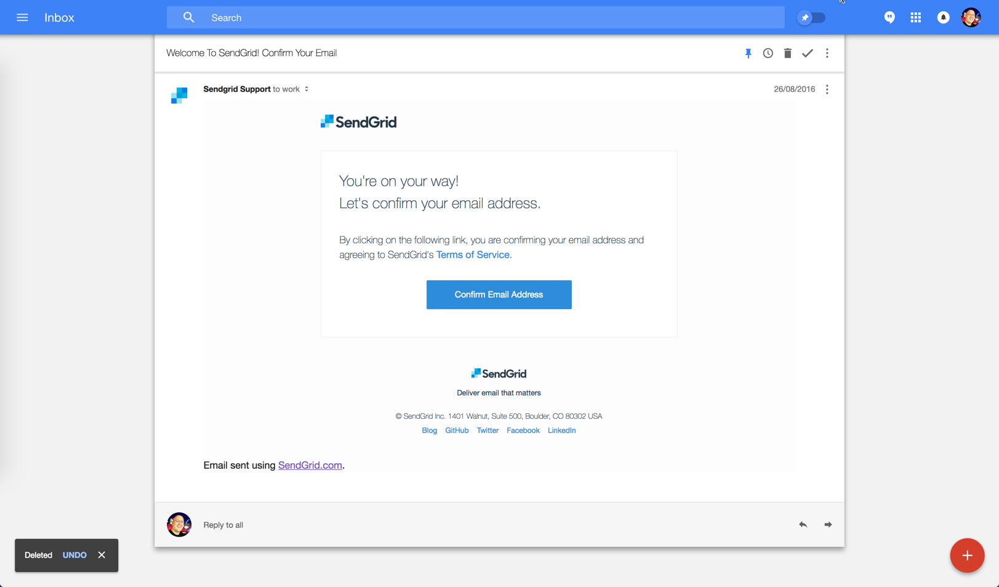
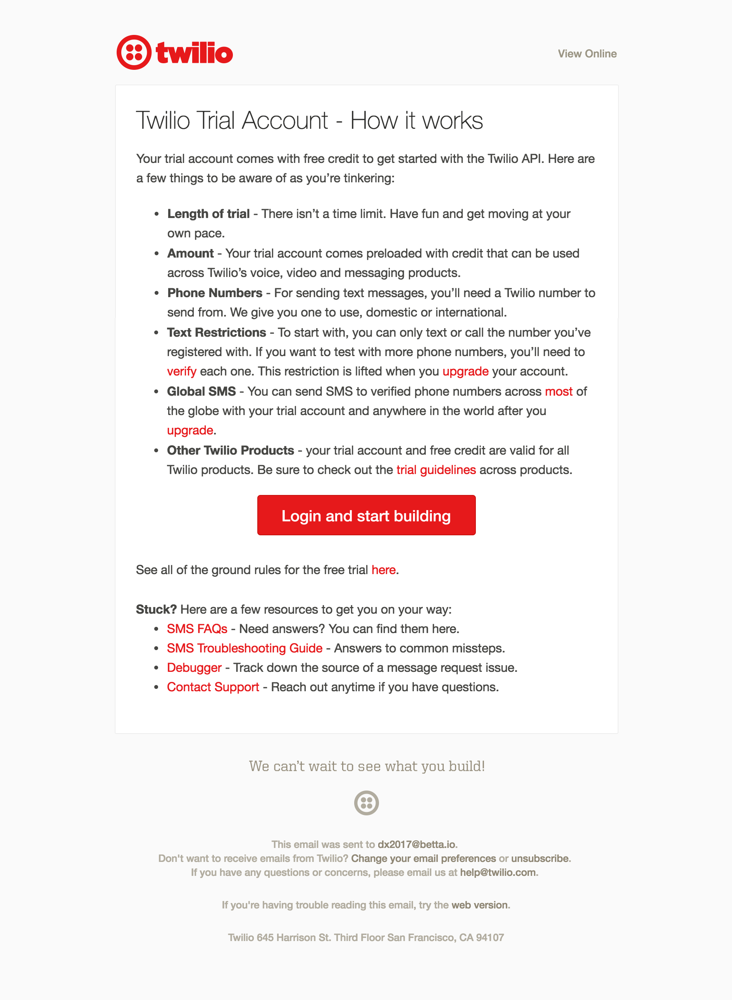

While looking at the developer onboarding of [Twilio](/blog/2017/01/09/developer-experience-review-twilio/), [Stripe](/blog/2016/10/16/developer-experience-review-stripe/), [Pusher](/blog/2016/08/31/developer-experience-review-pusher/) and [SendGrid](/blog/2016/08/29/developer-experience-review-sendgrid/) I noticed certain design patterns that were common across all of them. This article is the first in a series where I'll take a deeper look at specific parts of developer onboarding and how companies implement them differently.

In this first installment I'll look at the emails that are sent to developers when they sign up. Often these are part of a larger campaign of a trickle of emails, so I specifically focus on any emails sent on the same day as I signed up.

## Overview

The following are some of the core elements that seem to be present across the 4 companies I've reviewed so far.

|                       | SendGrid | Pusher   | Stripe   | Twilio  |
|-----------------------|----------|----------|----------|----------|
| Email verification    | <Icon type='Check' color='green'> | <Icon type='Check' color='green'>  | <Icon type='Check' color='green'>  | <Icon type='Check' color='orange'> |
| Link to documentation | <Icon type='Check' color='green'> | <Icon type='Check' color='green'>  | <Icon type='Check' color='green'>  | <Icon type='Check' color='green'>  |
| Link to support       | <Icon type='Check' color='green'> | <Icon type='Circle' color='orange'>  | <Icon type='Check' color='green'>  | <Icon type='Check' color='green'>  |
| Link to dashboard     | <Icon type='Check' color='green'> | <Icon type='AlertCircle' color='red'>    | <Icon type='Check' color='green'>  | <Icon type='Check' color='green'>  |
| Links to Get Started  | <Icon type='AlertCircle' color='red'>   | <Icon type='Check' color='green'>  | <Icon type='AlertCircle' color='red'>    | <Icon type='Check' color='green'>  |

<Message> **Note:** this is not meant to be an exhaustive list, nor am I saying that any omissions of these elements is a bad thing. This table just serves as an indicator of what's important to these companies and the level in which they share certain features. </Message>

## Observations

Further down I show every email I received, but before that I want to summarize some of the most interesting observations that I made.

### Timeline

Everyone but __Stripe__ sent me 2 emails on the first day. Mostly they consisted of a __confirmation__ email to confirm my email address, and a __information__ heavy email with some content as to how to proceed next.

__Pusher__ interestingly sent me the emails both at the same time, while SendGrid (an email company) took 2.5 hours to send me the second email.

|||
|---|---|
|SendGrid| 2.5 hours apart  |
|Pusher  | 0 minutes apart  |
|Twilio  | 30 minutes apart |

### Senders

From the 3 companies that sent me more than one email (Twilio, Pusher, SendGrid) only __Twilio__ used a consistent `from` address and name.

The most come email addresses seem to be a variation of `[company]team@` and `support@`.

|||
|---|---|
|SendGrid|`SendGrid Support <support@sendgrid.com> `|
|        |`SendGrid <sendgridteam@sendgrid.com>`    |
|Pusher  |`Pusher <support@pusher.com>`             |
|        |`The Pusher Team <team@pusher.com>`       |
|Stripe  |`Stripe <support@stripe.com>`             |
|Twilio  |`Team Twilio <teamtwilio@twilio.com>`             |
|        |`Team Twilio <teamtwilio@twilio.com>`       |

### Content-Type

Obviously SendGrid send me some beautiful HTML emails. Interestingly (as far as I can tell) the emails were HTML only, and not a multi part email with a text fallback. They probably have very good reasons to do so, as they are the email experts.

Pusher and Stripe just sent plain text emails.

Twilio also sent me 2 HTML emails but in this case they did have plain text backups.

|||
|---|---|
|SendGrid| `HTML` x2  |
|Pusher  | `TEXT` x2  |
|Stripe  | `TEXT`     |
|Twilio  | `HTML/TEXT` x2 |

### Length

Another observation is that all emails __except for Twilio's__ fit on my screen completely. In comparison to the other companies the emails that Twilio sends are __MASSIVE__. I have to admit they __are__ awesome, they contain full GIFs showcasing what the product does, and are full of useful links on how to use their product in real life.

### Lack of personalization

One final observation was the surprising lack of personalization. Only one email mentions me by name, and only one other email seems to have been catered to any other infirmation I provided on signup.

Only the first email I received from Twilio seems to be catered to the use case I chose on sign up (messaging, not voice).

## SendGrid

### The emails

> `Subject: Welcome To SendGrid! Confirm Your Email` 
>
> `From: SendGrid Support <support@sendgrid.com>` 
>
> `Received: 15:19`

> `Subject: Before You Press Send...`
>
> `From: SendGrid <sendgridteam@sendgrid.com>`
>
> `Received: 17:55 (over 2.5 hours later)`

### Insights

|||
|---|---|
| <Icon type='Check' color='green'> | Requires email confirmation on signup |
| <Icon type='Check' color='green'> | Has a link to the generic documentation |
| <Icon type='Check' color='green'> | Has a link to the support resources |
| <Icon type='Check' color='green'> | Has a link to the dashboard |
| <Icon type='AlertCircle' color='red'> | Does not have a link to a specific Get Started guide |
| <Icon type='Check' color='green'> | Has a link to the company's social media account |
| <Icon type='Check' color='green'> | Has a link to the company blo |
| <Icon type='Check' color='green'> | Has a link to a 'go-live' checklis |
| <Icon type='Check' color='green'> | Has a link to resources for non-develope |

## Pusher

### The emails

> `Subject: [Pusher] Please verify your email address` 
>
> `From: Pusher <support@pusher.com>` 
>
> `Received: 16:30`

> `Subject: Pusher quick start guide` 
>
> `From: The Pusher Team <team@pusher.com>` 
>
> `Received: 16:30 (0 minutes later)`

### Insights

|||
|---|---|---|
| <Icon type='Check' color='green'> | Requires email confirmation on signup |
| <Icon type='Check' color='green'> | Has a link to the generic documentation |
| <Icon type='Check' color='green'> | Has a link to a specific Get Started guide |
| <Icon type='Minus' color='orange'> | Has a link to the support, but only in the confirmation email |
| <Icon type='AlertCircle' color='red'> | Does not have a link to the dashboard |
| <Icon type='Check' color='green'> | Has links to guides for specific programming languages |

## Stripe

### The email

> `Subject: Confirm your Stripe email address!` 
>
> `From: Stripe <support@stripe.com>`

### Insights

|||
|-|-|
| <Icon type='Check' color='green'> | Requires email confirmation on signup |
| <Icon type='Check' color='green'> | Has a link to the generic documentation |
| <Icon type='Check' color='green'> | Has a link to the support resources |
| <Icon type='Check' color='green'> | Has a link to the dashboard |
| <Icon type='AlertCircle' color='red'> | Does not have a link to a specific Get Started guide |
| <Icon type='Minus' color='grey'> | Has a link to resources for non-developers |

## Twilio

### The emails

> `Subject: Your Twilio Account: Getting Started` 
>
> `From: Team Twilio <teamtwilio@twilio.com>` 
>
> `Received: 15:52`

> `Subject: Twilio SMS free trial tips` 
>
> `From: Team Twilio <teamtwilio@twilio.com>` 
>
> `Received: 16:22 (30 minutes later)`

### Insights

|||
|-|-|
| <Icon type='Check' color='green'> | Has a link to the generic documentation |
| <Icon type='Check' color='green'> | Has a link to the support resources |
| <Icon type='Check' color='green'> | Has a link to the dashboard |
| <Icon type='Check' color='green'> | Has a link to a specific Get Started guide |
| <Icon type='Minus' color='orange'> | Does not require email confirmation on signup (but validates the phone number) |
| <Icon type='Check' color='grey'> | Has a link to resources for non-developers |
| <Icon type='Check' color='grey'> | Informs the user where their API credentials can be found |
| <Icon type='Check' color='grey'> | Shows an animation of the product in action |
| <Icon type='Check' color='grey'> | Has a link to products build with the solution |
| <Icon type='Check' color='grey'> | Informs the user of the Trial Account's limitations |
| <Icon type='Check' color='grey'> | Emails include animated GIFs to show demo of product in action |
