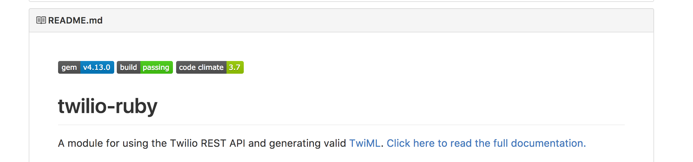
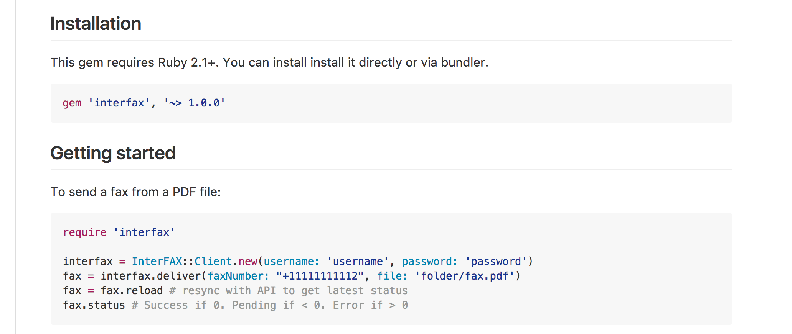
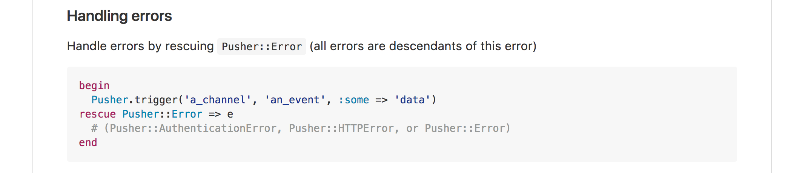
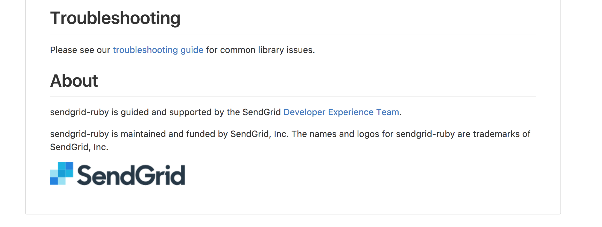

The `README.md` for a project on GitHub is often the first thing developers see when they encounter your product. The README for a library can be the starting point in a developers relation with your product. These text files serve both as a technical guide to your library and as marketing material for your product. So what should be in a README and what is better avoided?

## An analysis

For this article I've done a little survey across the [SendGrid](https://github.com/sendgrid/sendgrid-ruby), [Pusher](https://github.com/pusher/pusher-http-ruby), [Stripe](https://github.com/stripe/stripe-ruby) and [Twilio](https://github.com/twilio/twilio-ruby) Ruby libraries. I've also taken a screenshot of each README and put them in a [handy little gallery](/galleries/readmes) for future reference.

|                                | SendGrid | Pusher   | Stripe   | Twilio   |
|--------------------------------|----------|----------|----------|----------|
| Repo name                       | `sendgrid-ruby`                | `pusher-http-ruby`              | `stripe-ruby`                   | `twilio-ruby`                   |
| Build status badge              | <Icon type='CheckSquare' color='green'> | <Icon type='CheckSquare' color='green'>  | <Icon type='CheckSquare' color='green'>  | <Icon type='CheckSquare' color='green'>  |
| Library version badge           | <Icon type='AlertCircle' color='red'>   | <Icon type='AlertCircle' color='red'>    | <Icon type='AlertCircle' color='red'>    | <Icon type='CheckSquare' color='green'>  |
| Introduction                    | 129 words                      | 0 words                         | 100 words                       | 19 words                        |
| Install instructions            | <Icon type='CheckSquare' color='green'> | <Icon type='CheckSquare' color='green'>  | <Icon type='CheckSquare' color='green'>  | <Icon type='CheckSquare' color='green'>  |
| Installation requirements       | <Icon type='CheckSquare' color='green'> | <Icon type='AlertCircle' color='red'>    | <Icon type='CheckSquare' color='green'>  | <Icon type='CheckSquare' color='green'>  |
| Get Started samples             | <Icon type='CheckSquare' color='green'> | <Icon type='CheckSquare' color='green'>  | <Icon type='CheckSquare' color='green'>  | <Icon type='CheckSquare' color='green'>  |
| Link to docs                    | <Icon type='CheckSquare' color='green'> | <Icon type='CheckSquare' color='green'>  | <Icon type='CheckSquare' color='green'>  | <Icon type='CheckSquare' color='green'>  |
| Link to Ruby specific docs      | <Icon type='AlertCircle' color='red'>   | <Icon type='AlertCircle' color='red'>    | <Icon type='CheckSquare' color='green'>  | <Icon type='CheckSquare' color='green'>  |
| Link to API credentials         | <Icon type='CheckSquare' color='green'> | <Icon type='Circle' color='orange'> | <Icon type='Circle' color='orange'> | <Icon type='AlertCircle' color='red'>    |
| Link to support                 | <Icon type='CheckSquare' color='green'> | <Icon type='CheckSquare' color='green'>  | <Icon type='AlertCircle' color='red'>    | <Icon type='CheckSquare' color='green'>  |
| A [LICENSE](https://help.github.com/articles/licensing-a-repository/) file                  | <Icon type='CheckSquare' color='green'> | <Icon type='CheckSquare' color='green'>  | <Icon type='CheckSquare' color='green'>  | <Icon type='CheckSquare' color='green'>  |
| A [CHANGELOG](http://keepachangelog.com/) file                | <Icon type='CheckSquare' color='green'> | <Icon type='CheckSquare' color='green'>  | <Icon type='AlertCircle' color='red'>    | <Icon type='CheckSquare' color='green'>  |
| A [CONTRIBUTING](https://github.com/blog/1184-contributing-guidelines) file             | <Icon type='CheckSquare' color='green'> | <Icon type='AlertCircle' color='red'>    | <Icon type='AlertCircle' color='red'>    | <Icon type='AlertCircle' color='red'>  |

<Message> __Clarification:__ I'd like to make it clear that I am not saying any of these README's are good or bad. I think all of them have good things and bad things, which have probably come about for very good reasons. </Message>

## README template

While a README is a good starting point for a developer it is a limited tool. It's just a flat file with very little option for structure or design elements - add too much to a README and it becomes wieldy and hard to process.

A reasonable template for a README, as much as there can be one, would be:

1. __Inform__ the developer
  * about your product
  * about the SDK/library
  * what the license is
  * how to contribute
2. __Get started__ with
  * installing the library
  * getting the API keys
  * making the first API call
3. __Document__ common API calls
  * including method arguments
  * including how to handle responses
4. __Link__ out
  * to the full developer documentation
  * to the developer dashboard
  * to support channels

<Message> Do you prefer to learn by example? Have a look at this [Example README](https://github.com/workbetta/example-readme) I've put together for you. Make sure to read the [`WHAT_IS_THIS.md`](https://github.com/workbetta/example-readme/blob/master/WHAT_IS_THIS.md) for more information. </Message>

## 1. Inform

The first task of your README is to inform your user what your product does, and how your library or SDK helps to make this happen. I think Twilio does an excellent task at this:

### Repo name

Ideally your repo name should be `[company_name]-[language_name]`, for example `twilio-ruby`. Of the 4 providers I surveyed only Pusher deviated from this.

### Repo title

The repo title should be short and simple. Ideally it has your company name, and the word library or SDK. You could call it a wrapper for your API, but that's what a library or SDK really is, so why use a different word. Additionally you could add some explanation as to what your product does. For example, Twilio's repo could be called:

> Twilio SDK - Send and receive text messages and calls with Ruby

### Badges

Twilio uses a few badges badges. The 2 I think are important are firstly the one for their library version, and secondly one to show the current build status for the code in the master branch.

To get your own version badge I recommend having a look at [Version Badge](https://badge.fury.io/).

### Introduction

The introduction of your library should be short and to the point. it should explain what your product does and how this library helps with that.

Twilio's intro is short and simple. It's 19 words, explains what the library does, and then links to the official docs. I'd say the one thing missing here is that it does not explain what Twilio is for those uninformed.

### LICENSE, CHANGELOG, CONTRIBUTING files

There are a few standard files that are always good to have in your projects.

* [LICENSE](https://help.github.com/articles/licensing-a-repository/), a file containing the license for the code you are providing
* [CHANGELOG](http://keepachangelog.com/), a list of changes for each version of your library
* [CONTRIBUTING](https://github.com/blog/1184-contributing-guidelines), some instructions on how to contribute code to the library

If you want you could link to these from your README file.

## 2. Get Started

After you've informed a developer about your product and its library, the next step is to get them started with initializing and using your product. In this let's look at a different company, InterFAX:

### Install instructions

The first step is to explain how to install your library. If possible explain how to install it the most common way, and maybe the second most common way. Some languages only have one real way to install a library but not all do. Look at existing libraries for the same language for examples.

### Install requirements

It's important to add some guidance on the language, platform, and any other requirements your library may have. I recommend linking to the install instructions for those dependencies where possible.

### Link to API credentials

Finally, and this is often forgotten, it's important to provide a link, or some instructions, on where a developer can find their API credentials. If this is not provided it might prove very hard for a developer to get beyond this step.

## 3. Document

After the developer has successfully installed and initialized your library it's time to have them actually use your product. Think about what's the first step someone would want to take and get them started.

It can be easy to add too much information in this section so here are some guidelines.

__Do's__

* Do show some basic examples of how to use your core use cases for your product. You should know what they are!
* Do show how to use the response your API returns, both on success and error
* Do link out to the full documentation after each sample, to get the developer find the next step
* Do syntax highlight your code

__Don'ts__

* Don't document all your product's features in one massive code sample. Keep your code short and to the point, highlighting one use case at a time.
* Don't use the README to document every argument, response type, and edge case. This is what your developer reference documentation should be for. Stripe does an excellent job at this by combining [the full reference docs](https://stripe.com/docs/api) for every programming language into one UI.

It's important to not just document how to handle success, but also failure in your API. Pusher does an excellent job at this.

## 4. Link

After the developer has made their first API call they're ready to move on. This is ideally where developers leave the `README` and continue to your developer documentation on your site. If you have more Get Started guides and Tutorials on your site then this is where to point them next.

### Link to the docs

Ideally you should link to a few places in your documentation. The developer has just made their first API call but this is most likely not their last. What is the logical next step in this process? Link them there!

If possible I'd link to the documentation in their programming language, so they don't have to select this again. Additionally linking to the full reference docs as well as guides is very useful for those already familiar with your platform looking to make changes.

### Link to support

Finally, make sure to link to your support channels, whether that is email, Twitter, or other. SendGrid does an excellent job at this.

Allowing developers to find you and get a quick response to technical questions can prove to be a major factor in converting a developer into a success story.

