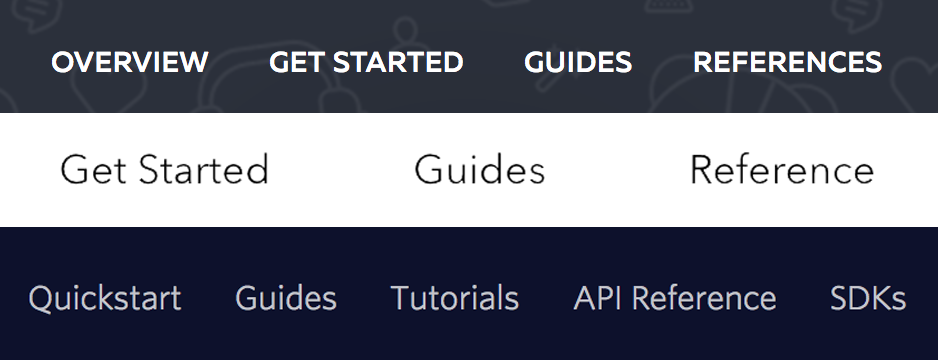
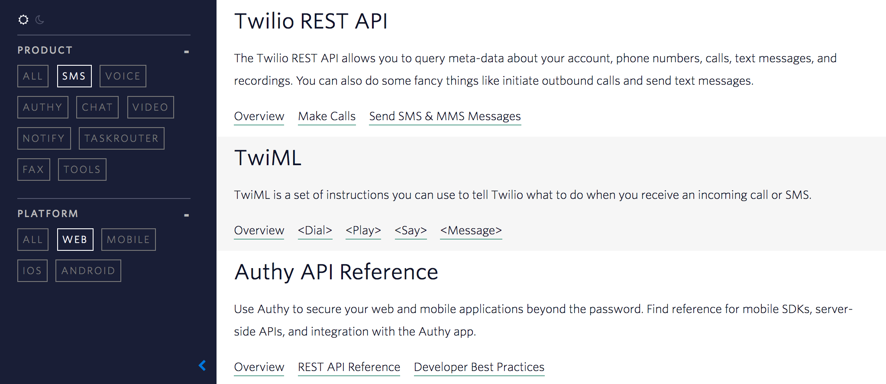
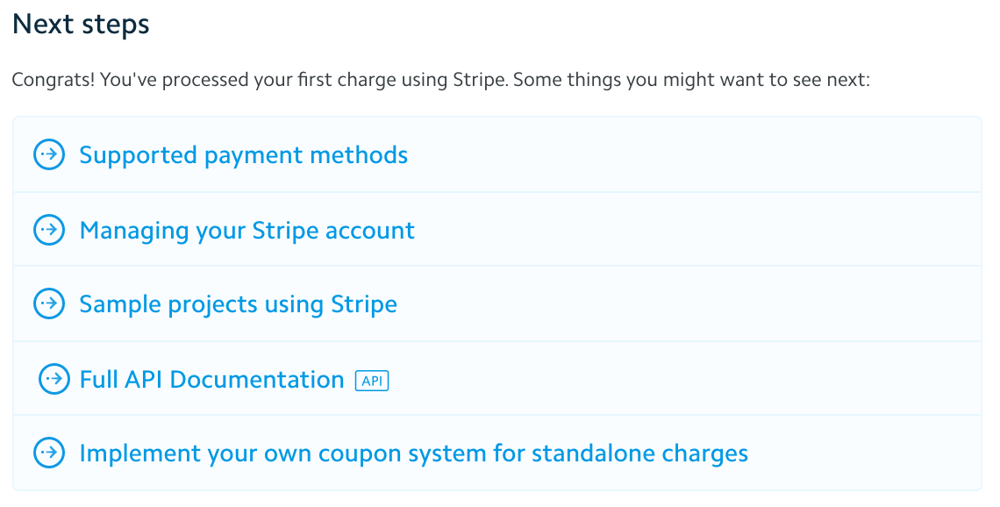

I've recently been introduced to the [Richardson Maturity Model](https://martinfowler.com/articles/richardsonMaturityModel.html), a simple idea that breaks down the principal elements of a REST API into 3 levels: Resources, HTTP Verbs, and Hypermedia Controls.

These 3 levels allow for an easy way to understand the maturity of an API, but I'm more interested in that it also provides a clear path on how to mature an API. As every level is building on top of the previous level, maturing an API can be done in a level-by-level, isolated, and manageable way.

So, this got me thinking. Is there a similar model we could apply to the developer experience of most API documentation?

## Level 0 - Minimum Viable Docs

I know I said we have 3 levels, but the first level is to have some docs in the first place. Often this is written by some of the first developers on the project, often written for themselves or their first client.

The documentation at this level can be __documentation of any type: reference, tutorial, or other__. They will be __mixed__, for example providing you with a guide on how to get started, followed by the reference documentation on the same page.

Often, this level of documentation exists out of __mostly reference__ documentation, focussing on providing a single source of truth and only considering the educational aspect as a secondary objective.

## Level 1 - Documentation Types

>  Reduce complexity by using divide and conquer

At the next level the documentation is fleshed out into separate documentation types. Often this will fall into some variation of Reference, Get Started Guides, Tutorials, Guides, and [Exploration](/blog/2017/03/12/defining-the-developer-journey/) documentation.

By providing a better information architecture in the documentation it becomes easier for developers to find the right documentation for them. As I pointed out [in a previous post](http://localhost:4567/blog/2017/05/15/api-documentation-maturity-model/), the developer journey consists of a few different steps and allowing developers to find the right step for them is essential to a great experience.

In essence, level 1 documentation __reduces complexity__ by dividing the documentation into various documentation types. With this in place each documentation type can __own the educational goals__ of that part of the developer experience.

## Level 2 - API Building Blocks

> Remove unnecessary variation by increasing reusability

At the next level, the documentation is standardised to provide well defined building blocks for the product. Often this involve splitting previously large parts of the documentation into smaller, more focussed parts which will will have their own standardised, human-readable URLs. Deciding what granularity is appropriate here is probably the hardest part and is very dependent on the product and its core use cases.

Not all work done at this level is visible to outsiders. Many companies put a lot of effort into standardising code samples and URL schemes so they can be re-used across the documentation and even be integrated into the onboarding experience. The benefit of this is that common mistakes can be easily prevented.

In essence, level 2 documentation __removes unnecessary variation by increasing reusability__ both for external developers and internal copy writers. A strategy is put in place to ensure every part of the product is documented to the same standard. By creating a __clear structure__ and overview of the __building blocks__ that make up the product it can be ensured that each one of these blocks is documented to the same standard.

## Level 3 - Cross-References

> Introduce discoverabilty across building blocks and documentation types

In the final level we can use the increased structure and reusability of the documentation to turn a strict hierarchy into a fully functional web of documentation. Before this level, the documentation already supported linear navigation through well defined paths.

Now, by linking across documentation type and building blocks exploration has been increased massively. At the one hand, providing links that move into more/less indepth topics allow developers to find the level of documentation that best matches their experience level. An example of this would be to add a link on a guide to the reference documentation of the same topic.

On the other hand, providing links that move laterally into related topics allow developers to always be learning new concepts and ideas, as well as providing a single source of truth for some often used building blocks. An example here would be the installation and initialisation of an SDK; often this is a prerequisite for most guides and tutorials. Another example is taken straight from the Stripe documentation where the "Payment Quick Start" directly links to both another Quick Start on "Subscriptions", and a guide on "Getting Paid".

In essence, level 3 documentation __introduce discoverabilty__ across building blocks and documentation types by __adding links__ to every page that __allow a developer to move from linear paths into related topics__. These related topics can be __vertical moves__, pointing at content covering the same topic but at a different complexity level. Alternatively, they can be __horizontal moves__ that point at content covering a different topic but at the same complexity level.

## Final thoughts

Even though this is just a first draft, I think works out quite well. As [Martin Fowler](https://martinfowler.com/articles/richardsonMaturityModel.html) pointed out the 3 levels are not just about the direct aspects of APIs (Resources, etc) but also about the common design techniques that are added at each level. I've taken those techniques and applied them to documentation:  

1. Reduce complexity by using divide and conquer
2. Remove unnecessary variation by increasing reusability
3. Introduce discoverabilty

I want to reiterate that this maturity model is not something that should be used to judge documentation, rather more interestingly I think it can be used to provide a clear path for improvements. As each level builds on top of the strengths of the previous ones it can be used as a guide on how to incrementaly improve any documentation.
