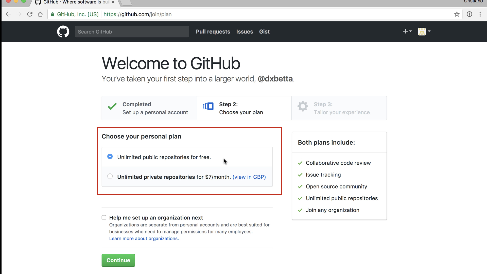
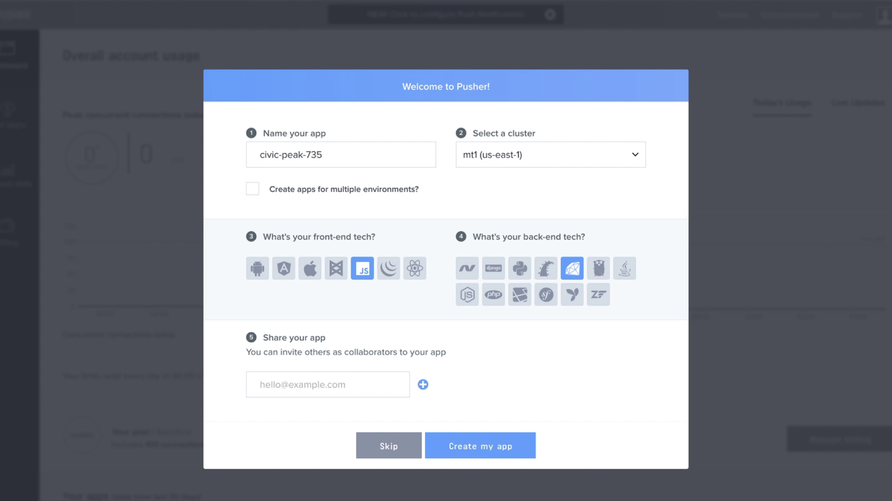

<Message> This post is a write up of a talk given at [DevRelCon Tokyo 2017](tokyo-2017.devrel.net) and a few other events. Slides for this talk are [available on Speaker Deck](https://speakerdeck.com/cbetta/the-7-deadly-sins-of-developer-experience-devrelcon-tokyo). </Message>

<Youtube id='JHtMN8TxUfc'></Youtube>

## Prologue

We all occasionally have one of these days where things don't quite go our way. We want to use things, but we can't quite figure out how. Everything in the world is designed for us, it's all made to be so easy, yet once in a while - with all good intent - we can't manage.

<Youtube id='SyCj5ce2jYk'></Youtube>

Doors are hard. 

Doors are really hard to deal with, especially glass doors, cause you can see right through them, and unless there's a special sign on them it can be hard to see they're there.

Yet a lot of us have APIs and SDKs, we sell products to developers, and those products are probably a lot harder than glass doors.

A lot harder.

## About me

So, who am I?

My name is Cristiano. I am Developer Experience designer who used to work at PayPal and Braintree. I am a big fan of great Developer Experiences, and as such, I like to write about them. On my site, I've looked at companies like [Stripe](https://betta.io/blog/2016/10/16/developer-experience-review-stripe/), [GitHub](https://betta.io/blog/2017/04/12/developer-experience-review-github/) and others, and looked at how they take a developer from first signup all the way to their first API call.

Additionally, I also like to look at publicly available software that these companies produce, like their [SDKs](https://betta.io/blog/2017/02/07/developer-experience-github-readmes/), samples and documentation.

Over the past year, I've worked with companies small and large to help them improve their DX in the onboarding, documentation, SDKs, and more.

## About Developer Experience

What I want to talk about today is DX and some of the worst things I've seen companies do to it. 

Let's start with a bit of a refresher of what DX is, and what it means to me. To me, DX is to Developers as UX is to Users.

To quote [Jennifer Riggens](https://twitter.com/jkriggins). 

> "Developer experience is an extension of UX that focuses on the developer, who can either be the intermediary or, as is the case with many APIs, the end user. Whether or not you focus on DX design, your developers are always experiencing your API, and that experience may either be positive or negative."

I personally love the last part: Your developers will always be experiencing your product, even when you did not put any time into your DX design. Even if your developer experience is rubbish.

For all of us who have an API or another kind of developer product, it's so important to realise that developers are still going to have an experience, and it's up to us to decide if that experience is a good one or a bad one.

For those of us who have a product, our ultimate goal is to have successful users using it. For a developer product, we can usually  generalize this user to have to be a successful developer.

We all start with a fresh new developer that gets introduced to our product, and then we take them on a journey to get onboarded and make their first API call, and then on the long term, we hope that they stay with us as their success increases as well.

That middle bit, that is Developer Experience to me. That journey from first landing on your site, your developer portal, your twitter, or even meeting you in person at a booth. All the way to that successful integration, that moment when they have a successful product that uses your product. 

Everything outside of that middle scope is, to me, either developer evangelism or developer advocacy. 

In the middle lives your product. To me, the developer experience of your product is very much driven by 2 factors: information and tooling. On the one side, you have your APIs, SDKs, and other software that developers will use as tools to achieve their goals.

On the other side is the documentation that supports these tools and allows developers to look up and learn every aspect of the tools you've given them

Those 2 things, they will make your product's developer experience.

## The 7 Sins

What I want to talk about today is how a lot of the information we provide to users is problematic, for many different reasons. Yes, information is useful, yet not all information is created equal.

There is so much information that we write. Often it's too much, and we give it to developers too soon. We then make things worse by providing developers with too little when they do need it.

To top things off, we structure the information we provide badly, we maintain it badly, leading to incomplete and incorrect information.

I don't know if you noticed, but those are 6 things. The last one is about the lack of proper tooling, which then together make for my 7 Sins of Developer Experience.

So let's kick it off, with the first sin, in no particular order.

## #1 - Too much information.

There's a concept called "Performance Overload". it comes from the idea of "Performance Load", which is the idea that when we have an object that we can perform an action on, there are 2 vectors of the difficulty we might have with that interaction.

In the case of a door, with a handle, the 2 vectors are the physical and cognitive performance loads.

The physical load is the idea that there's a certain physical force that needs to be applied to open the door. A door with a particularly heavy handle, or a heavy door, have a higher physical load than an automatic sliding door.

The other vector is the cognitive performance load. When the door is a handle the door could open either way. If there was just a flat pad on the door I could guess the door opened away from me, yet with a handle on the door the guess could be either push or pull.

We get cognitive dissonance when the interface's signifiers don't necessarily signal what you can do with the object. For example, when we get a handle the door might open inward, yet when the door opens away from us there is a disconnect between what we expected and what we are able to do.

Now, this example wasn't so bad, as we see doors quite often and we expect doors with handles to open in any direction. Things really cause a performance overload in situations like this.

In this example, there's a regular door handle in the middle, but also 2 bars on each side to pull at, and 4 seemingly unrelated yet confusing signs.

When people encounter this kind of situation they run the risk of cognitive overload, causing them to freeze, feel blocked and frustrated, and if they can't overcome this they will give up.

They will literally walk away and try a different door.

And yet, we see the same thing we see when we look at some websites, like Amazon's AWS portal.

I have to admit, I love Amazon. I love their store, their developer services, yet this is total overload. When a young developer looks at this they will feel overwhelmed, intimidated, and demotivated. And they will go away and try something else like Heroku.

Cognitive overload is literally a situation where you, as a teacher, give too much info (or too many tasks) to a learner at the same time. This results in the learner being unable to process all that information and failing to learn anything new. It's above their limit to consume new information at that time in one go.

There are some solutions to this, of which one is the concept called "Chunking". When you chunk lists into items of about 8 at a time, then you make it more likely that someone is able to parse, remember, and understand the information you've given them

What is great is that when you give them multiple chunks of chunks, people are still more likely to remember a larger percentage of that information as well.

Amazon does this kinda in their UI, though it's debatable if this is very effective.

When you actually go to one of their other sites, they apply a different information design concept: the 80/20 rule. The idea of this rule is that users will use 20% of your product 80% of the time.

On this site Amazon actually recognises that most users on AWS will use their product initially for one of a few different things, and they prioritized the things people mostly do: "spin up a Linux virtual machine", "spin up a Windows machine", etc. 

Those are the things most people want to do, regardless of what they want to do. So putting those things first, rather than the other 80% of features, is essential in educating developer while limiting cognitive overload.

## #2 - Information Too Soon

To me, providing information too soon is almost like some kind of __Cognitive Load__ as well.

We all know the fire alarm: that thing we have to break in the case of a fire. We all know how to use it, even though I imagine most of us have never had to use it before.

It's kind of cool how low the cognitive performance load is for a fire alarm. It takes little effort to understand what it does. 

Yet at the same time, it has a medium level of physical load: you need to intentionally press the glass with some force to break it.

The reason why we have that physical load requirement is to prevent abuse and accidents. We don't want people to accidentally lean against the button to set of the alarm 

We can achieve the same effect in digital user interfaces with __confirmation dialogues__.

"Are you sure you want to continue?"

The question has a low cognitive load to find an answer - "Yes, I really wanted to do this". Yet, at the same time, it still prevents accidents and abuse by requiring some extra physical load to click a button, again.

This is a good example of putting cognitive load in the way of users for their safety. Yet, often, we also put this kind of block in the way of users at the wrong times. And often this is when we deal with forms.

Let's take a look at this simple field asking a user for their name. Seems pretty simple right?

Yet, any moment that we put a question in the way of users, especially when they are a required field, we raise a lot of questions in the heads of our users.

In this case, we can ask a lot of questions about this field. Who can see this? Do I fill in my actual birth name, or can I use my married name? Can I change it later? Do you want all my names or just my first name? Can I control the visibility of this name?

A name might seem like an easy question, and we might all have our stock answers, yet we ask far more complicated questions in many of our onboarding flows. 

One thing I often see when I sign up for a developer product is the questions asking me what kind of user I am: "I am a developer/designer/business owner".

And again the same questions apply. Can I change this later? What if I am more both a business owner and a developer? If I pick business owner will I still get API keys? I don't know?!

All of those questions cause developers to experience increased cognitive load. And when those questions reach a point where their capacity to deal with that cognitive load is exceeded they give up and leave.

I love how GitHub deals with these problems on their sign up form. One of the decisions they want you to make is if you want to set up an organisation as well as a user account.

Now this is a hard question to ask, as I might not understand the concept of an organisation when I sign up to GitHub, as I have no experience with GitHub yet until I am signed up

So I first have to understand what an org is before I can make a decision on whether I want to set one up.

This understanding of how a product works is called a __Mental Model__. As product designers, we have to make sure that the way our users think our product works is in sync with how it actually operates. 

It is really hard for users to reason about why things worked or didn't work when their mental model does not reflect the way our product works.

So what GH does in this situation? Well, they first off put some help text under the question to help you make an educated decision. The also made the question optional, making it something that is easy to postpone.

A more difficult question is the choice between a paid plan with private repositories or a free plan without. This question is not optional, it's a radio button, and therefore you actually have to decide there and then.

It's a tough one and we can ask some of the same questions again, like "Can I change this later?".

Luckily, GitHub makes this an easy choice as they have put some text under the selection telling a user "not to worry, you can cancel or upgrade at any time". 

This simple little bit of text takes the load away from the user, allowing them to postpone the decision at that time, and therefore removing that feeling that they are being forced into a choice.

It allows every user to continue.

What I find interesting as well is that this is the second screen of GitHub's signup process, not their first. They have postponed the hard questions to the second page, applying __progressive disclosure__ to make sure developers sign up at the minimum.

> Progressive Disclosure: A strategy for managing information complexity in which only necessary information is requested at any given time.

What GitHub has done here is to make sure that when you sign up they only ask you for a username, email, and password.

Nothing else.

Those questions have a very low cognitive load. I mostly know what my standard username is. What my standard email is. And we all use the same password everywhere, right?

Right?

And then only after that low complexity form, after I'm signed up, only then do they start asking me the hard questions.

## #3 - Information Without Structure

When we read a book, there's a lot of structure in a book to help us navigate.

There are the page numbers, the current chapter at the top of a page, the table of content at the start of the book, and the index at the back.

We can flip to the next page just by pulling the corner, and we can flip to the previous page just by pulling the other corner.

All of these things help us understand where we are in a book.

"What page am I on?" can be answered just by looking at the side of a book to see approximately how far through we are.

"Where can I go?" can be answered in so many different ways. We can go to the next page or previous page, or we can just look at the index and table of content to see what chapters and content is available on each page.

And finally, "Where did I come from" can be similarly explored just by looking at the previous pages.

All these signals are a form of __Sign Posting__ and we use it a lot online on our websites and in our apps.

If you look at most websites, you'll see some navigation at the top. The navigation tends to remain there even as we move across to different pages on the same site.

There will be links that tell us "we can use this to go somewhere else", and when we click on one of those the UI might change to tell us that we are now in a different section of the site.

Yet, a lot of developer portals that I deal with are missing that basic structure that tells users where they are at any point. The type of structure that tells a user where they can go, where they came from, and how they can make their way to content more suited to their needs.

A great way to show users where they are on a site is with a design pattern commonly known as __breadcrumbs__. 

On this page within the Facebook developer documentation we can see that we are within the __Docs > Games__ section, and even within the page we can get an outline of all the available subsections.

This kind of layout goes hand in hand with a design principle called the __Guttenberg Diagram__. 

> Guttenberg Diagram: A diagram that describes the general pattern followed by the eyes when looking at evenly distributed, homogeneous information.

For most websites, this diagram will look something like this.

As you can see you get in interesting F-shape heatmap that focusses mostly on the top left of the page, with less and less attention from the user as we go more to the bottom right of the page.

This is why you generally find all the navigation on websites on the top and left side of the page, with the main content in the middle of the page.

With this in mind, it becomes obvious that to have effective signposting the placement of your navigation links in those places where people will most likely look for them is essential.

Only people with very high motivation will scroll all the way to the footer and look there for the content they are looking for. They might only do so after they have given up looking in the other places.

## #4 - Too Little Information, Too Late

As technical writers or developer advocates we think a lot about documentation, and therefore we tend to write a lot of documentation.

Yet, I feel like documentation is a bit like duct tape: Once you have it, you want to use it for everything.

And often we use it for the wrong reasons. Often we have something that's broken, and rather than working on a fix we settle for something that's just good enough.

We see this a lot with doors. We find that people are having trouble with a door and rather than fixing the UI we just put up a note. We add more documentation.

And more documentation is not always better.

There is a website I recently looked at that had over 600 pages of documentation, and one of the pages had enough content for 23 printed A4 sheets. That is so much information that it becomes pretty hard to maintain and navigate.

A lot of this documentation is used to explain bad UX in a product. I often see people do pretty clever things with their documentation where they might have some product which does something awesome - but with some very specific constraints.

To clarify this weird behaviour we then add a little warning note to inform a developer of this oddity.

Now while this might look like __Progressive Disclosure__ (information disclosed when it is important) that's not what's really happening here. This kind of documentation is more like __Progressive Revelation__ where we only provide people with the documentation when they run into an error and try and find a solution in the documentation.

What ideally should be happening here is that we should be trying to solve the problem in the product. We could look at the product and ensure that it worked the way the developer expected it to. We could update the API or SDK to be more forgiving and understanding of the developer intent.

With that fix in place, we could actually use the documentation to please the developer with our attention to detail, not just for it to cover us when developers come to us with technical support about the inflexibility about our product.

## #5 - Information Without Flow

I hate "Get Started" buttons because so often they take a user straight from the button to the absolutely nowhere.

When I first looked at SendGrid's onboarding their __Get Started__ button took a developer from their marketing site, through signup, to a page on their developer dashboard with no clear next steps. 

They just left a developer completely hanging. It was almost like all they wanted to get from a developer was their email address.

We are all trying to tell stories with our products. We want to tell developers that our product will save them time and money, or that it will make their life better. At the core, we want to tell our customers how our products will make them more successful.

Story telling is essential when we take people on that adventure, taking them from first landing on a site all the way to making their first API call. 

When we compare SendGrid to Pusher we see the difference a good understanding of story telling can make. Pusher takes a developer from Signup...

...to creating their first application...

...all the way to making that first API call in their preferred programming language.

Pusher has basically understood that they will need to take you from __Get Started__ all the way to being a success on their platform.

Yet how many of us have a good understanding of what success means for developers using our products? Is it getting an email address? That first API call? A paying user? Probably not.

The ultimate goal is to have a successful user using our product. If your user is a business, ensuring that they are a successful business of their own can help ensure that they remain active on your product.

## #6 - Incomplete Information

When you do a search on GitHub "documentation mistake" you will find 43,000+ issues. When you search for "typo" you will find 614,000+ issues! 

Now imagine every one of those issues cause at least 1 developer an issue for 10 minutes? Seems like a fair assumption right?

That would mean that those issues will have caused more than 12 years of reduced productivity!

I personally had this problem with Ember where their documentation was on version 2.12, and they had implemented a nice feature where if you went to the 2.0 docs it would tell you that you were at old guides.

Yet, if you went to search for "ember router" on Google you would eventually end up on the 1.0 documentation, which had no mention of this being an old version of the docs at all!

These are the kind of mistakes that will make developers get so frustrated about wasting their time that they will leave and try out your competitor instead.

The solution to these issues is to treat your documentation and onboarding with the same respect as the rest of your code base. Which means that you should lint and test your documentation to ensure there are no mistakes, and common standard and guidelines are followed. 

It's so often that I see companies test their product's code, yet when it comes to their documentation there is little automation in place to ensure the same kind of quality.

## #7 - Out of Control Tooling

Many companies I deal with who do not own their own SDKs, and often they either have started the feel the pain of this or are not aware of the problems it can cause.

PayPal didn't use to own their own SDKs, and when I was there I was able to see the problems this caused first hand.

What PayPal ended up with, still today, is that the library at the top of the Ruby Gems search for "paypal" is a library that is not the official PayPal one.

The official library (although it has more users) is listed below the unofficial one. They actually ended up with a lot of unofficial libraries because a lot of people developed their own when PayPal did not yet have their own libraries in place.

It's even worse when you search for "PayPal Express Checkout" in RubyGems.

As you can see the result consists of only unofficial libraries, with one being one a version number of 0.0.3!

When you go to GitHub, you will find over 4000 PayPal related repositories, of which many are libraries of different states of development.

When you search for "Twitter" on GitHub you can see that for them (they also don't own their own SDKs) the problem is even worse.

It was Tristan Sokol from Square who eloquently put this problem into perspective at [DevXCon SF](https://2017.devxcon.com/tristan-sokol/) earlier this year.

> "...in reality, whatever people can pull down from their favourite package manager is their developer experience..."

This is exactly the reason why the companies with some of the best Developer Experiences, like Stripe and Square, own their own SDKs, documentation, and onboarding.

## Final Thoughts

We might have bad days where we really want to use doors, yet fail every time we try. The doors are designed well, yet we still have trouble with them. And those are the days when we need those little bits of help, that well-designed UI. 

UX is hard, but DX is harder, way harder. We have some great tools at out disposal though to create easy to use experiences.

The following 7 tricks are my tools for creating great Developer Experiences.

### Prevent Cognitive Overload

### Only Ask Questions When Needed

### Present Information with Structure

### Present Information on Time

### Tell The Best Stories

### Tell The Whole Story

### Own The Whole Story

Thank you!

## Bibliography

If you enjoyed this talk I have some book recommendations. A lot of the content from this talk came from the following books.

### [The Universal Principles of Design](http://amzn.to/2hqdIz8)

A great book covering over 120 different design principles, many of which are relative to this talk that I did not have time to get into.

### [The Design of Everyday Things](http://amzn.to/2iN6gue)

The UX bible by Don Norman, with a lot of content on doors. Don basically doesn't like glass doors.

### [Envisioning Information](http://amzn.to/2jfGOBM)

A great book ok how to show complex information. Old but still a great book to flip through once in a while.

### [The Mom Test](http://amzn.to/2jeeAam)

Probably the odd one out, as this is not about UX. It's a very small book that teaches you how to ask the right questions without build in bias. I find it useful when talking to people about what drives success on their APIs.

