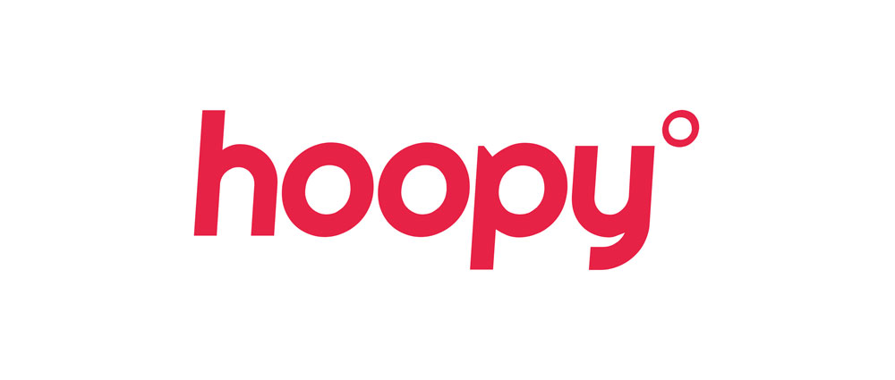

I've been in Developer Relations for a few years now, initially while I was at PayPal and more recently through my own company, [Work Betta](https://betta.io). One of the main things I've learned about this industry is that it takes a team to do it well, and the number of different fields of expertise required is pretty mind-boggling.

Although I've personally been highly focussed on helping to define the field of Developer Experience, there are some amazing people out there focussing on Developer Marketing, Community, Events, and even overall Developer Relations Strategy. Many of these people come together at events like [DevRelCon and DevXCon](https://devrelcon.net/) each year, and to some extent I feel like they are my closest colleagues.

## Joining forces

As a result, over the past year, I've been working very closely with [Matthew Revell](https://twitter.com/matthewrevell?lang=en) at [Hoopy](https://hoopy.io), working for [clients](https://hoopy.io) together, delivering [training](https://london-2017.devrel.net/#training) together, and just generally using each other to bounce ideas and opinions off. Matthew has over 15 years of experience in developer relations, and together we've been pushing the boundaries of what we are able to deliver to our clients.

Today, we’re excited to announce that I, and Work Betta, will be partnering with Hoopy. Together, we’ll provide a full end-to-end developer experience, developer relations and developer marketing consultancy to our existing and new clients.

## New opportunities

If you already worked with me or Hoopy, you now enjoy access to a wider range of strategic expertise. For new clients, we’re excited to offer training, mentorship, audits and ongoing support in developer experience, developer community, developer events and developer marketing. Soon, we’ll be announcing a range of new products designed to help our clients reach and convert more developers. And as our team grows, we’ll be excited to introduce you to the wider Hoopy family.

Today, interest in developer experience and developer relations is growing so fast that it’s nearly impossible for companies to hire the right expertise in-house. By Hoopy and Work Betta working together you’ll have access to more than we could ever offer alone.

We'd love to hear your thoughts? [Book an initial chat](mailto:cristiano@hoopy.io) with us today.
