<Message> This is the sixth in a series of articles focussing on reviewing [Developer API Onboarding](https://betta.io/blog/categories/developer-onboarding/). In this post I'm looking at the API onboarding offered by [Heroku](https://heroku.com/). </Message>

## Criteria

I will be looking at 3 aspects of the onboarding experience:

1. [**Exploration**](#exploration): Does the experience help me to understand or try out their product before signing up for an account?
2. [**Onboarding &amp; Integration:**](#onboarding) How well does the product guide me from their main site to create an account and to make that first API call or integration?
3. [**Reference:**](#reference) Once I have my first integration in place, how hard is it to find the full reference documentation for the API call I made?

Additionally, I will look at the [**emails**](#emails) sent by Heroku after I sign up.

Too lazy to read? Click through to the [conclusions](#conclusions).

## Heroku

> Cloud platform as a service

<Youtube id="mbqT_hyNDqM"></Youtube>

> Heroku is a cloud platform as a service (PaaS) supporting several programming languages that is used as a web application deployment model. Heroku, one of the first cloud platforms, has been in development since June 2007, when it supported only the Ruby programming language, but now supports Java, Node.js, Scala, Clojure, Python, PHP, and Go - [Wikipedia](https://en.wikipedia.org/wiki/Heroku)

Heroku is quite a different company from my previous subjects, in the sense that it's mainly not an API but a cloud platform. Interestingly, Heroku does have APIs to extend their platform, yet for this article I'm mainly looking at their onboarding for the purpose of deploying apps.

## Before we start - some changes

In contrary to previous reviews, this one relatively "shorter". I won't be going into the full details here, rather I'll focus on the more interesting findings. If you want to see the full, raw onboarding then I recommend you have a look at the screencast.

## Exploration

★★★★★

We start by looking at the Heroku landing page, which I have to admit is rather boring.

[`https://heroku.com`](https://heroku.com)

A bit down the page though, we find this handy little widget giving developers an interesting idea of what the purpose of Heroku is - to highly simplify your application architecture.

One of the key elements here is the idea that Heroku can be summarised into three topics: __deploy__, __manage__ and __scale__. We see these three topics in a few more places, including a series of videos a bit further down the page.

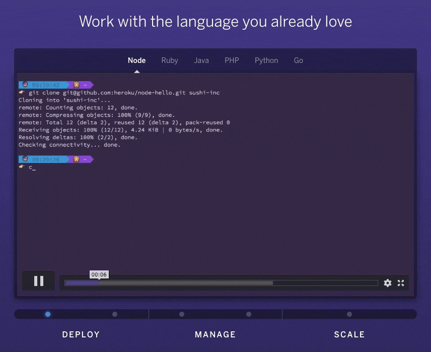

These five videos show a developer what actual deploying, managing, and scaling looks like on Heroku. In the videos, it combines the CLI, the Heroku Dashboard, and actual application code to paint a pretty clear picture to a developer how easy it is to do (previously complicated things) on their platform.

A bit further down the page, we find some links to popular programming languages, and when we click through we find a similar video series showcasing what deployment looks like in that language.

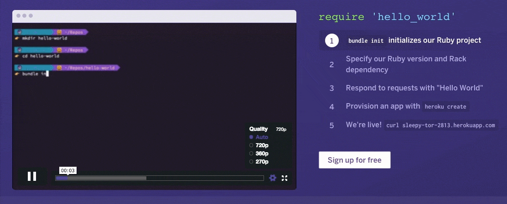

What's great about this video is that the bullet points on the right have been tied in with the timings in the video. This video expands on the video on the frontpage, which is rather generic, to show a developer exactly what the development flow would look like in their programming language of choice.

## Onboarding

★★★★

The onboarding and first integration onto Heroku is almost perfect. Sign up is pretty seamless, though a few oddities to show up.

For example, the initial sign up form asks a lot of questions that could easily have been moved to a later stage (the way [GitHub](/blog/2017/04/12/developer-experience-review-github/) does successfully).

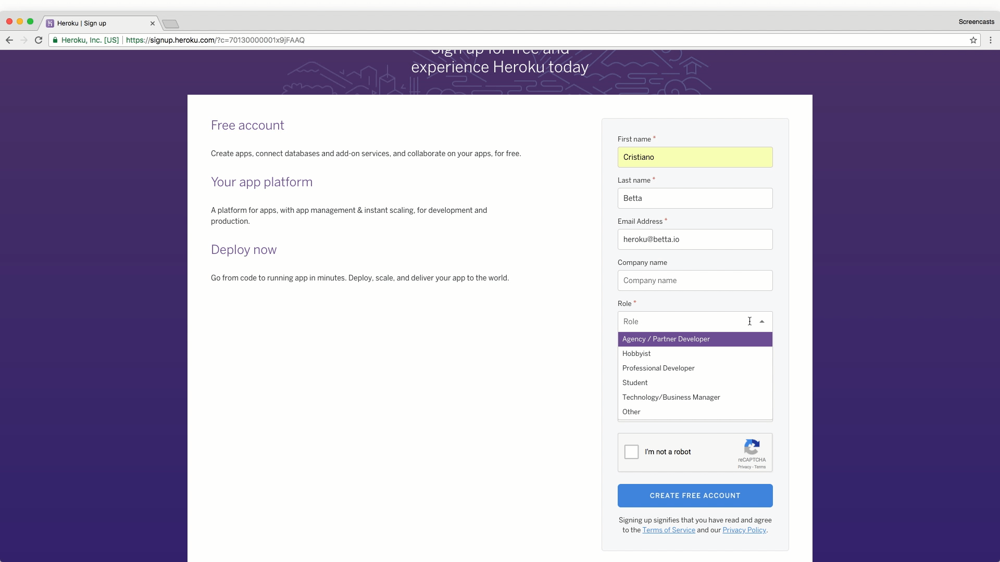

One of the questions is a typical "developer marketing" question to help segment new users: "Role". What's frustrating about these questions is how binary the answers are, and how little context is given to them. What do I select if I'm a student and a hobbyist? What effect do these answers have on the next steps?

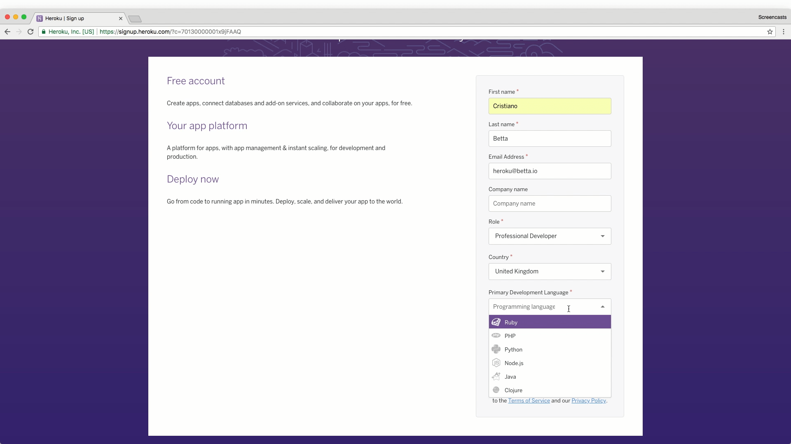

One of the questions that seems to be a lot clearer is the question of my primary programming language. You'd expect this to be used to automatically flow a new user into a Get Started Guide in that language, yet as you will see in a moment this is not so. Instead, this question is again just used for marketing purposes it seems.

One thing we can learn here is that at Heroku the developer marketing is definitely in charge of designing the signup form.

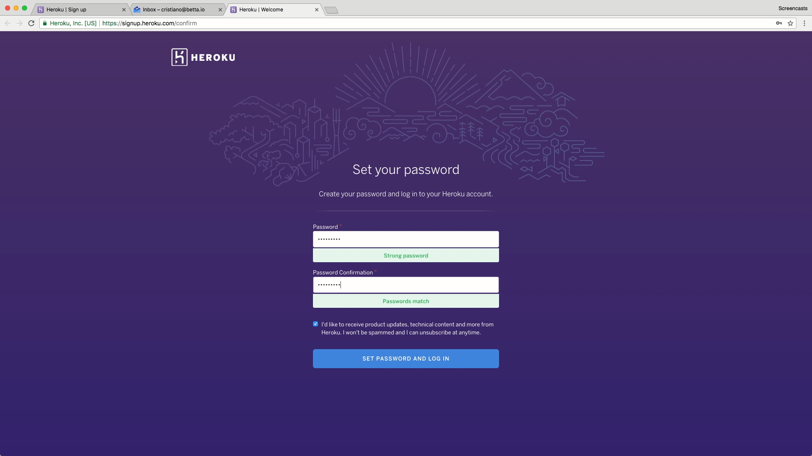

Once we confirm our email address (more on that in the [emails](#emails) section) we set our password and then continue on to a screen that's not that common in these kind of flows.

This screen at first confused me. Though not as a user, as my initial response is to just blindly push that purple button.

Yet as someone interested in UX, I was wondering what the purpose of this screen is. Why not flow the user directly to the next step? It seems to me that the main reason for this step is to give the user some form of __closure__ - the sense that they are done with signup and now ready to get started.

The added benefit of this page seems to be to train us all to keep pressing the purple buttons wherever we go, though immediately this seems like the wrong thing to do.

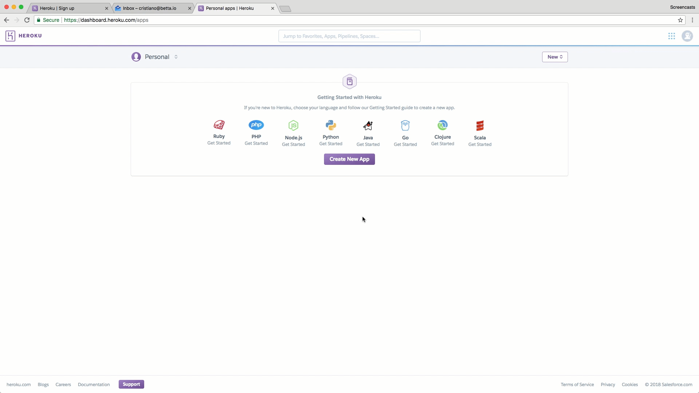

On the next screen we see a pretty standard first-use-experience. We get the option to pick a programming language to get started with, and a big purple button to create a new app.

What's interesting here is that if I press that very clear, big, purple button I don't get guided through a Get Started Guide. Instead, I need to click on one of the programming languages to be directed to the documentation portal - Heroku's "Dev Center". Was I to click on the purple button I'd totally miss the awesomeness that's the Get Started Guides Heroku provides.

Heroku's Dev Center oddly also requires me to authorize access to my Heroku (isn't the Dev Center Heroku?!) though why this is required is not explained here. I figure out that it's to allow for easy support on the Dev Center without the need for a user to log in there again.

This page could really do with an automatic, explicit flow, or at least a more clear message as to what is happening here.

<Message> I've been informed by Heroku that this was indeed supposed to be a implicit authorization, and the issue has been resolved. Apparently I caught a regression, and tests have been put in place to stop this from happening again. </Message>

For now though, I just dig in and follow the purple button road to see the Wizard.

I love the Get Started guides Heroku has designed. They take developers on a clear path, through all the steps of __deploy__, __manage__ and __scale__, in increasing levels of complexity.

What is great is that every page ends with a big purple button.

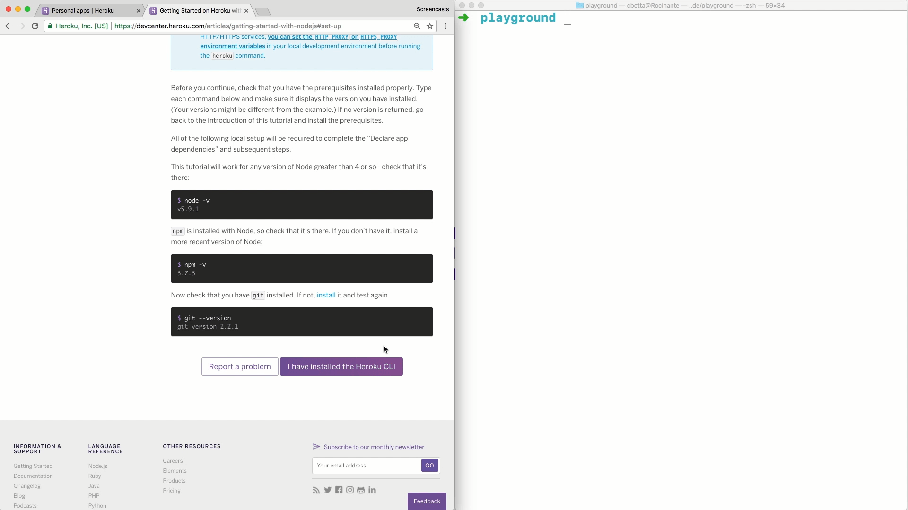

On most pages, the big purple button clearly states the intended end-goal of that page, the thing the user should have achieved at some point. In this case, it expects the user to have "installed the Heroku CLI".

What's nice is that most of these buttons come with a nice "Report a problem" button right next to it. When you click on these you can quickly (without logging in or providing your email address) raise a flag and get the support you need.

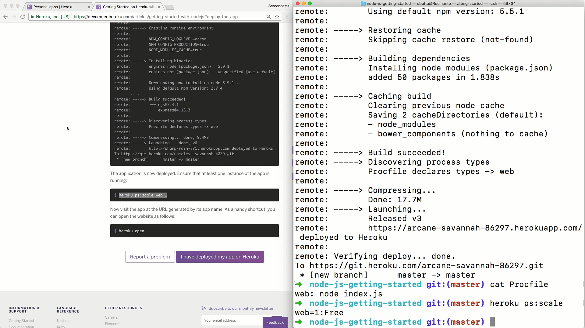

All and all getting started with Heroku was pretty effortless, though some oddities definitely exist. One of the other oddities I noticed was an unnecessary need to "scale up" a first node for a new application. Besides being unnecessary, there was also little explanation for the CLI method used. It just felt like an odd oversight in the documentation.

## Reference

★★★★

During the onboarding, we invoked a few CLI commands, like `heroku create`. The CLI itself has a lot of documentation with it under the `--help` flag, but it's always good to have some of this documentation online too.

This documentation is pretty well linked to in the top navigation.

This documentation is pretty sparse, and pretty much copies what is available on from the help flag. It fails to specify basic things like what regions are available under the `--region` flag.

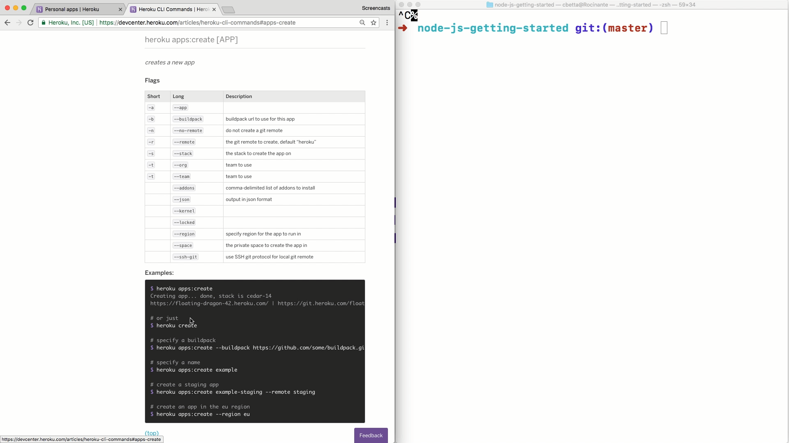

Under the hood though, this CLI is calling an API, so I went digging for this. I eventually found the "Extending Heroku" navigation.

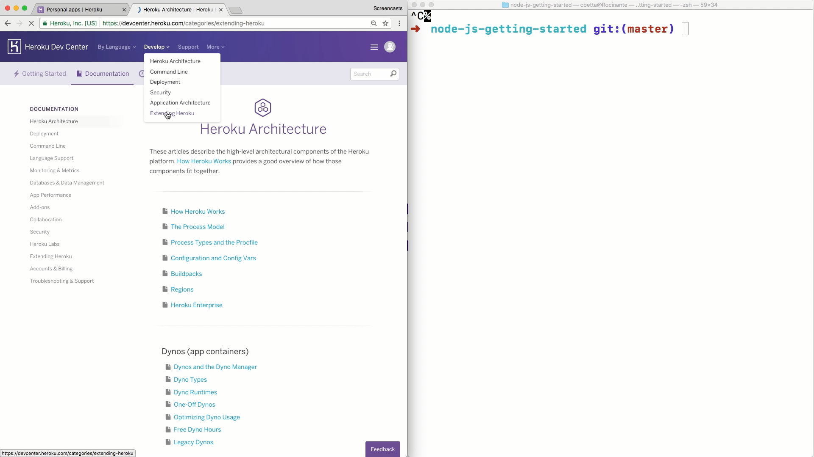

Under this, I found the rather generic sounding "Platform API Reference".

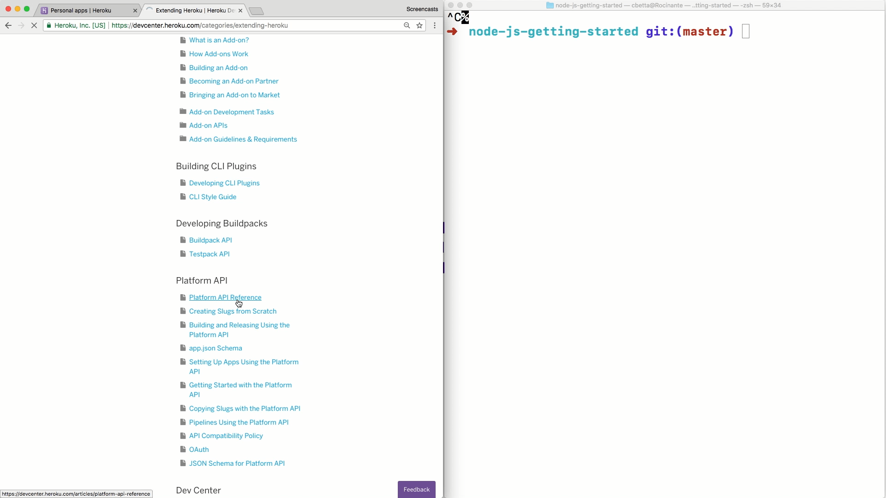

In here, I indeed found the documentation on creating an app. What was interesting here was the use of cURL samples. I tried copy pasting one of these into my terminal and instantly hit a snag.

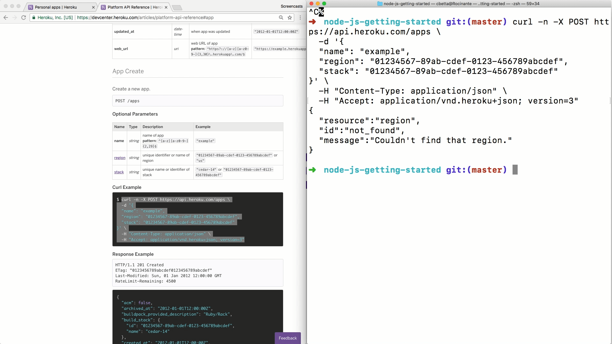

I had to set the `region` and `stack` parameters to the non-UUID examples from the reference documentation to get this example to work. I also had to set a unique app name, but then, surprisingly, the API call worked!

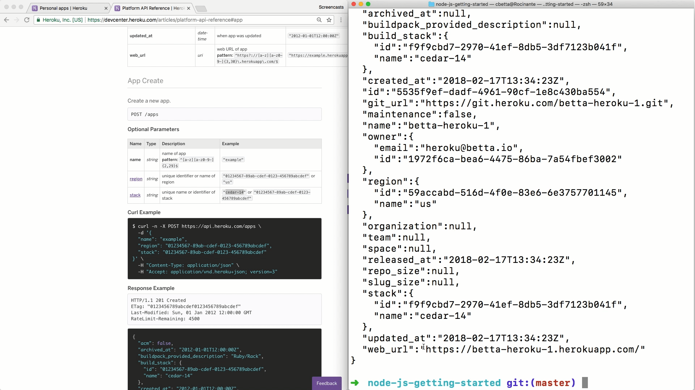

Now, this was actually rather odd, as that API call didn't use any API credentials, access tokens, or username and passwords. So how was this call authenticated?

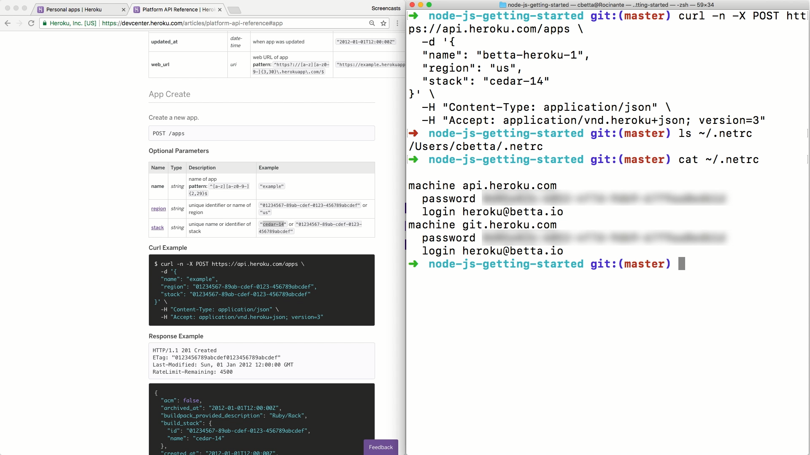

After a bit of Google'ing I learned that when I logged into the CLI tool, the CLI also put my username and "password" in my `~/.netrc` file. This is pretty cool, yet I also feel rather magical. I assume this is how the CLI itself authenticates as well, so it has a nice upside of automatically authenticating cURL commands as well.

## Emails

On a final note, I want to highlight the emails I eventually received from Heroku.

The first email I received was one to verify my email address. A simple email with nothing but a plain-text link.

During the next few days though, I received a very well planned out list of emails covering various key Heroku topics.

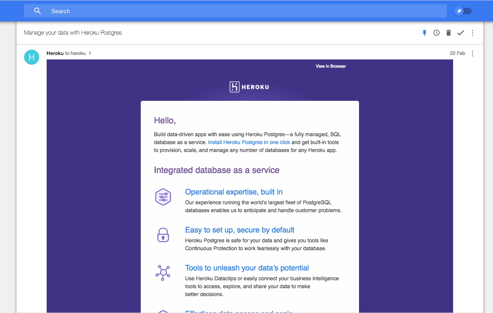

It's interesting to see a company be so dedicated to educating a developer past signup, and it's equally positive to see that all of these emails are truly catered to developers, showing code and CLI commands right there in the emails.

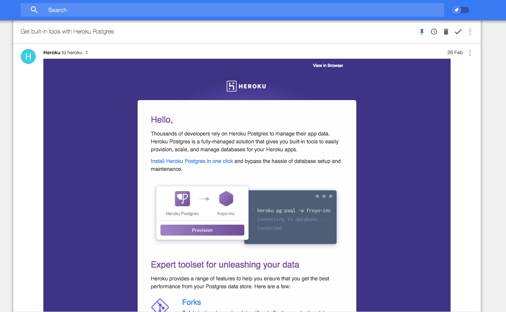

I've actually lost track as to how many emails I received, and I'm not sure if I've reached the end of the campaign yet.

## Conclusions

> ★★★★
>
> Almost flawless

Heroku is a great example of a company that truly cares about DX, hell they even have a [DX page](https://www.heroku.com/dx)! As a result, the onboarding is pretty damn good. A few things came up that seemed a bit odd, but nothing that really got in the way of deploying that first application.

The reference documentation was a bit hard to find, and sparse, though interestingly magical. If it wasn't for the few oddities in onboarding and the reference documentation, Heroku would have had a perfect Developer Experience.

### The good

* __Exploration:__ Breaking down the product into the simple __deploy__, __manage__, __scale__ concepts helps to tell the story of Heroku, and in result has led to clear videos on the topics. It simplifies the understanding for the audience, yet also makes it easier for Heroku to tell the story of what Heroku us.
* __Onboarding:__ The onboarding guides are very well thought out and follow the same three topics. Every step in the guides has a clear next step, and the user really just has to follow the big purple buttons. It's great to see that a powerful feedback system has been built straight into the developer documentation as well, allowing for instant feedback and support when a developer is stuck.
* __Tooling:__ With the CLI, Heroku has moved away a lot of the configuration of applications into a developer-friendly and repeatable environment. By using the `.netrc`-file for storing the user credentials the CLI also allows for cURL calls without authentication.

### The bad

* __Exploration:__ The top of the homepage is very generic, featuring a carousel of loosely connected content. Clearly, this is a battle for the "above the fold" by various stakeholders, with little understanding about the users landing on these pages.
* __Onboarding:__ There are quite a few questions in the first signup form that could have been moved to a second step. These questions are potentially blocking, only used for marketing purposes, provided without much context, and not used in next steps to improve the onboarding experience. After signup the user has not logged in automatically, instead requiring the user to verify their email address before continuing.
* __First use experience:__ After signup, the user is not automatically directed to a Get Started Guide in their programming language of choice. Instead, they are provided with the choice of languages again, as well as a very prominent button that will take them away from the Get Started Guides.
* <del>__Developer portal__: When a developer decided to proceed to a Get Started Guide they are provided with an OAuth flow to allow the developer documentation access to their Heroku account. This is done for good reasons, though poorly explained, leaving the user with little context.</del>
* __Reference:__ Although the reference documentation exists, it's relatively hard to find and sparse in places. The CLI reference is not much more than can be found by running the `--help` flag on the CLI tool, and most of the parameters are not given much detail. A user would have to find the corresponding Platform API reference for more detail on the parameters.
* __Samples:__ Although the CLI has been engineered to allow for cURL commands to be made without authentication, most cURL commands still don't run as-is without any modifications. This is disappointing, as the developer portal is clearly a dynamically generated document, and as such ensuring that these API calls were runnable by simple copy-paste should be achievable.

## Next

That's it for this sixth [Developer Onboarding](/blog/categories/developer-onboarding/) review. Let me know in the comments below what you think of this post and if I should continue. I'd also love to know what company you think I should review next.
